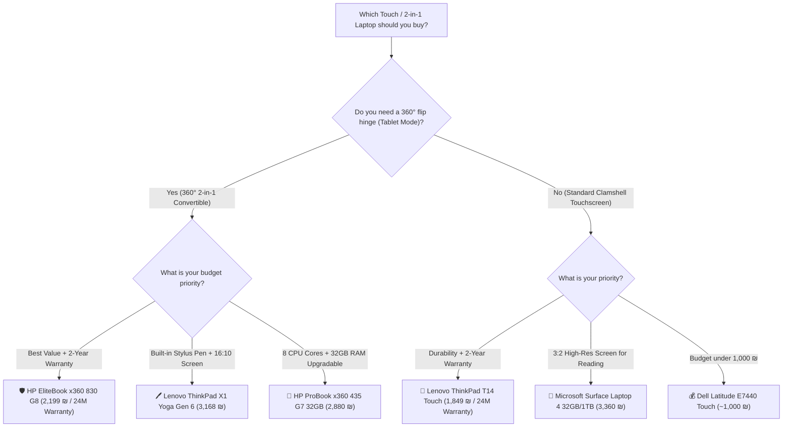

# 🔄 2-in-1 Convertibles & Touchscreen Laptops Master Guide

A complete, verified comparison of all **360° Convertible Laptops (2-in-1)** and **Touchscreen Clamshell Laptops** currently available across Israeli refurbished computer stores (**Ecology Computers**, **IT Outlet**, and **LaptopTech LTS**).

*Verified Live Stock & Pricing Audit Date: August 30, 2026*

---

## 💡 Form Factor Classification (Convertible vs Clamshell Touch)

1. 🔄 **True 2-in-1 Convertibles (360° Hinge):**
   * Can fold completely flat or flip backwards 360° into **Tablet**, **Tent**, and **Stand** modes.
   * Typically feature **Active Stylus / Pen digitizers** for pressure-sensitive handwriting, digital signing, and sketching.
2. 💻 **Touchscreen Clamshell Laptops (Standard Hinge):**
   * Traditional laptop form factor (opens up to ~180° max flat, cannot flip into a tablet).
   * Features a **Multi-Touch capacitive glass screen** for finger navigation, swiping, tapping, and zooming.

---

## 🏆 Top Recommended Picks by Use Case

| Category | Model | Form Factor | Verified Best Deal Price | Store | Direct Product Link |
| :--- | :--- | :---: | :---: | :---: | :---: |
| 🛡️ **Best Overall 360° 2-in-1 (2-Year Warranty)** | **HP EliteBook x360 830 G8** | 🔄 360° Convertible | **2,199 ₪** *(24M Warranty)* | Ecology | [View Product](https://www.ecommunity.org.il/lti71030g8_touch) |
| 🖊️ **Best Integrated Garage Stylus 2-in-1** | **Lenovo ThinkPad X1 Yoga Gen 6** | 🔄 360° Convertible | **3,168 ₪** *(4% Card Disc.)* | IT Outlet | [View Product](https://www.itoutlet.co.il/items/8299691-%D7%9E%D7%97%D7%A9%D7%91-%D7%A0%D7%99%D7%99%D7%93-%D7%9E%D7%97%D7%95%D7%93%D7%A9-Lenovo-Thinkpad-X1-Yoga-Gen6-i7-16GB-500GB-) |
| 🚀 **Best 32GB RAM 2-in-1 (Upgradable)** | **HP ProBook x360 435 G7 (32GB)**| 🔄 360° Convertible | **2,880 ₪** *(4% Card Disc.)* | IT Outlet | [View Product](https://www.itoutlet.co.il/items/9538702-HP-ProBook-x360-435-G7-Ryzen-7-32GB-512GB-SSD) |
| 🏢 **Best Business Touchscreen Clamshell** | **Lenovo ThinkPad T14 Touch** | 💻 Touch Clamshell | **1,849 ₪** *(24M Warranty)* | Ecology | [View Product](https://www.ecommunity.org.il/thinkpad_t14) |
| 🎨 **Best High-Res 3:2 Display for Reading** | **Microsoft Surface Laptop 4 (32GB/1TB)** | 💻 Touch Clamshell | **3,360 ₪** *(4% Card Disc.)* | IT Outlet | [View Product](https://www.itoutlet.co.il/items/9347740-%D7%9E%D7%97%D7%A9%D7%91-%D7%A0%D7%99%D7%99%D7%93-%D7%9E%D7%97%D7%95%D7%93%D7%A9-Microsoft-Surface-4-i7-32GB-1TB-SSD) |
| 💰 **Best Budget Touchscreen (< 1,000 ₪)** | **Dell Latitude E7440 Touch** | 💻 Touch Clamshell | **~1,000 ₪** | LTS | [View Product](https://lts.co.il/פריט/dell-latitude-e7440-touch-14-i5-8gb-500gb/) |

---

## 🔄 Group 1: True 2-in-1 Convertibles (360° Hinge & Tablet Mode)

These laptops fold backwards 360° into tablets and support active digital pens.

| # | Model | CPU & Cores | RAM & Slots | Storage & Interface | Pen / Stylus Support | Verified Sale Price | Best Deal Price | Store | Score | Direct Link |
| :-: | :--- | :--- | :--- | :--- | :---: | :---: | :---: | :---: | :---: | :---: |
| 1 | **HP EliteBook x360 830 G8** | Core i7-1185G7 (4C/8T) | 16GB LPDDR4x (Soldered) | 512GB ⚡ M.2 PCIe NVMe | 🖊️ Active HP Pen | **2,199 ₪** | **2,199 ₪** *(24M Warranty)* | Ecology | 🟠 5.0 | [View Product](https://www.ecommunity.org.il/lti71030g8_touch) |
| 2 | **HP ProBook x360 435 G7 (Ryzen 5)** | Ryzen 5 PRO 4650U (6C/12T) | 16GB (2x SODIMM Slots) | 512GB ⚡ M.2 PCIe NVMe | 🖊️ Active HP Pen | **2,500 ₪** | **2,400 ₪** *(100 ₪ Coupon)* | IT Outlet | 🟢 9.0 | [View Product](https://www.itoutlet.co.il/items/9538791-HP-ProBook-x360-435-G7-Ryzen-5-16GB-512GB-SSD) |
| 3 | **HP ProBook x360 435 G7 (Ryzen 7)** | Ryzen 7 PRO 4750U (8C/16T) | **32GB** (2x SODIMM Slots)| 512GB ⚡ M.2 PCIe NVMe | 🖊️ Active HP Pen | **3,000 ₪** | **2,880 ₪** *(4% Card Disc.)* | IT Outlet | 🟢 9.0 | [View Product](https://www.itoutlet.co.il/items/9538702-HP-ProBook-x360-435-G7-Ryzen-7-32GB-512GB-SSD) |
| 4 | **Lenovo ThinkPad X1 Yoga Gen 6** | Core i7-1165G7 (4C/8T) | 16GB LPDDR4x (Soldered) | 500GB ⚡ M.2 PCIe Gen4 | 🖊️ **Built-in Garage Pen** | **3,300 ₪** | **3,168 ₪** *(4% Card Disc.)* | IT Outlet | 🟡 7.5 | [View Product](https://www.itoutlet.co.il/items/8299691-%D7%9E%D7%97%D7%A9%D7%91-%D7%A0%D7%99%D7%99%D7%93-%D7%9E%D7%97%D7%95%D7%93%D7%A9-Lenovo-Thinkpad-X1-Yoga-Gen6-i7-16GB-500GB-) |
| 5 | **Dell Inspiron 13 5379 2-in-1** | Core i7-8550U (4C/8T) | 8GB (2x SODIMM Slots) | 250GB ⚡ M.2 NVMe / Bay | 🖊️ Capacitive Stylus | **~2,000 ₪** | **~2,000 ₪** | LTS | 🟢 9.0 | [View Product](https://lts.co.il/פריט/dell-inspiron-13-5379-2-in-1-touch-13-3-i7-8gb-250gb/) |

---

## 💻 Group 2: Touchscreen Clamshell Laptops (Standard Hinge)

These laptops have standard laptop hinges (~180° flat) with integrated multi-touch capacitive displays.

| # | Model | CPU & Cores | RAM & Slots | Storage & Interface | Screen Type | Verified Sale Price | Best Deal Price | Store | Score | Direct Link |
| :-: | :--- | :--- | :--- | :--- | :--- | :---: | :---: | :---: | :---: | :---: |
| 1 | **Lenovo ThinkPad T14 Touch** | Core i5-10210U (10th) | 16GB (1 sold. + 1 slot) | 256GB ⚡ M.2 PCIe NVMe | 14.0" FHD Touch (Anti-glare) | **1,849 ₪** | **1,849 ₪** *(24M Warranty)* | Ecology | 🟡 7.5 | [View Product](https://www.ecommunity.org.il/thinkpad_t14) |
| 2 | **Microsoft Surface Laptop 3** | Core i7 (10th Gen) | 16GB LPDDR4x (Soldered) | 500GB ⚡ M.2 2230 NVMe | 13.5" PixelSense 3:2 Touch | **2,500 ₪** | **2,400 ₪** *(100 ₪ Coupon)* | IT Outlet | 🔴 1.0 | [View Product](https://www.itoutlet.co.il/items/7283286-%D7%9E%D7%97%D7%A9%D7%91-%D7%A0%D7%99%D7%99%D7%93-%D7%9E%D7%97%D7%95%D7%93%D7%A9-Microsoft-Surface-3-i7-16GB-500GB-SSD) |
| 3 | **Microsoft Surface Laptop 4 (16GB)**| Core i7-1185G7 (11th)| 16GB LPDDR4x (Soldered) | 500GB ⚡ M.2 2230 NVMe | 13.5" PixelSense 3:2 (2256x1504) | **2,800 ₪** | **2,688 ₪** *(4% Card Disc.)* | IT Outlet | 🔴 1.0 | [View Product](https://www.itoutlet.co.il/items/7777501-%D7%9E%D7%97%D7%A9%D7%91-%D7%A0%D7%99%D7%99%D7%93-%D7%9E%D7%97%D7%95%D7%93%D7%A9-Microsoft-Surface-4-i7-16GB-500GB-SSD) |
| 4 | **Microsoft Surface Laptop 4 (32GB)**| Core i7-1185G7 (11th)| **32GB** LPDDR4x (Soldered)| **1TB** ⚡ M.2 2230 NVMe | 13.5" PixelSense 3:2 (2256x1504) | **3,500 ₪** | **3,360 ₪** *(4% Card Disc.)* | IT Outlet | 🔴 1.0 | [View Product](https://www.itoutlet.co.il/items/9347740-%D7%9E%D7%97%D7%A9%D7%91-%D7%A0%D7%99%D7%99%D7%93-%D7%9E%D7%97%D7%95%D7%93%D7%A9-Microsoft-Surface-4-i7-32GB-1TB-SSD) |
| 5 | **Lenovo ThinkPad X1 Carbon Touch** | Core i7 (8th Gen) | 16GB (Soldered) | **1TB** ⚡ M.2 PCIe NVMe | 14.0" FHD In-cell Touch | **~2,000 ₪** | **~2,000 ₪** | LTS | 🟠 5.0 | [View Product](https://lts.co.il/פריט/lenovo-thinkpad-x1-carbon-touch-14-i7-16g-1tb/) |
| 6 | **Dell Latitude E7440 Touch** | Core i5-4300U (4th Gen) | 8GB (2x SODIMM Slots) | 500GB 🐢 2.5" SATA SSD | 14.0" Full HD Touch | **~1,000 ₪** | **~1,000 ₪** | LTS | 🟢 8.0 | [View Product](https://lts.co.il/פריט/dell-latitude-e7440-touch-14-i5-8gb-500gb/) |

---

## 🔍 Detailed Comparison of Top Contenders

### 1. 🛡️ HP EliteBook x360 830 G8 vs 🖊️ Lenovo ThinkPad X1 Yoga Gen 6

| Feature | HP EliteBook x360 830 G8 | Lenovo ThinkPad X1 Yoga Gen 6 |
| :--- | :--- | :--- |
| **Best Deal Price** | **2,199 ₪** | **3,168 ₪** *(Difference: ~970 ₪)* |
| **Warranty** | 🛡️ **24 Months (2 Years)** | 12 Months (1 Year) |
| **Stylus Storage** | Magnetic attach to side / separate | 🖊️ **Built-in garage silo in chassis (auto-charging)** |
| **Screen Ratio** | 13.3" 16:9 (1920 x 1080) | 14.0" **16:10 (1920 x 1200, 11% taller)** |
| **CPU** | Intel Core i7-1185G7 (4.8 GHz) | Intel Core i7-1165G7 (4.7 GHz) |
| **RAM** | 16GB LPDDR4x | 16GB LPDDR4x |
| **Storage** | 512GB PCIe NVMe SSD | 500GB PCIe NVMe SSD |
| **Chassis** | Natural Silver CNC Aluminum | Storm Grey CNC Aluminum |
| **Verdict** | **Best Value & Warranty**: 970 ₪ cheaper with double the warranty length. | **Best Pen & Screen Experience**: Integrated stylus silo and taller 16:10 display. |

---

### 2. 🚀 HP ProBook x360 435 G7 (AMD Ryzen Power & 32GB RAM)

* **Why it's unique:** Most 2-in-1 laptops (like EliteBook x360 and X1 Yoga) solder their RAM directly to the motherboard to save space, making RAM non-upgradable.
* **Hardware Advantage:** The ProBook x360 435 G7 retains **2x physical DDR4 SODIMM slots** (Upgradability Score: **🟢 9.0/10**).
* **Multi-Core Performance:** The 8-Core / 16-Thread Ryzen 7 PRO 4750U outperforms quad-core Intel 11th Gen CPUs in multi-threaded programming tasks, Docker containers, and video rendering.
* **Pricing:**
  * **32GB RAM / 512GB SSD:** 3,000 ₪ list $\rightarrow$ **2,880 ₪** (with 4% phone card discount).
  * **16GB RAM / 512GB SSD:** 2,500 ₪ list $\rightarrow$ **2,400 ₪** (with 100 ₪ newsletter code).

---

### 3. 🎨 Microsoft Surface Laptop 4 (PixelSense 3:2 Touchscreen)

* **Form Factor:** Clamshell Touchscreen Laptop (does not flip 360°).
* **Screen:** 13.5" PixelSense (2256 x 1504) with high pixel density (201 PPI) and 3:2 aspect ratio.
* **Why buy it:** Unmatched screen clarity and vertical estate for reading books, reviewing code, and working with documents. Compatible with Surface Pen.
* **Pricing:**
  * **32GB RAM / 1TB SSD:** 3,500 ₪ list $\rightarrow$ **3,360 ₪** (with 4% phone card discount).
  * **16GB RAM / 500GB SSD:** 2,800 ₪ list $\rightarrow$ **2,688 ₪** (with 4% phone card discount).

---

## 🎯 Final Decision Matrix

