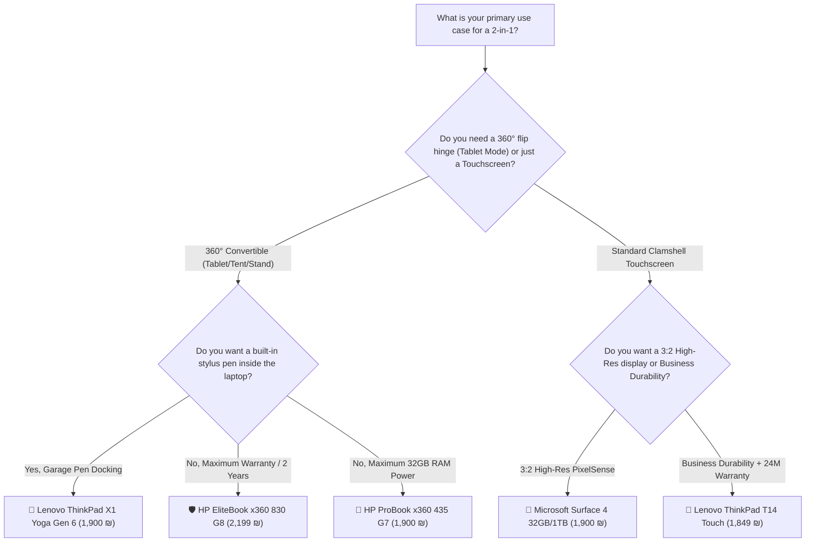

# 🔄 2-in-1 & Touchscreen Refurbished Laptops Buyer's Guide

A comprehensive comparison of all **2-in-1 Convertibles (360° Hinge)**, **Touchscreen Ultrabooks**, and **Pen-Enabled Devices** currently available across Israeli refurbished computer stores (**Ecology Computers**, **IT Outlet**, and **LaptopTech LTS**).

*Catalog & Pricing Audit Date: August 30, 2026*

---

## 🏆 Top Recommended 2-in-1 Picks

| Category | Model | Key Highlight | Best Deal Price | Store | Direct Link |
| :--- | :--- | :--- | :---: | :---: | :---: |
| 👑 **Best Overall 360° Convertible** | **Lenovo ThinkPad X1 Yoga Gen 6** | Built-in Garage Stylus • 16:10 Touch • 16GB / 500GB SSD | **1,900 ₪** *(Coupon)* | IT Outlet | [View Product](https://www.itoutlet.co.il/items/8299691-%D7%9E%D7%97%D7%A9%D7%91-%D7%A0%D7%99%D7%99%D7%93-%D7%9E%D7%97%D7%95%D7%93%D7%A9-Lenovo-Thinkpad-X1-Yoga-Gen6-i7-16GB-500GB-) |
| 🛡️ **Best Premium Build & 2-Year Warranty** | **HP EliteBook x360 830 G8** | 11th Gen i7 • CNC Aluminum • 512GB NVMe • **24M Warranty** | **2,199 ₪** | Ecology | [View Product](https://www.ecommunity.org.il/lti71030g8_touch) |
| 🚀 **Best Multitasking 2-in-1 (32GB RAM)** | **HP ProBook x360 435 G7** | AMD Ryzen 7 PRO (8C/16T) • **32GB RAM** • 512GB SSD | **1,900 ₪** *(Coupon)* | IT Outlet | [View Product](https://www.itoutlet.co.il/items/9538702-HP-ProBook-x360-435-G7-Ryzen-7-32GB-512GB-SSD) |
| 🎨 **Best Display for Drawing & Note-Taking** | **Microsoft Surface Laptop 4** | 3:2 PixelSense High-Res Touch • **32GB RAM / 1TB SSD** | **1,900 ₪** *(Coupon)* | IT Outlet | [View Product](https://www.itoutlet.co.il/items/9347740-%D7%9E%D7%97%D7%A9%D7%91-%D7%A0%D7%99%D7%99%D7%93-%D7%9E%D7%97%D7%95%D7%93%D7%A9-Microsoft-Surface-4-i7-32GB-1TB-SSD) |
| 💰 **Best Budget Touchscreen (< 1,000 ₪)** | **Dell Latitude E7440 Touch** | 14.0" Touch Display • 8GB RAM • 500GB SSD | **~1,000 ₪** | LTS | [View Product](https://lts.co.il/פריט/dell-latitude-e7440-touch-14-i5-8gb-500gb/) |

---

## 📊 Comprehensive 2-in-1 & Touchscreen Comparison Table

| # | Model | Form Factor | CPU & Gen | RAM & SSD | Stylus / Pen | Price & Deals | Store | Upgradability | Warranty | Direct Link |
| :-: | :--- | :--- | :--- | :--- | :---: | :---: | :---: | :---: | :---: | :---: |
| 1 | **Lenovo ThinkPad X1 Yoga Gen 6** | 🔄 **360° Flip (4 Modes)** | Core i7 (11th Gen) | 16GB / 500GB SSD | 🖊️ **Built-in Stylus Silo** | **1,900 ₪** *(100 ₪ Off)* | IT Outlet | 🟡 7.5 *(NVMe M.2)* | 12 Mos | [View Product](https://www.itoutlet.co.il/items/8299691-%D7%9E%D7%97%D7%A9%D7%91-%D7%A0%D7%99%D7%99%D7%93-%D7%9E%D7%97%D7%95%D7%93%D7%A9-Lenovo-Thinkpad-X1-Yoga-Gen6-i7-16GB-500GB-) |
| 2 | **HP EliteBook x360 830 G8** | 🔄 **360° Flip (4 Modes)** | Core i7-1185G7 (11th) | 16GB / 512GB SSD | 🖊️ Active Pen Support | **2,199 ₪** | Ecology | 🟠 5.0 *(NVMe M.2)* | 🛡️ **24 Mos** | [View Product](https://www.ecommunity.org.il/lti71030g8_touch) |
| 3 | **HP ProBook x360 435 G7 (32GB)** | 🔄 **360° Flip (4 Modes)** | Ryzen 7 PRO (8C/16T) | **32GB** / 512GB SSD | 🖊️ Active Pen Support | **1,900 ₪** *(100 ₪ Off)* | IT Outlet | 🟢 9.0 *(2x SODIMM)* | 12 Mos | [View Product](https://www.itoutlet.co.il/items/9538702-HP-ProBook-x360-435-G7-Ryzen-7-32GB-512GB-SSD) |
| 4 | **HP ProBook x360 435 G7 (16GB)** | 🔄 **360° Flip (4 Modes)** | Ryzen 5 PRO (6C/12T) | 16GB / 512GB SSD | 🖊️ Active Pen Support | **1,900 ₪** *(100 ₪ Off)* | IT Outlet | 🟢 9.0 *(2x SODIMM)* | 12 Mos | [View Product](https://www.itoutlet.co.il/items/9538791-HP-ProBook-x360-435-G7-Ryzen-5-16GB-512GB-SSD) |
| 5 | **Microsoft Surface 4 (32GB/1TB)** | 💻 **Touch Clamshell** | Core i7 (11th Gen) | **32GB** / **1TB** SSD | 🖊️ Surface Pen Support | **1,900 ₪** *(100 ₪ Off)* | IT Outlet | 🔴 1.0 *(Soldered)* | 12 Mos | [View Product](https://www.itoutlet.co.il/items/9347740-%D7%9E%D7%97%D7%A9%D7%91-%D7%A0%D7%99%D7%99%D7%93-%D7%9E%D7%97%D7%95%D7%93%D7%A9-Microsoft-Surface-4-i7-32GB-1TB-SSD) |
| 6 | **Microsoft Surface 4 (16GB/500GB)**| 💻 **Touch Clamshell** | Core i7 (11th Gen) | 16GB / 500GB SSD | 🖊️ Surface Pen Support | **1,900 ₪** *(100 ₪ Off)* | IT Outlet | 🔴 1.0 *(Soldered)* | 12 Mos | [View Product](https://www.itoutlet.co.il/items/7777501-%D7%9E%D7%97%D7%A9%D7%91-%D7%A0%D7%99%D7%99%D7%93-%D7%9E%D7%97%D7%95%D7%93%D7%A9-Microsoft-Surface-4-i7-16GB-500GB-SSD) |
| 7 | **Microsoft Surface 3 (16GB/500GB)**| 💻 **Touch Clamshell** | Core i7 (10th Gen) | 16GB / 500GB SSD | 🖊️ Surface Pen Support | **1,900 ₪** *(100 ₪ Off)* | IT Outlet | 🔴 1.0 *(Soldered)* | 12 Mos | [View Product](https://www.itoutlet.co.il/items/7283286-%D7%9E%D7%97%D7%A9%D7%91-%D7%A0%D7%99%D7%99%D7%93-%D7%9E%D7%97%D7%95%D7%93%D7%A9-Microsoft-Surface-3-i7-16GB-500GB-SSD) |
| 8 | **Dell Inspiron 13 5379 2-in-1** | 🔄 **360° Flip (4 Modes)** | Core i7-8550U (8th Gen) | 8GB / 250GB SSD | 🖊️ Capacitive Touch | **~2,000 ₪** | LTS | 🟢 9.0 *(2x SODIMM)* | 12 Mos | [View Product](https://lts.co.il/פריט/dell-inspiron-13-5379-2-in-1-touch-13-3-i7-8gb-250gb/) |
| 9 | **Lenovo ThinkPad T14 Touch** | 💻 **Touch Clamshell** | Core i5 (10th Gen) | 16GB / 256GB SSD | 🖐️ Finger Touchscreen | **1,849 ₪** | Ecology | 🟡 7.5 *(1 Slot+NVMe)* | 🛡️ **24 Mos** | [View Product](https://www.ecommunity.org.il/thinkpad_t14) |
| 10 | **Lenovo ThinkPad X1 Carbon Touch**| 💻 **Touch Clamshell** | Core i7 (8th Gen) | 16GB / **1TB** SSD | 🖐️ 10-Point Multi-Touch | **~2,000 ₪** | LTS | 🟠 5.0 *(NVMe M.2)* | 12 Mos | [View Product](https://lts.co.il/פריט/lenovo-thinkpad-x1-carbon-touch-14-i7-16g-1tb/) |
| 11 | **Dell Latitude E7440 Touch** | 💻 **Touch Clamshell** | Core i5 (4th Gen) | 8GB / 500GB SSD | 🖐️ Finger Touchscreen | **~1,000 ₪** | LTS | 🟢 8.0 *(2x SODIMM)* | 12 Mos | [View Product](https://lts.co.il/פריט/dell-latitude-e7440-touch-14-i5-8gb-500gb/) |

---

## 🔍 In-Depth Model Breakdowns

### 1. 🥇 Lenovo ThinkPad X1 Yoga Gen 6 (14.0" 16:10 360° Convertible)
* **Form Factor:** 360-Degree Convertible with Laptop, Tent, Stand, and Tablet modes.
* **Why it's #1:** Includes an **Integrated ThinkPad Pen Pro** docked inside a dedicated silo in the laptop chassis that recharges automatically. You will never lose your stylus or run out of AAA batteries.
* **Display:** 14.0-inch 16:10 aspect ratio (1920x1200 Low Power IPS Touch display) — provides ~11% more vertical reading space than traditional 16:9 laptops.
* **Build:** Precision-machined Storm Grey CNC Aluminum with legendary ThinkPad spill-resistant keyboard.
* **Specs:** 11th Gen Core i7, 16GB LPDDR4x-4266 RAM, 500GB M.2 2280 PCIe Gen 4 NVMe SSD, Dual Thunderbolt 4 / USB-C ports.
* **Best Deal Price:** **1,900 ₪** *(After 100 ₪ newsletter code on IT Outlet)*.

### 2. 🛡️ HP EliteBook x360 830 G8 (13.3" FHD 360° Convertible)
* **Form Factor:** Compact 360-Degree Executive 2-in-1.
* **Why it stands out:** Comes with **Ecology Computers' full 24-Month (2-Year) Warranty** (double the warranty of standard refurbished stores).
* **Build:** 1.31 kg all-metal CNC aluminum chassis with Bang & Olufsen tuned quad-speakers.
* **Specs:** Intel Core i7-1185G7 (vPro, Up to 4.80 GHz), 16GB LPDDR4x RAM, 512GB M.2 2280 PCIe NVMe SSD.
* **Best Deal Price:** **2,199 ₪** at Ecology Computers.

### 3. 🚀 HP ProBook x360 435 G7 (13.3" Ryzen 7 32GB RAM Workhorse)
* **Form Factor:** 360-Degree AMD Ryzen Convertible.
* **Why it stands out:** Features an **8-Core / 16-Thread AMD Ryzen 7 PRO 4750U** processor paired with **32GB of RAM** — the highest RAM configuration available in a 2-in-1 under 2,000 ₪.
* **Upgradability Advantage:** Unlike the X1 Yoga and EliteBook 830 which have soldered RAM, the ProBook 435 G7 has **2 physical SODIMM RAM slots** (Upgradability Score: **🟢 9/10**).
* **Best Deal Price:** **1,900 ₪** at IT Outlet.

### 4. 🎨 Microsoft Surface Laptop 4 (13.5" 3:2 PixelSense Touchscreen)
* **Form Factor:** Ultra-thin Clamshell Touchscreen Laptop with Surface Pen stylus digitizer support.
* **Why artists & note-takers love it:** The **3:2 aspect ratio PixelSense display (2256 x 1504)** offers 201 PPI razor-sharp text and natural paper-like proportions for writing, PDF markup, and spreadsheet viewing.
* **Specs:** 11th Gen Core i7, **32GB RAM**, **1TB SSD** for **1,900 ₪**.
* **Trade-off:** 100% soldered logic board and glued body (**🔴 1/10 Upgradability**). Buy the 32GB/1TB version to avoid needing any future upgrades.

---

## 🎯 Which 2-in-1 Should You Choose?

### Summary Recommendations:
1. **For the Ultimate 2-in-1 Experience (Stylus + Tablet Mode):**  
   👉 Choose the **[Lenovo ThinkPad X1 Yoga Gen 6](https://www.itoutlet.co.il/items/8299691-%D7%9E%D7%97%D7%A9%D7%91-%D7%A0%D7%99%D7%99%D7%93-%D7%9E%D7%97%D7%95%D7%93%D7%A9-Lenovo-Thinkpad-X1-Yoga-Gen6-i7-16GB-500GB-)** (**1,900 ₪**). The built-in charging garage pen, 16:10 display, and lightweight aluminum body make it the best overall convertible.

2. **For Maximum Peace of Mind & Warranty:**  
   👉 Choose the **[HP EliteBook x360 830 G8](https://www.ecommunity.org.il/lti71030g8_touch)** (**2,199 ₪**). Features an 11th Gen i7 with a full **2-year official warranty** from Ecology Computers.

3. **For Heavy Coding & Multitasking:**  
   👉 Choose the **[HP ProBook x360 435 G7 with 32GB RAM](https://www.itoutlet.co.il/items/9538702-HP-ProBook-x360-435-G7-Ryzen-7-32GB-512GB-SSD)** (**1,900 ₪**). 8 full CPU cores with modular 2x SODIMM RAM slots.

