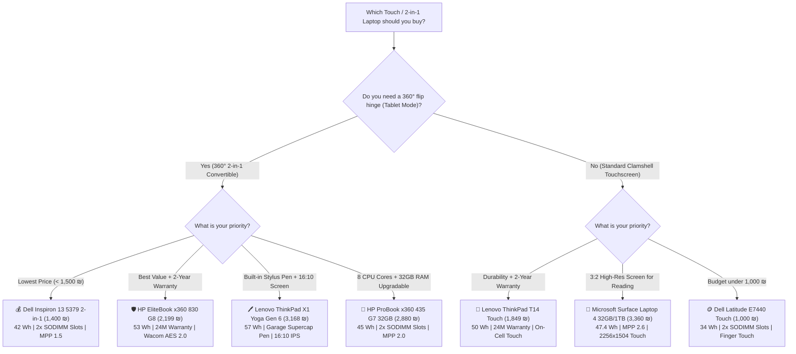

# 🔄 2-in-1 Convertibles & Touchscreen Laptops Master Guide
### Featuring Pen Technology, Battery Capacities, Real-World Drain & Pricing

A complete, verified comparison of all **360° Convertible Laptops (2-in-1)** and **Touchscreen Clamshell Laptops** currently available across Israeli refurbished computer stores (**Ecology Computers**, **IT Outlet**, and **LaptopTech LTS**).

*Verified Live Stock & Hardware Audit Date: August 30, 2026*

---

## 💡 Form Factor & Pen Technology Classification

1. 🔄 **True 2-in-1 Convertibles (360° Hinge & Active Digitizers):**
   * Can fold completely flat or flip backwards 360° into **Tablet**, **Tent**, and **Stand** modes.
   * Feature **Active Stylus Digitizers (Wacom AES or Microsoft Pen Protocol MPP)** with 4,096 levels of pressure sensitivity, tilt detection, and hardware palm rejection.
2. 💻 **Touchscreen Clamshell Laptops (Standard Hinge):**
   * Traditional laptop hinge (opens ~180° flat, cannot flip into a tablet).
   * Feature **Multi-Touch capacitive glass** designed for finger navigation, swiping, tapping, and zooming. Some (like Microsoft Surface Laptop) also support active MPP pens.

---

## 🏆 Top Recommended Picks by Use Case

| Category | Model | Form Factor | Pen Technology & Power | Battery (Wh) & Real Runtime | Verified Deal Price | Store | Direct Link |
| :--- | :--- | :---: | :--- | :---: | :---: | :---: | :---: |
| 🛡️ **Best Overall 360° 2-in-1 (2-Year Warranty)** | **HP EliteBook x360 830 G8** | 🔄 360° Flip | **Wacom AES 2.0** *(USB-C Rechargeable G3 Pen)* | **53 Wh** • ~8 – 10.5h | **2,199 ₪** *(24M Warranty)* | Ecology | [View Product](https://www.ecommunity.org.il/lti71030g8_touch) |
| 🖊️ **Best Integrated Garage Stylus 2-in-1** | **Lenovo ThinkPad X1 Yoga Gen 6** | 🔄 360° Flip | **Wacom AES 2.0** *(Built-in Garage Pen, 15s Charge)*| **57 Wh** • ~8 – 11h | **3,168 ₪** *(4% Card Disc.)* | IT Outlet | [View Product](https://www.itoutlet.co.il/items/8299691-%D7%9E%D7%97%D7%A9%D7%91-%D7%A0%D7%99%D7%99%D7%93-%D7%9E%D7%97%D7%95%D7%93%D7%A9-Lenovo-Thinkpad-X1-Yoga-Gen6-i7-16GB-500GB-) |
| 🚀 **Best 32GB RAM 2-in-1 (Upgradable)** | **HP ProBook x360 435 G7 (32GB)**| 🔄 360° Flip | **MPP 2.0 / AES** *(AAAA Active Pro Pen)* | **45 Wh** • ~7 – 9h | **2,880 ₪** *(4% Card Disc.)* | IT Outlet | [View Product](https://www.itoutlet.co.il/items/9538702-HP-ProBook-x360-435-G7-Ryzen-7-32GB-512GB-SSD) |
| 💰 **Best Budget 360° Convertible (< 1,500 ₪)** | **Dell Inspiron 13 5379 2-in-1** | 🔄 360° Flip | **MPP 1.5 / Capacitive** *(AAAA Active Pen PN338M)* | **42 Wh** • ~4.5 – 6h | **1,400 ₪** *(Was 1,500 ₪)* | LTS | [View Product](https://lts.co.il/פריט/dell-inspiron-13-5379-2-in-1-touch-13-3-i7-8gb-250gb/) |
| 🎨 **Best High-Res 3:2 Display for Reading** | **Microsoft Surface Laptop 4 (32GB/1TB)** | 💻 Clamshell | **MPP 2.0 / 2.6** *(Surface Pen / Slim Pen 2)* | **47.4 Wh** • ~9 – 12h | **3,360 ₪** *(4% Card Disc.)* | IT Outlet | [View Product](https://www.itoutlet.co.il/items/9347740-%D7%9E%D7%97%D7%A9%D7%91-%D7%A0%D7%99%D7%99%D7%93-%D7%9E%D7%97%D7%95%D7%93%D7%A9-Microsoft-Surface-4-i7-32GB-1TB-SSD) |
| 🏢 **Best Business Touchscreen Clamshell** | **Lenovo ThinkPad T14 Touch** | 💻 Clamshell | **On-Cell Finger Touch** *(Passive Capacitive)* | **50 Wh** • ~7.5 – 10h | **1,849 ₪** *(24M Warranty)* | Ecology | [View Product](https://www.ecommunity.org.il/thinkpad_t14) |
| 🪙 **Lowest Price Touchscreen Laptop** | **Dell Latitude E7440 Touch** | 💻 Clamshell | **Finger Touch** *(Passive Capacitive)* | **34 Wh** • ~3.5 – 5h | **1,000 ₪** | LTS | [View Product](https://lts.co.il/פריט/dell-latitude-e7440-touch-14-i5-8gb-500gb/) |

---

## 🔄 Group 1: True 2-in-1 Convertibles (360° Hinge & Active Stylus Digitizers)

These laptops fold backwards 360° into tablets and support active digital pens with pressure sensitivity and palm rejection.

| # | Model | CPU & RAM | Storage | Pen Protocol & Digitizer | Stylus Power & Battery Type | Laptop Battery (Wh) | Real-World Battery Runtime & Drain | Verified Deal Price | Store | Direct Link |
| :-: | :--- | :--- | :--- | :--- | :--- | :---: | :--- | :---: | :---: | :---: |
| 1 | **HP EliteBook x360 830 G8** | Core i7-1185G7 • 16GB | 512GB ⚡ NVMe | **Wacom AES 2.0** *(4,096 levels, tilt, magnetic side dock)* | 🔋 **USB-C Rechargeable** *(HP Active Pen G3, lasts ~30-60 days/charge)* | **53 Wh** | 🌐 **Web/Office:** ~8.5 – 10.5 hrs<br>🎬 **Video:** ~11 hrs<br>⚡ **Heavy:** ~3.5 – 4.5 hrs<br>*(Fast Charge: 50% in 30m)* | **2,199 ₪** *(24M Warranty)* | Ecology | [View Product](https://www.ecommunity.org.il/lti71030g8_touch) |
| 2 | **HP ProBook x360 435 G7 (Ryzen 5)** | Ryzen 5 PRO • 16GB (2 slots)| 512GB ⚡ NVMe | **MPP 2.0 / AES** *(4,096 levels, palm rejection)* | 🔋 **1x AAAA Battery** *(HP Pro Pen, lasts 12–18 months)* | **45 Wh** | 🌐 **Web/Office:** ~7 – 9 hrs<br>🎬 **Video:** ~8.5 hrs<br>⚡ **Heavy:** ~3 – 4 hrs<br>*(Fast Charge: 50% in 30m)* | **2,400 ₪** *(100 ₪ Coupon)* | IT Outlet | [View Product](https://www.itoutlet.co.il/items/9538791-HP-ProBook-x360-435-G7-Ryzen-5-16GB-512GB-SSD) |
| 3 | **HP ProBook x360 435 G7 (Ryzen 7)** | Ryzen 7 PRO • **32GB** (2 slots)| 512GB ⚡ NVMe | **MPP 2.0 / AES** *(4,096 levels, palm rejection)* | 🔋 **1x AAAA Battery** *(HP Pro Pen, lasts 12–18 months)* | **45 Wh** | 🌐 **Web/Office:** ~6.5 – 8.5 hrs<br>🎬 **Video:** ~8 hrs<br>⚡ **Heavy:** ~3 – 3.5 hrs<br>*(Fast Charge: 50% in 30m)* | **2,880 ₪** *(4% Card Disc.)* | IT Outlet | [View Product](https://www.itoutlet.co.il/items/9538702-HP-ProBook-x360-435-G7-Ryzen-7-32GB-512GB-SSD) |
| 4 | **Lenovo ThinkPad X1 Yoga Gen 6** | Core i7-1165G7 • 16GB | 500GB ⚡ Gen4 NVMe| **Wacom AES 2.0** *(4,096 levels, tilt, 16:10 screen)* | ⚡ **Internal Garage Silo** *(Supercapacitor, 15s charge = 100m use)* | **57 Wh** | 🌐 **Web/Office:** ~8 – 11 hrs<br>🎬 **Video:** ~10 – 12 hrs<br>⚡ **Heavy:** ~3.5 – 5 hrs<br>*(RapidCharge: 80% in 60m)* | **3,168 ₪** *(4% Card Disc.)* | IT Outlet | [View Product](https://www.itoutlet.co.il/items/8299691-%D7%9E%D7%97%D7%A9%D7%91-%D7%A0%D7%99%D7%99%D7%93-%D7%9E%D7%97%D7%95%D7%93%D7%A9-Lenovo-Thinkpad-X1-Yoga-Gen6-i7-16GB-500GB-) |
| 5 | **Dell Inspiron 13 5379 2-in-1** | Core i7-8550U • 8GB (2 slots) | 250GB ⚡ SSD | **MPP 1.5 / Synaptics** *(1,024–2,048 levels, Dell Active Pen)* | 🔋 **1x AAAA Battery** *(Dell PN338M / PN350M, lasts ~12 months)* | **42 Wh** *(WDX0R)* | 🌐 **Web/Office:** ~4.5 – 6 hrs<br>🎬 **Video:** ~5 – 6 hrs<br>⚡ **Heavy:** ~2.5 – 3.5 hrs<br>*(Replaceable battery ~120 ₪)* | **1,400 ₪** *(Was 1,500 ₪)* | LTS | [View Product](https://lts.co.il/פריט/dell-inspiron-13-5379-2-in-1-touch-13-3-i7-8gb-250gb/) |

---

## 💻 Group 2: Touchscreen Clamshell Laptops (Standard Hinge)

These laptops feature multi-touch displays. Active pen digitizer support is specified where available.

| # | Model | CPU & RAM | Storage | Touch & Pen Protocol | Stylus Power & Battery Type | Laptop Battery (Wh) | Real-World Battery Runtime & Drain | Verified Deal Price | Store | Direct Link |
| :-: | :--- | :--- | :--- | :--- | :--- | :---: | :--- | :---: | :---: | :---: |
| 1 | **Dell Latitude E7440 Touch** | Core i5-4th Gen • 8GB | 500GB 🐢 SATA | **Capacitive Multi-Touch** *(Finger touch only)* | 🖐️ None *(Passive touch)* | **34 Wh** | 🌐 **Web/Office:** ~3.5 – 5 hrs<br>⚡ **Heavy:** ~2 – 3 hrs | **1,000 ₪** | LTS | [View Product](https://lts.co.il/פריט/dell-latitude-e7440-touch-14-i5-8gb-500gb/) |
| 2 | **Lenovo ThinkPad T14 Touch** | Core i5-10th Gen • 16GB | 256GB ⚡ NVMe | **On-Cell Multi-Touch** *(Finger touch anti-glare)* | 🖐️ None *(Passive touch)* | **50 Wh** | 🌐 **Web/Office:** ~7.5 – 10 hrs<br>🎬 **Video:** ~9 hrs<br>⚡ **Heavy:** ~3.5 – 4.5 hrs | **1,849 ₪** *(24M Warranty)* | Ecology | [View Product](https://www.ecommunity.org.il/thinkpad_t14) |
| 3 | **Microsoft Surface Laptop 3** | Core i7-10th Gen • 16GB | 500GB ⚡ NVMe | **MPP 2.0 PixelSense 3:2** *(4,096 levels, tilt support)* | 🔋 **1x AAAA Battery** *(Surface Pen, lasts ~12 months)* | **45.8 Wh** | 🌐 **Web/Office:** ~7 – 9 hrs<br>🎬 **Video:** ~8.5 hrs<br>⚡ **Heavy:** ~3 – 4 hrs | **2,400 ₪** *(100 ₪ Coupon)* | IT Outlet | [View Product](https://www.itoutlet.co.il/items/7283286-%D7%9E%D7%97%D7%A9%D7%91-%D7%A0%D7%99%D7%99%D7%93-%D7%9E%D7%97%D7%95%D7%93%D7%A9-Microsoft-Surface-3-i7-16GB-500GB-SSD) |
| 4 | **Microsoft Surface Laptop 4 (16GB)**| Core i7-1185G7 • 16GB | 500GB ⚡ NVMe | **MPP 2.0 / 2.6 3:2** *(4,096 levels, zero-force inking)* | 🔋 **AAAA or Slim Pen 2** *(Surface Pen or Magnetic Base)* | **47.4 Wh** | 🌐 **Web/Office:** ~9 – 12 hrs<br>🎬 **Video:** ~11 hrs<br>⚡ **Heavy:** ~4 – 5 hrs | **2,688 ₪** *(4% Card Disc.)* | IT Outlet | [View Product](https://www.itoutlet.co.il/items/7777501-%D7%9E%D7%97%D7%A9%D7%91-%D7%A0%D7%99%D7%99%D7%93-%D7%9E%D7%97%D7%95%D7%93%D7%A9-Microsoft-Surface-4-i7-16GB-500GB-SSD) |
| 5 | **Lenovo ThinkPad X1 Carbon Touch** | Core i7-8th Gen • 16GB | **1TB** ⚡ NVMe | **In-Cell Multi-Touch** *(Finger touch ultra-thin)* | 🖐️ None *(Passive touch)* | **57 Wh** | 🌐 **Web/Office:** ~6.5 – 8.5 hrs<br>🎬 **Video:** ~8 hrs<br>⚡ **Heavy:** ~3 – 4 hrs | **3,000 ₪** | LTS | [View Product](https://lts.co.il/פריט/lenovo-thinkpad-x1-carbon-touch-14-i7-16g-1tb/) |
| 6 | **Microsoft Surface Laptop 4 (32GB)**| Core i7-1185G7 • **32GB**| **1TB** ⚡ NVMe | **MPP 2.0 / 2.6 3:2** *(4,096 levels, zero-force inking)* | 🔋 **AAAA or Slim Pen 2** *(Surface Pen or Magnetic Base)* | **47.4 Wh** | 🌐 **Web/Office:** ~8.5 – 11.5 hrs<br>🎬 **Video:** ~10.5 hrs<br>⚡ **Heavy:** ~4 – 4.5 hrs | **3,360 ₪** *(4% Card Disc.)* | IT Outlet | [View Product](https://www.itoutlet.co.il/items/9347740-%D7%9E%D7%97%D7%A9%D7%91-%D7%A0%D7%99%D7%99%D7%93-%D7%9E%D7%97%D7%95%D7%93%D7%A9-Microsoft-Surface-4-i7-32GB-1TB-SSD) |

---

## 🖊️ Stylus Protocols & Power Mechanisms Explained

```
┌───────────────────────────────────────────────────────────────────────────────────────────┐
│                               STYLUS ECOSYSTEM COMPARISON                                 │
├───────────────────────┬───────────────────────┬───────────────────┬───────────────────────┤
│ Protocol / Tech       │ Typical Laptops       │ Pressure & Tilt   │ Power Source & Lifespan│
├───────────────────────┼───────────────────────┼───────────────────┼───────────────────────┤
│ ⚡ Wacom AES 2.0       │ ThinkPad X1 Yoga Gen6 │ 4,096 Levels      │ Internal Supercapacitor│
│    (Built-in Garage)  │                       │ Tilt Supported    │ (15s charge = 100 min)│
├───────────────────────┼───────────────────────┼───────────────────┼───────────────────────┤
│ 🔋 Wacom AES 2.0       │ HP EliteBook x360 830 │ 4,096 Levels      │ USB-C Rechargeable    │
│    (Active Pen G3)    │                       │ Tilt Supported    │ (Lasts 30 to 60 days) │
├───────────────────────┼───────────────────────┼───────────────────┼───────────────────────┤
│ 🔋 Microsoft Pen (MPP)│ Surface Laptop 3 / 4, │ 4,096 Levels      │ 1x AAAA Battery       │
│    (MPP 2.0 / 2.6)    │ HP ProBook x360 435   │ Tilt Supported    │ (Lasts 12 to 18 mos)  │
├───────────────────────┼───────────────────────┼───────────────────┼───────────────────────┤
│ 🖐️ Capacitive Multi-  │ ThinkPad T14 Touch,   │ Touch/Gestures    │ Passive (No battery)  │
│    Touch (Finger)     │ ThinkPad X1 Carbon    │ No Pressure       │ Finger / Rubber Stylus│
└───────────────────────┴───────────────────────┴───────────────────┴───────────────────────┘
```

---

## 🔋 Battery Drain & Longevity Checklist for Refurbished Units

1. **How to Check Battery Health in Windows 11 (Immediate Test):**
   * Open Windows Terminal or Command Prompt as Admin and run:
     ```cmd
     powercfg /batteryreport
     ```
   * Open the generated `battery-report.html` and compare:
     $$\text{Battery Health (\%)} = \frac{\text{FULL CHARGE CAPACITY (mWh)}}{\text{DESIGN CAPACITY (mWh)}} \times 100$$
   * A healthy refurbished laptop should have **$\ge 80\%$ remaining capacity**.

2. **Battery Replacement Cost Breakdown:**
   * **Dell Inspiron 13 5379 (42 Wh Type WDX0R):** ~**110 – 140 ₪** on KSP/eBay/Amazon (very cheap & easy 5-minute swap).
   * **HP EliteBook 830 / ProBook 435 (45–53 Wh):** ~**150 – 190 ₪**.
   * **ThinkPad T14 / X1 Yoga (50–57 Wh):** ~**180 – 240 ₪**.
   * **Microsoft Surface Laptop 3/4:** Glued shut chassis; battery replacement is difficult and requires professional heat-gun service.

---

## 🎯 Final Decision Matrix


