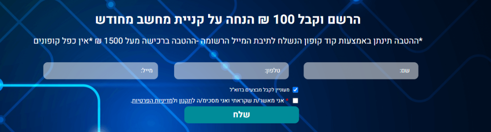
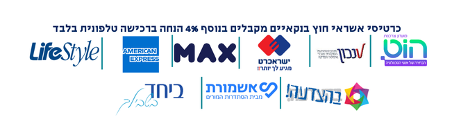
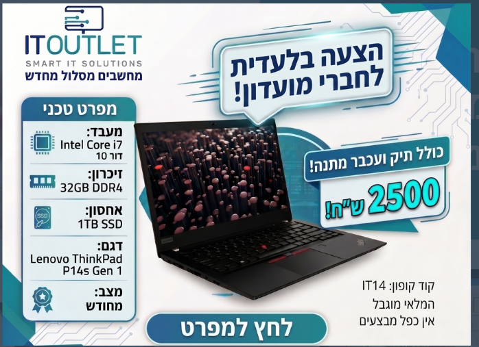

# 💻 Refurbished Laptops Market Research & Multi-Store Comparison Guide
**Stores Audited & Researched:**
1. 🏬 **Ecology Computers (אקולוגיה לקהילה מוגנת):** [ecommunity.org.il/מחשבים-ניידים](https://www.ecommunity.org.il/%D7%9E%D7%97%D7%A9%D7%91%D7%99%D7%9D-%D7%A0%D7%99%D7%99%D7%93%D7%99%D7%9D)
2. 🏬 **IT Outlet (איי טי אאוטלט):** [itoutlet.co.il/מחשבים-ניידים](https://www.itoutlet.co.il/164920-%D7%9E%D7%97%D7%A9%D7%91%D7%99%D7%9D-%D7%A0%D7%99%D7%99%D7%93%D7%99%D7%9D?order=up_price)
3. 🏬 **LaptopTech LTS (לפטופ.טק):** [lts.co.il/מחשבים-ניידים-מחודשים-יד-2](https://lts.co.il/%D7%9E%D7%97%D7%A9%D7%91%D7%99%D7%9D-%D7%A0%D7%99%D7%99%D7%93%D7%99%D7%9D-%D7%9E%D7%97%D7%95%D7%93%D7%A9%D7%99%D7%9D-%D7%99%D7%93-2/)
4. 🏬 **Recomp Computers (ריקומפ):** [recomp.co.il/מחשבים-מחודשים-במבצע](https://recomp.co.il/%d7%9e%d7%97%d7%a9%d7%91%d7%99%d7%9d-%d7%9e%d7%97%D7%95%D7%93%d7%a9%d7%99%d7%9d-%d7%91%d7%9e%d7%91%d7%a6%d7%a2/)
5. 🏬 **Olam HaKolnoa (עולם הקולנוע):** [cwc.co.il/מחשבים-מחודשים](https://www.cwc.co.il/product-category/%D7%9E%D7%97%D7%A9%D7%91%D7%99%D7%9D-%D7%95%D7%A6%D7%99%D7%95%D7%93-%D7%A0%D7%9C%D7%95%D7%95%D7%94-1/%D7%9E%D7%97%D7%A9%D7%91%D7%99%D7%9D-%D7%9E%D7%97%D7%95%D7%93%D7%A9%D7%99%D7%9D/)
6. 🏬 **Machsanei Hashmal (מחסני חשמל / Payngo):** [payngo.co.il/direct-imports-tech](https://www.payngo.co.il/computers-pcs/computing-gaming/direct-imports-tech.html)
7. 🏬 **A.L.M (א.ל.מ):** [alm.co.il/compoutlet](https://www.alm.co.il/smartphones-laptops-techproducts/compoutlet.html)
8. 🏬 **Shufersal Online (שופרסל):** [shufersal.co.il/G030401](https://www.shufersal.co.il/online/he/%D7%A7%D7%98%D7%92%D7%95%D7%A8%D7%99%D7%95%D7%AA/%D7%94%D7%A7%D7%A0%D7%99%D7%95%D7%9F-%D7%94%D7%9B%D7%9C-%D7%9C%D7%91%D7%99%D7%AA/%D7%90%D7%9C%D7%A7%D7%98%D7%A8%D7%95%D7%A0%D7%99%D7%A7%D7%94-%D7%95%D7%A1%D7%9C%D7%95%D7%9C%D7%A8/%D7%9E%D7%97%D7%A9%D7%91%D7%99%D7%9D-%D7%95%D7%92%D7%99%D7%99%D7%9E%D7%99%D7%A0%D7%92/%D7%9E%D7%97%D7%A9%D7%91%D7%99%D7%9D-%D7%A0%D7%99%D7%99%D7%93%D7%99%D7%9D-%D7%95%D7%A0%D7%99%D7%99%D7%97%D7%99%D7%9D/c/G030401)
9. 🏬 **P1000 (פי אלף):** [p1000.co.il/laptopoutlet](https://www.p1000.co.il/categories/category.aspx?categoryname=laptopoutlet)
10. 🏬 **LastPrice (לאסטפרייס):** [lastprice.co.il/c/85](https://www.lastprice.co.il/c/85/%D7%9E%D7%97%D7%A9%D7%91%D7%99%D7%9D-%D7%95%D7%92%D7%99%D7%99%D7%9E%D7%99%D7%A0%D7%92/%D7%9E%D7%97%D7%A9%D7%91%D7%99%D7%9D/%D7%9E%D7%97%D7%A9%D7%91%D7%99%D7%9D-%D7%A0%D7%99%D7%99%D7%93%D7%99%D7%9D-%D7%9E%D7%97%D7%95%D7%93%D7%A9%D7%99%D7%9D-%D7%95%D7%A2%D7%95%D7%93%D7%A4%D7%99-%D7%9E%D7%9C%D7%90%D7%99)
11. 🏬 **VOLT (וולט מחשוב ירוק):** [volt.co.il/23409-ניידים-מחודשים](https://www.volt.co.il/23409-%D7%A0%D7%99%D7%99%D7%93%D7%99%D7%9D-%D7%9E%D7%97%D7%95%D7%93%D7%A9%D7%99%D7%9D)
12. 🏬 **Ofek PC (אופק פי סי):** [ofekpc.co.il/מחשבים-ניידים-מחודשים](https://ofekpc.co.il/%D7%9E%D7%97%D7%A9%D7%91%D7%99%D7%9D-%D7%A0%D7%99%D7%99%D7%93%D7%99%D7%9D-%D7%9E%D7%97%D7%95%D7%93%D7%A9%D7%99%D7%9D)

*Last Automated Live Audit: September 13, 2026 (11:38)*

---

## 📌 Quick Navigation
- [💾 Storage Interfaces Explained](#-storage-interfaces-explained-nvme-vs-sata-vs-soldered)
- [🔧 Upgradability Scoring Guide](#-upgradability-scoring-guide)
- [🏷️ Store Discounts & Coupons](#️-it-outlet-discounts--coupon-optimization)
- [🏆 Top Recommended Picks](#-top-overall-available-picks-dynamically-auto-ranked-from-live-inventory)
- [📸 Featured Deal: ThinkPad P14s](#-featured-deal-lenovo-thinkpad-p14s-gen-1-it-outlet)
- [🏬 IT Outlet Live Audit](#-1-it-outlet-איי-טי-אאוטלט--live-catalog--stock-audit)
- [🏬 Ecology Computers Live Audit](#-2-ecology-computers-אקולוגיה-לקהילה-מוגנת--live-stock-audit)
- [🏬 LaptopTech LTS Live Audit](#-3-laptoptech-lts-לפטופטק--live-stock-audit)
- [🏬 Recomp Computers Live Audit](#-4-recomp-computers-ריקומפ--live-stock-audit)
- [🏬 Olam HaKolnoa Live Audit](#-5-olam-hakolnoa-עולם-הקולנוע--live-stock-audit)
- [🏬 Machsanei Hashmal Live Audit](#-6-machsanei-hashmal-מחסני-חשמל--payngo--live-stock-audit)
- [🏬 A.L.M Live Audit](#-7-alm-אלמ--live-stock-audit)
- [🏬 Shufersal Online Live Audit](#-8-shufersal-online-שופרסל--live-stock-audit)
- [🏬 P1000 Live Audit](#-9-p1000-פי-אלף--live-stock-audit)
- [🏬 LastPrice Live Audit](#-10-lastprice-לאסטפרייס--live-stock-audit)
- [🏬 VOLT Live Audit](#-11-volt-וולט-מחשוב-ירוק--live-stock-audit)
- [🏬 Ofek PC Live Audit](#-12-ofek-pc-אופק-פי-סי--live-stock-audit)
- [🎯 Buyer Rules of Thumb](#-quick-rules-of-thumb)

---

## 💾 Storage Interfaces Explained (NVMe vs SATA vs Soldered)

| Storage Type | Speed & Bus | Form Factor | Upgradability |
| :--- | :--- | :--- | :--- |
| ⚡ **M.2 PCIe NVMe (Gen 3 / Gen 4)** | **2,500 – 7,000 MB/s** *(Ultra-fast)* | M.2 2280 stick (looks like a stick of gum) | ✅ **100% Removable / Upgradable** to any size (1TB, 2TB, 4TB). |
| ⚡ **Dual M.2 NVMe Slots** | **Up to 7,000 MB/s** | 2 separate M.2 slots (2280 + 2242) | ✅ **Can install TWO independent internal SSDs** simultaneously. |
| 🐢 **2.5" SATA SSD / M.2 SATA** | **~500 – 550 MB/s** *(6x slower than NVMe)* | 2.5-inch drive bay or M.2 SATA key | ✅ **Removable / Upgradable**, but capped at legacy SATA III speeds. |
| 🔒 **Soldered BGA NVMe / eMMC** | **Fast (PCIe) or Slow (eMMC)** | Chips soldered directly to the logic board | ❌ **NON-UPGRADABLE** (cannot be removed or replaced). |

---

## 🔧 Upgradability Scoring Guide

* 🟢 **10/10 (Extreme Workstation):** 4x RAM slots (up to 128GB) + 2 to 4 M.2 NVMe SSD slots + tool-less access.
* 🟢 **9/10 (Full Enterprise Modular):** 2x SODIMM RAM slots (0% soldered, up to 64GB) + replaceable M.2 NVMe SSD.
* 🟢 **8.5/10 (Dual M.2 SSD Champion):** 1x RAM slot + **Dual internal M.2 NVMe SSD slots** (add a 2nd drive anytime).
* 🟡 **7.5/10 (Semi-Modular):** 1x Soldered RAM + 1x SODIMM slot (up to 40GB/48GB total) + replaceable M.2 NVMe SSD.
* 🟠 **5/10 (Storage Only / Soldered RAM):** 100% Soldered RAM (fixed) + **Standard M.2 PCIe NVMe SSD (fully replaceable)**.
* 🔴 **1/10 (Locked Down):** 100% Soldered RAM + Soldered SSD + Glued chassis (no DIY upgrades).

---

## 🏷️ IT Outlet Discounts & Coupon Optimization

IT Outlet features multiple discount programs. Note that coupons and club discounts **do not stack** (*אין כפל מבצעים / קופונים*): only **one** discount method can be applied to an order.

### 💡 How the Discounts & Sales Work:

1. **📧 100 ₪ Newsletter Sign-Up Coupon:**
   * **How to claim:** Visit [itoutlet.co.il](https://www.itoutlet.co.il), wait for the customer club pop-up modal, and enter your email address. You will receive an instant 100 ₪ discount coupon code.
   * **Conditions:** Valid on purchases **over 1,500 ₪**.
   * **Optimal range:** Best for laptops priced **between 1,500 ₪ and 2,500 ₪** (saving ~4% to 6.6% off the base price).

2. **💳 4% Credit Card & Consumer Club Discount:**
   * **How to claim:** Valid **strictly via phone orders** (*הזמנות טלפוניות בלבד*).
   * **Supported cards & clubs:** Non-bank credit cards including MAX, Isracard, Amex, LifeStyle, Hot, Tov, ביחד בשבילך, אשמורת, בהצדעה.
   * **Optimal range:** Best for laptops priced **above 2,500 ₪** (since 4% of 2,500 ₪ is 100 ₪, and at 3,000 ₪ you save 120 ₪, at 3,500 ₪ you save 140 ₪).

3. **🏷️ Special Promo Code `IT14` (ThinkPad P14s Deal):**
   * Drops the flagship **Lenovo ThinkPad P14s Gen 1** (Core i7, 32GB RAM, 1TB SSD, Dedicated GPU) from 2,800 ₪ down to **2,500 ₪** (saving 300 ₪!).
   * Also includes a complimentary laptop carrying bag and wireless optical mouse.

| 📧 100 ₪ Email Newsletter Coupon | 💳 4% Credit Card / Club Discount |
| :---: | :---: |
|  |  |

---

## 🏆 Top Overall Available Picks (Dynamically Auto-Ranked from Live Inventory)

| Category | Model | Key Specs | Best Deal Price | Store | Storage Interface | RAM Architecture | Upgradability | Direct Link |
| :--- | :--- | :--- | :---: | :---: | :--- | :--- | :---: | :---: |
| **👑 Best Value RAM Champion** | **נייד 14 אינצ' DELL Latitude E5450 מעבד i5-5200u דיסק 240GB SSD חלונות 10 ואופיס 2019 דל** | Core i5 (5th Gen) • **32GB DDR3L RAM** • 240GB SSD | **1,650 ₪** | Volt | ⚡ M.2 2280 PCIe NVMe (Swappable) | Modular / Semi-Modular | 🟡 7.5 | [View Product](https://www.volt.co.il/items/2812393-%D7%A0%D7%99%D7%99%D7%93-14-%D7%90%D7%99%D7%A0%D7%A6-DELL-Latitude-E5450-%D7%9E%D7%A2%D7%91%D7%93-i5-5200u-%D7%93%D7%99%D7%A1%D7%A7-240GB-SSD-%D7%97%D7%9C%D7%95%D7%A0%D7%95%D7%AA-10-%D7%95%D7%90%D7%95%D7%A4%D7%99%D7%A1-2019-%D7%93%D7%9C) |
| **🚀 Best 32GB + 1TB Workhorse** | **לגרפיקה ועריכה Lenovo ThinkPad P52 i7/32GB/1TB SSD** | Core i7 (8th Gen) • **32GB DDR4 RAM** • 1000GB SSD | **1,800 ₪ (100 ₪ Coupon)** | IT Outlet | ⚡ M.2 2280 PCIe NVMe (Swappable) | 2x SODIMM Slots (up to 64GB) | 🟢 9.0 | [View Product](https://www.itoutlet.co.il/items/8299583-%D7%9E%D7%97%D7%A9%D7%91-%D7%A0%D7%99%D7%99%D7%93-%D7%9E%D7%97%D7%95%D7%93%D7%A9-%D7%9C%D7%92%D7%A8%D7%A4%D7%99%D7%A7%D7%94-%D7%95%D7%A2%D7%A8%D7%99%D7%9B%D7%94-Lenovo-ThinkPad-P52-i7-32GB-1TB-SSD) |
| **⚡ Best Modern CPU Power (12th Gen)** | **Asus Vivobook E1504GA Nj 15 6 I3 8GB 250GB** | Core i3 (12th Gen) • **8GB DDR4 RAM** • 250GB SSD | **1,000 ₪** | LaptopTech LTS | ⚡ M.2 2280 PCIe NVMe (Swappable) | Modular / Semi-Modular | 🟡 7.5 | [View Product](https://lts.co.il/פריט/asus-vivobook-e1504ga-nj-15-6-i3-8gb-250gb/) |
| **🥈 Best 2-in-1 / Touchscreen** | **מחשב נייד Latitude 5420 I5 דור 11 מסך מגע “14 256GB 16GB מחודש דל DELL** | Core i5 (11th Gen) • **16GB DDR4 RAM** • 256GB SSD | **1,499 ₪** | Olam HaKolnoa | ⚡ M.2 2280 PCIe NVMe (Swappable) | 2x SODIMM Slots (up to 64GB) | 🟢 9.0 | [View Product](https://www.cwc.co.il/product/%d7%9e%d7%97%d7%a9%d7%91-%d7%a0%d7%99%d7%99%d7%93-latitude-e5420-i5-%d7%93%d7%95%d7%a8-11-%d7%9e%d7%a1%d7%9a-14-256gb-16gb-%d7%9e%d7%97%d7%95%d7%93%d7%a9-%d7%93%d7%9c-dell/) |
| **🏗️ Best Heavy Workstation** | **HP ZBook Fury 15 G7 i7 16GB 512GB (45W GPU)** | Core i7 (10th Gen) • **16GB DDR4 RAM** • 512GB SSD | **3,499 ₪ (24M Warranty)** | Ecology Computers | ⚡ Quad/Dual M.2 NVMe Slots | 4x SODIMM Slots (up to 128GB) | 🟢 10.0 | [View Product](https://www.ecommunity.org.il/page_25916) |
| **🪶 Best Featherlight (< 1.3kg)** | **מחשב נייד Lenovo X1 CARBON עם מעבד I7 דור 8 זיכרון 16 דיסק 256 מחודש לנובו** | Core i7 (8th Gen) • **16GB LPDDR4x RAM** • 256GB SSD | **1,999 ₪** | Olam HaKolnoa | ⚡ M.2 2280 PCIe NVMe (Swappable) | Soldered (Fixed) | 🟠 5.0 | [View Product](https://www.cwc.co.il/product/%d7%9e%d7%97%d7%a9%d7%91-%d7%a0%d7%99%d7%99%d7%93-lenovo-x1-carbon-%d7%a2%d7%9d-%d7%9e%d7%a2%d7%91%d7%93-i7-%d7%93%d7%95%d7%a8-8-%d7%96%d7%99%d7%9b%d7%a8%d7%95%d7%9f-16-%d7%93%d7%99%d7%a1%d7%a7-256/) |
| **🛡️ Best Peace of Mind** | **HP/Dell/Lenovo G-4 i5 8GB 240GB** | Core i5 (4th Gen) • **8GB DDR3L RAM** • 240GB SSD | **849 ₪ (24M Warranty)** | Ecology Computers | 🐢 2.5" SATA SSD / Bay | 2x SODIMM Slots | 🟡 8.0 | [View Product](https://www.ecommunity.org.il/%D7%9E%D7%97%D7%A9%D7%91-%D7%A0%D7%99%D7%99%D7%93-i5-%D7%9E%D7%97%D7%95%D7%93%D7%A9) |

---

## 📸 Featured Deal: Lenovo ThinkPad P14s Gen 1 (IT Outlet)

> **Direct Link:** [Lenovo ThinkPad P14s Gen 1 Product Page](https://www.itoutlet.co.il/items/8733190-%D7%9E%D7%97%D7%A9%D7%91-%D7%A0%D7%99%D7%99%D7%93-%D7%9E%D7%97%D7%95%D7%93%D7%A9-%D7%9C%D7%A2%D7%A8%D7%99%D7%9B%D7%94-%D7%92%D7%A8%D7%A4%D7%99%D7%AA-Lenovo-ThinkPad-P14s-Gen-1-i7-32GB-1TB-SSD)  
> **Status:** 🟢 **AVAILABLE & IN STOCK**  
> **Offer Price:** **2,500 ₪** *(Original 2,800 ₪, with coupon `IT14` — saves 300 ₪)*  
> **Includes:** Free laptop carry bag and wireless optical mouse  
> **Storage:** ⚡ **1 TB M.2 2280 PCIe 3.0 NVMe SSD** *(Fully swappable up to 2TB/4TB)*  
> **Memory:** 16 GB Soldered + 16 GB SODIMM Slot = **32 GB RAM** *(Expandable up to 48 GB)*  
> **Graphics:** Dedicated NVIDIA Quadro P520 GPU  
> **Upgradability Score:** 🟡 **7.5/10**

---

## 🏬 1. IT Outlet (איי טי אאוטלט) — Live Stock Audit

| # | Model / Product Title | CPU & Gen | RAM & SSD | Screen | Weight | Battery | Deal Price | Storage Interface | Upgradability | Direct Link |
| :-: | :--- | :--- | :---: | :---: | :---: | :---: | :---: | :--- | :---: | :---: |
| 1 | **Lenovo ThinkPad X13 G1 i7/16GB/500GB SSD** | Core i7 (10th Gen) | 16GB LPDDR4x / 500GB | 13.3" | ⚖️ 1.28 kg | 🔋 45 Wh | **1,700 ₪ (100 ₪ Coupon)** | ⚡ M.2 2280 PCIe NVMe (Swappable) | 🟠 5.0 | [View Product](https://www.itoutlet.co.il/items/7972648-%D7%9E%D7%97%D7%A9%D7%91-%D7%A0%D7%99%D7%99%D7%93-%D7%9E%D7%97%D7%95%D7%93%D7%A9-Lenovo-ThinkPad-X13-G1-i7-16GB-500GB-SSD-) |
| 2 | **לגרפיקה ועריכה Lenovo ThinkPad P52 i7/32GB/1TB SSD** | Core i7 (8th Gen) | 32GB DDR4 / 1000GB | 15.6" | ⚖️ 2.45 kg | 🔋 90 Wh | **1,800 ₪ (100 ₪ Coupon)** | ⚡ M.2 2280 PCIe NVMe (Swappable) | 🟢 9.0 | [View Product](https://www.itoutlet.co.il/items/8299583-%D7%9E%D7%97%D7%A9%D7%91-%D7%A0%D7%99%D7%99%D7%93-%D7%9E%D7%97%D7%95%D7%93%D7%A9-%D7%9C%D7%92%D7%A8%D7%A4%D7%99%D7%A7%D7%94-%D7%95%D7%A2%D7%A8%D7%99%D7%9B%D7%94-Lenovo-ThinkPad-P52-i7-32GB-1TB-SSD) |
| 3 | **Dell Latitude 7410 i7/16GB/500GB SSD** | Core i7 (10th Gen) | 16GB LPDDR4x / 500GB | 14.0" | ⚖️ 1.35 kg | 🔋 50 Wh | **1,900 ₪ (100 ₪ Coupon)** | ⚡ M.2 2280 PCIe NVMe (Swappable) | 🟠 5.0 | [View Product](https://www.itoutlet.co.il/items/6851586-%D7%9E%D7%97%D7%A9%D7%91-%D7%A0%D7%99%D7%99%D7%93-%D7%9E%D7%97%D7%95%D7%93%D7%A9-Dell-Latitude-7410-i7-16GB-500GB-SSD) |
| 4 | **Lenovo ThinkPad T14 GEN1 i7/32GB/512GB SSD** | Core i7 (10th Gen) | 32GB DDR4 / 1000GB | 14.0" | ⚖️ 1.55 kg | 🔋 51 Wh | **1,900 ₪ (100 ₪ Coupon)** | ⚡ M.2 2280 PCIe NVMe (Swappable) | 🟡 7.5 | [View Product](https://www.itoutlet.co.il/items/5337411-%D7%9E%D7%97%D7%A9%D7%91-%D7%A0%D7%99%D7%99%D7%93-%D7%9E%D7%97%D7%95%D7%93%D7%A9-Lenovo-ThinkPad-T14-GEN1-i7-32GB-512GB-SSD) |
| 5 | **Lenovo ThinkPad T14s GEN1 i7/32GB/1TB SSD** | Core i7 (10th Gen) | 32GB LPDDR4x / 1000GB | 14.0" | ⚖️ 1.35 kg | 🔋 57 Wh | **2,100 ₪ (100 ₪ Coupon)** | ⚡ M.2 2280 PCIe NVMe (Swappable) | 🟠 5.0 | [View Product](https://www.itoutlet.co.il/items/8314186-%D7%9E%D7%97%D7%A9%D7%91-%D7%A0%D7%99%D7%99%D7%93-%D7%9E%D7%97%D7%95%D7%93%D7%A9-Lenovo-ThinkPad-T14s-GEN1-i7-32GB-1TB-SSD) |
| 6 | **Lenovo ThinkPad P15s Gen 1 i7/16GB/512GB SSD** | Core i7 (10th Gen) | 16GB DDR4 / 512GB | 15.6" | ⚖️ 1.75 kg | 🔋 51 Wh | **2,100 ₪ (100 ₪ Coupon)** | ⚡ Dual M.2 PCIe NVMe Slots | 🟢 9.5 | [View Product](https://www.itoutlet.co.il/items/8608165-%D7%9E%D7%97%D7%A9%D7%91-%D7%A0%D7%99%D7%99%D7%93-%D7%9E%D7%97%D7%95%D7%93%D7%A9-%D7%9C%D7%A2%D7%A8%D7%99%D7%9B%D7%94-%D7%92%D7%A8%D7%A4%D7%99%D7%AA-Lenovo-ThinkPad-P15s-Gen-1-i7-16GB-512GB-SSD) |
| 7 | **Lenovo ThinkPad T14s Gen 2 i5/16GB/512GB SSD** | Core i5 (11th Gen) | 16GB LPDDR4x / 512GB | 14.0" | ⚖️ 1.35 kg | 🔋 57 Wh | **2,200 ₪ (100 ₪ Coupon)** | ⚡ M.2 2280 PCIe NVMe (Swappable) | 🟠 5.0 | [View Product](https://www.itoutlet.co.il/items/7617612-%D7%9E%D7%97%D7%A9%D7%91-%D7%A0%D7%99%D7%99%D7%93-%D7%9E%D7%97%D7%95%D7%93%D7%A9-Lenovo-ThinkPad-T14s-Gen-2-i5-16GB-512GB-SSD) |
| 8 | **DELL Latitude 7420 i7/16GB/512GB SSD** | Core i7 (11th Gen) | 16GB LPDDR4x / 512GB | 14.0" | ⚖️ 1.22 kg | 🔋 63 Wh | **2,200 ₪ (100 ₪ Coupon)** | ⚡ M.2 2280 PCIe NVMe (Swappable) | 🟠 5.0 | [View Product](https://www.itoutlet.co.il/items/5665104-%D7%9E%D7%97%D7%A9%D7%91-%D7%A0%D7%99%D7%99%D7%93-%D7%9E%D7%97%D7%95%D7%93%D7%A9-DELL-Latitude-7420-i7-16GB-512GB-SSD-) |
| 9 | **Dell Latitude 3520 i7/16GB/512GB SSD** | Core i7 (11th Gen) | 16GB DDR4 / 512GB | 15.6" | ⚖️ 1.75 kg | 🔋 54 Wh | **2,300 ₪ (100 ₪ Coupon)** | ⚡ M.2 2280 PCIe NVMe (Swappable) | 🟡 7.5 | [View Product](https://www.itoutlet.co.il/items/9481010-%D7%9E%D7%97%D7%A9%D7%91-%D7%A0%D7%99%D7%99%D7%93-%D7%9E%D7%97%D7%95%D7%93%D7%A9-Dell-Latitude-3520-i7-16GB-512GB-SSD-) |
| 10 | **Microsoft Surface 3 i7/16GB/500GB SSD** | Core i7 (10th Gen) | 16GB LPDDR4x / 500GB | 13.5" | ⚖️ 1.28 kg | 🔋 49 Wh | **2,400 ₪ (4% Card Disc.)** | 🔒 Soldered BGA NVMe / Unified | 🟠 1.0 | [View Product](https://www.itoutlet.co.il/items/7283286-%D7%9E%D7%97%D7%A9%D7%91-%D7%A0%D7%99%D7%99%D7%93-%D7%9E%D7%97%D7%95%D7%93%D7%A9-Microsoft-Surface-3-i7-16GB-500GB-SSD) |
| 11 | **Lenovo ThinkPad E14 Gen 4 i7/16GB/512GB SSD** | Core i7 (12th Gen) | 16GB DDR4 / 512GB | 14.0" | ⚖️ 1.55 kg | 🔋 51 Wh | **2,400 ₪ (4% Card Disc.)** | ⚡ Dual M.2 NVMe Slots (2242 + 2280) | 🟢 8.5 | [View Product](https://www.itoutlet.co.il/items/8914011-%D7%9E%D7%97%D7%A9%D7%91-%D7%A0%D7%99%D7%99%D7%93-%D7%9E%D7%97%D7%95%D7%93%D7%A9-Lenovo-ThinkPad-E14-Gen-4-i7-16GB-512GB-SSD) |
| 12 | **Lenovo ThinkPad P1 Gen 3 i7/32GB/512GB SSD** | Core i7 (10th Gen) | 32GB DDR4 / 512GB | 15.6" | ⚖️ 2.05 kg | 🔋 90 Wh | **2,400 ₪ (4% Card Disc.)** | ⚡ Dual M.2 PCIe NVMe Slots | 🟢 9.5 | [View Product](https://www.itoutlet.co.il/items/7476604-%D7%9E%D7%97%D7%A9%D7%91-%D7%A0%D7%99%D7%99%D7%93-%D7%9E%D7%97%D7%95%D7%93%D7%A9-Lenovo-ThinkPad-P1-Gen-3-i7-32GB-512GB-SSD) |
| 13 | **Lenovo ThinkPad P15 GEN1 i7/32GB/1TB SSD** | Core i7 | 32GB DDR4 / 1000GB | 15.6" | ⚖️ 2.05 kg | 🔋 90 Wh | **2,400 ₪ (4% Card Disc.)** | ⚡ Quad/Dual M.2 NVMe Slots | 🟢 10.0 | [View Product](https://www.itoutlet.co.il/items/7388291-%D7%9E%D7%97%D7%A9%D7%91-%D7%A0%D7%99%D7%99%D7%93-%D7%9E%D7%97%D7%95%D7%93%D7%A9-%D7%9C%D7%A2%D7%A8%D7%99%D7%9B%D7%94-%D7%92%D7%A8%D7%A4%D7%99%D7%AA-Lenovo-ThinkPad-P15-GEN1-i7-32GB-1TB-SSD) |
| 14 | **Lenovo ThinkPad X1 Carbon Gen8 i7/16GB/500GB** | Core i7 (10th Gen) | 16GB LPDDR4x / 500GB | 14.0" | ⚖️ 1.1 kg | 🔋 57 Wh | **2,400 ₪ (4% Card Disc.)** | ⚡ M.2 2280 PCIe NVMe (Swappable) | 🟠 5.0 | [View Product](https://www.itoutlet.co.il/items/6505116-%D7%9E%D7%97%D7%A9%D7%91-%D7%A0%D7%99%D7%99%D7%93-%D7%9E%D7%97%D7%95%D7%93%D7%A9-Lenovo-ThinkPad-X1-Carbon-Gen8-i7-16GB-500GB) |
| 15 | **Lenovo ThinkPad T14 GEN2 i7/32GB/512GB SSD** | Core i7 (11th Gen) | 32GB DDR4 / 512GB | 14.0" | ⚖️ 1.55 kg | 🔋 51 Wh | **2,496 ₪ (4% Card Disc.)** | ⚡ M.2 2280 PCIe NVMe (Swappable) | 🟡 7.5 | [View Product](https://www.itoutlet.co.il/items/8273750-%D7%9E%D7%97%D7%A9%D7%91-%D7%A0%D7%99%D7%99%D7%93-%D7%9E%D7%97%D7%95%D7%93%D7%A9-Lenovo-ThinkPad-T14-GEN2-i7-32GB-512GB-SSD) |
| 16 | **Lenovo ThinkPad L13 Gen 3 i5/16GB/512GB SSD** | Core i5 (12th Gen) | 16GB DDR4 / 512GB | 13.3" | ⚖️ 1.4 kg | 🔋 50 Wh | **2,496 ₪ (4% Card Disc.)** | ⚡ M.2 2280 PCIe NVMe (Swappable) | 🟡 7.5 | [View Product](https://www.itoutlet.co.il/items/9582063-%D7%9E%D7%97%D7%A9%D7%91-%D7%A0%D7%99%D7%99%D7%93-%D7%9E%D7%97%D7%95%D7%93%D7%A9-Lenovo-ThinkPad-L13-Gen-3-i5-16GB-512GB-SSD) |
| 17 | **Lenovo ThinkPad P14s Gen 1 i7/32GB/1TB SSD** | Core i7 (10th Gen) | 32GB DDR4 / 1000GB | 14.0" | ⚖️ 1.55 kg | 🔋 51 Wh | **2,500 ₪ (Coupon IT14)** | ⚡ Dual M.2 PCIe NVMe Slots | 🟢 9.5 | [View Product](https://www.itoutlet.co.il/items/8733190-%D7%9E%D7%97%D7%A9%D7%91-%D7%A0%D7%99%D7%99%D7%93-%D7%9E%D7%97%D7%95%D7%93%D7%A9-%D7%9C%D7%A2%D7%A8%D7%99%D7%9B%D7%94-%D7%92%D7%A8%D7%A4%D7%99%D7%AA-Lenovo-ThinkPad-P14s-Gen-1-i7-32GB-1TB-SSD) |
| 18 | **Lenovo ThinkPad T14s Gen 2 Ryzen 5/16GB/512GB SSD** | AMD Ryzen 5 PRO | 16GB LPDDR4 / 512GB | 14.0" | ⚖️ 1.35 kg | 🔋 57 Wh | **2,688 ₪ (4% Card Disc.)** | ⚡ M.2 2280 PCIe NVMe (Swappable) | 🟠 5.0 | [View Product](https://www.itoutlet.co.il/items/9505817-%D7%9E%D7%97%D7%A9%D7%91-%D7%A0%D7%99%D7%99%D7%93-%D7%9E%D7%97%D7%95%D7%93%D7%A9-Lenovo-ThinkPad-T14s-Gen-2-Ryzen-5-16GB-512GB-SSD) |
| 19 | **Microsoft Surface 4 i7/16GB/500GB SSD** | Core i7 (11th Gen) | 16GB LPDDR4x / 500GB | 13.5" | ⚖️ 1.28 kg | 🔋 49 Wh | **2,688 ₪ (4% Card Disc.)** | 🔒 Soldered BGA NVMe / Unified | 🟠 1.0 | [View Product](https://www.itoutlet.co.il/items/7777501-%D7%9E%D7%97%D7%A9%D7%91-%D7%A0%D7%99%D7%99%D7%93-%D7%9E%D7%97%D7%95%D7%93%D7%A9-Microsoft-Surface-4-i7-16GB-500GB-SSD) |
| 20 | **Lenovo ThinkPad T14s Gen 2 i7/32GB/1TB NVMe** | Core i7 (11th Gen) | 32GB LPDDR4x / 1000GB | 14.0" | ⚖️ 1.35 kg | 🔋 57 Wh | **2,784 ₪ (4% Card Disc.)** | ⚡ M.2 2280 PCIe NVMe (Swappable) | 🟠 5.0 | [View Product](https://www.itoutlet.co.il/items/8385913-%D7%9E%D7%97%D7%A9%D7%91-%D7%A0%D7%99%D7%99%D7%93-%D7%9E%D7%97%D7%95%D7%93%D7%A9-Lenovo-ThinkPad-T14s-Gen-2-i7-32GB-1TB-NVMe) |
| 21 | **Dell Latitude 5330 i7/32GB/512GB SSD** | Core i7 (12th Gen) | 32GB DDR4 / 512GB | 13.3" | ⚖️ 1.35 kg | 🔋 57 Wh | **2,880 ₪ (4% Card Disc.)** | ⚡ M.2 2280 PCIe NVMe (Swappable) | 🟡 7.5 | [View Product](https://www.itoutlet.co.il/items/9530736-%D7%9E%D7%97%D7%A9%D7%91-%D7%A0%D7%99%D7%99%D7%93-%D7%9E%D7%97%D7%95%D7%93%D7%A9-Dell-Latitude-5330-i7-32GB-512GB-SSD-) |
| 22 | **Dell Latitude 5430 i7/32GB/500GB SSD** | Core i7 (12th Gen) | 32GB DDR4 / 500GB | 14.0" | ⚖️ 1.55 kg | 🔋 57 Wh | **2,880 ₪ (4% Card Disc.)** | ⚡ M.2 2280 PCIe NVMe (Swappable) | 🟢 9.0 | [View Product](https://www.itoutlet.co.il/items/8488051-%D7%9E%D7%97%D7%A9%D7%91-%D7%A0%D7%99%D7%99%D7%93-%D7%9E%D7%97%D7%95%D7%93%D7%A9-Dell-Latitude-5430-i7-32GB-500GB-SSD-) |
| 23 | **HP ProBook x360 435 G7 Ryzen 7/32GB/512GB SSD** | AMD Ryzen 7 PRO | 32GB DDR4 / 512GB | 13.3" | ⚖️ 1.4 kg | 🔋 45 Wh | **2,880 ₪ (4% Card Disc.)** | ⚡ M.2 2280 PCIe NVMe (Swappable) | 🟢 9.0 | [View Product](https://www.itoutlet.co.il/items/9538702-HP-ProBook-x360-435-G7-Ryzen-7-32GB-512GB-SSD) |
| 24 | **Dell Latitude 5530 i7/32GB/512GB SSD** | Core i7 (12th Gen) | 32GB DDR4 / 512GB | 15.6" | ⚖️ 1.75 kg | 🔋 57 Wh | **2,880 ₪ (4% Card Disc.)** | ⚡ M.2 2280 PCIe NVMe (Swappable) | 🟢 9.0 | [View Product](https://www.itoutlet.co.il/items/8314070-%D7%9E%D7%97%D7%A9%D7%91-%D7%A0%D7%99%D7%99%D7%93-%D7%9E%D7%97%D7%95%D7%93%D7%A9-Dell-Latitude-5530-i7-32GB-512GB-SSD-) |
| 25 | **Lenovo ThinkPad P14s Gen 2 i7/32GB/1TB SSD** | Core i7 (11th Gen) | 32GB DDR4 / 1000GB | 14.0" | ⚖️ 1.55 kg | 🔋 51 Wh | **2,500 ₪ (Coupon IT14)** | ⚡ Dual M.2 PCIe NVMe Slots | 🟢 9.5 | [View Product](https://www.itoutlet.co.il/items/7285805-%D7%9E%D7%97%D7%A9%D7%91-%D7%A0%D7%99%D7%99%D7%93-%D7%9E%D7%97%D7%95%D7%93%D7%A9-%D7%9C%D7%A2%D7%A8%D7%99%D7%9B%D7%94-%D7%92%D7%A8%D7%A4%D7%99%D7%AA-Lenovo-ThinkPad-P14s-Gen-2-i7-32GB-1TB-SSD) |
| 26 | **מחשב מחודש לעריכה גרפית HP ZBook Firefly 14 G8 i7/32GB/1TB SSD** | Core i7 (11th Gen) | 32GB DDR4 / 1000GB | 14.0" | ⚖️ 1.4 kg | 🔋 51 Wh | **3,072 ₪ (4% Card Disc.)** | ⚡ M.2 2280 PCIe NVMe (Swappable) | 🟢 9.0 | [View Product](https://www.itoutlet.co.il/items/9210216-%D7%9E%D7%97%D7%A9%D7%91-%D7%9E%D7%97%D7%95%D7%93%D7%A9-%D7%9C%D7%A2%D7%A8%D7%99%D7%9B%D7%94-%D7%92%D7%A8%D7%A4%D7%99%D7%AA-HP-ZBook-Firefly-14-G8-i7-32GB-1TB-SSD-) |
| 27 | **Lenovo ThinkPad P1 Gen 3 i9/32GB/1TB SSD** | Core i9 (10th Gen) | 32GB DDR4 / 1000GB | 15.6" | ⚖️ 2.05 kg | 🔋 90 Wh | **3,168 ₪ (4% Card Disc.)** | ⚡ Dual M.2 PCIe NVMe Slots | 🟢 9.5 | [View Product](https://www.itoutlet.co.il/items/7897909-%D7%9E%D7%97%D7%A9%D7%91-%D7%A0%D7%99%D7%99%D7%93-%D7%9E%D7%97%D7%95%D7%93%D7%A9-%D7%9C%D7%A2%D7%A8%D7%99%D7%9B%D7%94-%D7%92%D7%A8%D7%A4%D7%99%D7%AA-Lenovo-ThinkPad-P1-Gen-3-i9-32GB-1TB-SSD) |
| 28 | **Dell Latitude 7330 i7/16GB/512GB SSD** | Core i7 (12th Gen) | 16GB LPDDR5 / 512GB | 13.3" | ⚖️ 1.2 kg | 🔋 57 Wh | **3,168 ₪ (4% Card Disc.)** | ⚡ M.2 2280 PCIe NVMe (Swappable) | 🟡 7.5 | [View Product](https://www.itoutlet.co.il/items/7892116-%D7%9E%D7%97%D7%A9%D7%91-%D7%A0%D7%99%D7%99%D7%93-%D7%9E%D7%97%D7%95%D7%93%D7%A9-Dell-Latitude-7330-i7-16GB-512GB-SSD-) |
| 29 | **Lenovo Thinkpad X1 Yoga Gen6 i7/16GB/500GB** | Core i7 (11th Gen) | 16GB DDR4 / 500GB | 14.0" | ⚖️ 1.5 kg | 🔋 50 Wh | **3,168 ₪ (4% Card Disc.)** | ⚡ M.2 2280 PCIe NVMe (Swappable) | 🟡 7.5 | [View Product](https://www.itoutlet.co.il/items/8299691-%D7%9E%D7%97%D7%A9%D7%91-%D7%A0%D7%99%D7%99%D7%93-%D7%9E%D7%97%D7%95%D7%93%D7%A9-Lenovo-Thinkpad-X1-Yoga-Gen6-i7-16GB-500GB-) |
| 30 | **Lenovo ThinkPad X1 Carbon Gen9 i7/16GB/1TB** | Core i7 (11th Gen) | 16GB LPDDR4x / 1000GB | 14.0" | ⚖️ 1.1 kg | 🔋 57 Wh | **3,264 ₪ (4% Card Disc.)** | ⚡ M.2 2280 PCIe NVMe (Swappable) | 🟠 5.0 | [View Product](https://www.itoutlet.co.il/items/8299647-%D7%9E%D7%97%D7%A9%D7%91-%D7%A0%D7%99%D7%99%D7%93-%D7%9E%D7%97%D7%95%D7%93%D7%A9-Lenovo-ThinkPad-X1-Carbon-Gen9-i7-16GB-1TB) |
| 31 | **Dell Latitude 5431 i7/32GB/1TB SSD** | Core i7 (12th Gen) | 32GB DDR4 / 1000GB | 14.0" | ⚖️ 1.55 kg | 🔋 68 Wh | **3,360 ₪ (4% Card Disc.)** | ⚡ M.2 2280 PCIe NVMe (Swappable) | 🟢 9.0 | [View Product](https://www.itoutlet.co.il/items/6960903-%D7%9E%D7%97%D7%A9%D7%91-%D7%A0%D7%99%D7%99%D7%93-%D7%9E%D7%97%D7%95%D7%93%D7%A9-Dell-Latitude-5431-i7-32GB-1TB-SSD-) |
| 32 | **Dell Latitude 5531 i7/32GB/1TB SSD** | Core i7 (12th Gen) | 32GB DDR4 / 1000GB | 15.6" | ⚖️ 1.75 kg | 🔋 68 Wh | **3,360 ₪ (4% Card Disc.)** | ⚡ M.2 2280 PCIe NVMe (Swappable) | 🟢 9.0 | [View Product](https://www.itoutlet.co.il/items/6960942-%D7%9E%D7%97%D7%A9%D7%91-%D7%A0%D7%99%D7%99%D7%93-%D7%9E%D7%97%D7%95%D7%93%D7%A9-Dell-Latitude-5531-i7-32GB-1TB-SSD-) |
| 33 | **Lenovo ThinkPad T14 Gen 3 i7/32GB/512GB SSD** | Core i7 (12th Gen) | 32GB DDR4 / 512GB | 14.0" | ⚖️ 1.55 kg | 🔋 51 Wh | **3,360 ₪ (4% Card Disc.)** | ⚡ M.2 2280 PCIe NVMe (Swappable) | 🟡 7.5 | [View Product](https://www.itoutlet.co.il/items/9084495-%D7%9E%D7%97%D7%A9%D7%91-%D7%A0%D7%99%D7%99%D7%93-%D7%9E%D7%97%D7%95%D7%93%D7%A9-Lenovo-ThinkPad-T14-Gen-3-i7-32GB-512GB-SSD) |
| 34 | **Lenovo ThinkPad P15v Gen 2 i9/32GB/512GB SSD** | Core i9 (2nd Gen) | 32GB DDR3L / 512GB | 15.6" | ⚖️ 2.05 kg | 🔋 68 Wh | **3,360 ₪ (4% Card Disc.)** | ⚡ Dual M.2 PCIe NVMe Slots | 🟢 9.5 | [View Product](https://www.itoutlet.co.il/items/9319793-%D7%9E%D7%97%D7%A9%D7%91-%D7%A0%D7%99%D7%99%D7%93-%D7%9E%D7%97%D7%95%D7%93%D7%A9-Lenovo-ThinkPad-P15v-Gen-2-i9-32GB-512GB-SSD) |
| 35 | **Lenovo ThinkPad T15g Gen1 i9/64GB/1TB SSD** | Core i9 | 64GB DDR4 / 1000GB | 15.6" | ⚖️ 1.75 kg | 🔋 54 Wh | **3,360 ₪ (4% Card Disc.)** | ⚡ M.2 2280 PCIe NVMe (Swappable) | 🟡 7.5 | [View Product](https://www.itoutlet.co.il/items/7120006-%D7%9E%D7%97%D7%A9%D7%91-%D7%A0%D7%99%D7%99%D7%93-%D7%9E%D7%97%D7%95%D7%93%D7%A9-Lenovo-ThinkPad-T15g-Gen1-i9-64GB-1TB-SSD) |
| 36 | **Microsoft Surface 4 i7/32GB/1TB SSD** | Core i7 (11th Gen) | 32GB LPDDR4x / 1000GB | 13.5" | ⚖️ 1.28 kg | 🔋 49 Wh | **3,360 ₪ (4% Card Disc.)** | 🔒 Soldered BGA NVMe / Unified | 🟠 1.0 | [View Product](https://www.itoutlet.co.il/items/9347740-%D7%9E%D7%97%D7%A9%D7%91-%D7%A0%D7%99%D7%99%D7%93-%D7%9E%D7%97%D7%95%D7%93%D7%A9-Microsoft-Surface-4-i7-32GB-1TB-SSD) |

---

## 🏬 2. Ecology Computers (אקולוגיה לקהילה מוגנת) — Live Stock Audit

*(All laptops include a full 24-Month / 2-Year Warranty)*

| # | Model / Product Title | CPU & Gen | RAM & SSD | Screen | Weight | Battery | Deal Price | Storage Interface | Upgradability | Direct Link |
| :-: | :--- | :--- | :---: | :---: | :---: | :---: | :---: | :--- | :---: | :---: |
| 1 | **HP ZBook G7 14" i5 16GB 240GB** | Core i5 (10th Gen) | 16GB DDR4 / 240GB | 14.0" | ⚖️ 2.25 kg | 🔋 54 Wh | **1,849 ₪ (24M Warranty)** | ⚡ M.2 2280 PCIe NVMe (Swappable) | 🟡 7.5 | [View Product](https://www.ecommunity.org.il/hp_zbook_i5) |
| 2 | **HP EliteBook x360 830 G8 Touch i7 16GB 512GB** | Core i7 (11th Gen) | 16GB LPDDR4x / 512GB | 13.3" | ⚖️ 1.35 kg | 🔋 51 Wh | **2,199 ₪ (24M Warranty)** | ⚡ M.2 2280 PCIe NVMe (Swappable) | 🟠 5.0 | [View Product](https://www.ecommunity.org.il/lti71030g8_touch) |
| 3 | **Dell Latitude 5480 i5 8GB 256GB** | Core i5 (7th Gen) | 8GB DDR4 / 256GB | 14.0" | ⚖️ 1.55 kg | 🔋 45 Wh | **1,049 ₪ (24M Warranty)** | 🐢 2.5" SATA SSD / Bay | 🟡 8.0 | [View Product](https://www.ecommunity.org.il/page_19398) |
| 4 | **Lenovo ThinkPad E14 i5 16GB 512GB Dual SSD** | Core i5 | 16GB DDR4 / 512GB | 14.0" | ⚖️ 1.55 kg | 🔋 50 Wh | **1,850 ₪ (24M Warranty)** | ⚡ Dual M.2 NVMe Slots (2242 + 2280) | 🟢 8.5 | [View Product](https://www.ecommunity.org.il/page_20368) |
| 5 | **Lenovo ThinkPad X280 i5 8GB 240GB** | Core i5 (8th Gen) | 8GB LPDDR4 / 240GB | 12.5" | ⚖️ 1.28 kg | 🔋 45 Wh | **999 ₪ (24M Warranty)** | ⚡ M.2 2280 PCIe NVMe (Swappable) | 🟠 5.0 | [View Product](https://www.ecommunity.org.il/page_21809) |
| 6 | **Dell Latitude 5410 i5 8GB 240GB** | Core i5 (10th Gen) | 8GB DDR4 / 240GB | 14.0" | ⚖️ 1.55 kg | 🔋 45 Wh | **1,399 ₪ (24M Warranty)** | ⚡ M.2 2280 PCIe NVMe (Swappable) | 🟢 9.0 | [View Product](https://www.ecommunity.org.il/page_22509) |
| 7 | **HP ZBook Fury 15 G7 i7 16GB 512GB (45W GPU)** | Core i7 (10th Gen) | 16GB DDR4 / 512GB | 15.6" | ⚖️ 2.45 kg | 🔋 90 Wh | **3,499 ₪ (24M Warranty)** | ⚡ Quad/Dual M.2 NVMe Slots | 🟢 10.0 | [View Product](https://www.ecommunity.org.il/page_25916) |
| 8 | **HP ZBook 15 G6 i7 16GB 512GB Quadro GPU** | Core i7 (9th Gen) | 16GB DDR4 / 512GB | 15.6" | ⚖️ 2.25 kg | 🔋 68 Wh | **2,799 ₪ (24M Warranty)** | ⚡ M.2 2280 PCIe NVMe (Swappable) | 🟡 7.5 | [View Product](https://www.ecommunity.org.il/page_26486) |
| 9 | **HP EliteBook 850 G7 i5 8GB 256GB** | Core i5 (10th Gen) | 8GB DDR4 / 256GB | 15.6" | ⚖️ 1.75 kg | 🔋 54 Wh | **1,849 ₪ (24M Warranty)** | ⚡ M.2 2280 PCIe NVMe (Swappable) | 🟢 9.0 | [View Product](https://www.ecommunity.org.il/page_27023) |
| 10 | **Lenovo ThinkPad T14 Touch i5 16GB 256GB** | Core i5 | 16GB DDR4 / 256GB | 14.0" | ⚖️ 1.55 kg | 🔋 51 Wh | **1,849 ₪ (24M Warranty)** | ⚡ M.2 2280 PCIe NVMe (Swappable) | 🟡 7.5 | [View Product](https://www.ecommunity.org.il/thinkpad_t14) |
| 11 | **HP/Dell/Lenovo G-4 i5 8GB 240GB** | Core i5 (4th Gen) | 8GB DDR3L / 240GB | 14.0" | ⚖️ 1.5 kg | 🔋 50 Wh | **849 ₪ (24M Warranty)** | 🐢 2.5" SATA SSD / Bay | 🟡 8.0 | [View Product](https://www.ecommunity.org.il/%D7%9E%D7%97%D7%A9%D7%91-%D7%A0%D7%99%D7%99%D7%93-i5-%D7%9E%D7%97%D7%95%D7%93%D7%A9) |
| 12 | **Lenovo ThinkPad E480 i7 16GB 240GB** | Core i7 (8th Gen) | 16GB DDR4 / 240GB | 14.0" | ⚖️ 1.55 kg | 🔋 45 Wh | **1,349 ₪ (24M Warranty)** | ⚡ M.2 2280 PCIe NVMe (Swappable) | 🟢 9.0 | [View Product](https://www.ecommunity.org.il/%D7%9E%D7%97%D7%A9%D7%91-%D7%A0%D7%99%D7%99%D7%93-%D7%9C%D7%A0%D7%95%D7%91%D7%95-lenovo-i7-thinkpad-e480-14-%D7%9E%D7%97%D7%95%D7%93%D7%A9) |

---

## 🏬 3. LaptopTech LTS (לפטופ.טק) — Live Stock Audit

| # | Model / Product Title | CPU & Gen | RAM & SSD | Screen | Weight | Battery | Deal Price | Storage Interface | Upgradability | Direct Link |
| :-: | :--- | :--- | :---: | :---: | :---: | :---: | :---: | :--- | :---: | :---: |
| 1 | **Acer A517 52G 51E7 17 3 I5 8GB 1TB** | Core i5 (11th Gen) | 8GB DDR4 / 1000GB | 17.3" | ⚖️ 2.6 kg | 🔋 41 Wh | **1,300 ₪** | ⚡ M.2 2280 PCIe NVMe (Swappable) | 🟢 9.0 | [View Product](https://lts.co.il/פריט/acer-a517-52g-51e7-17-3-i5-8gb-1tb/) |
| 2 | **Acer SFX14 41G 1RS6 14 Amd 16G 500G** | AMD Ryzen | 16GB DDR4 / 500GB | 14.0" | ⚖️ 1.55 kg | 🔋 50 Wh | **2,100 ₪** | ⚡ M.2 2280 PCIe NVMe (Swappable) | 🟡 7.5 | [View Product](https://lts.co.il/פריט/acer-sfx14-41g-1rs6-14-amd-16g-500g/) |
| 3 | **Asus Vivobook E1504GA Nj 15 6 I3 8GB 250GB** | Core i3 (12th Gen) | 8GB DDR4 / 250GB | 15.6" | ⚖️ 1.75 kg | 🔋 41 Wh | **1,000 ₪** | ⚡ M.2 2280 PCIe NVMe (Swappable) | 🟡 7.5 | [View Product](https://lts.co.il/פריט/asus-vivobook-e1504ga-nj-15-6-i3-8gb-250gb/) |
| 4 | **Asus X1404ZA Nk 14 I5 16GB 500GB** | Core i5 (12th Gen) | 16GB DDR4 / 500GB | 14.0" | ⚖️ 1.55 kg | 🔋 50 Wh | **1,600 ₪** | ⚡ M.2 2280 PCIe NVMe (Swappable) | 🟡 7.5 | [View Product](https://lts.co.il/פריט/asus-x1404za-nk-14-i5-16gb-500gb/) |
| 5 | **Asus X442UR 14 I5 8G 250G** | Core i5 (7th Gen) | 8GB DDR4 / 250GB | 14.0" | ⚖️ 1.85 kg | 🔋 54 Wh | **1,100 ₪** | ⚡ M.2 2280 PCIe NVMe (Swappable) | 🟡 7.5 | [View Product](https://lts.co.il/פריט/asus-x442ur-14-i5-8g-250g/) |
| 6 | **Asus X515EA Ej 15 6 I3 8GB 250GB** | Core i3 (11th Gen) | 8GB DDR4 / 250GB | 15.6" | ⚖️ 1.75 kg | 🔋 41 Wh | **1,000 ₪** | ⚡ M.2 2280 PCIe NVMe (Swappable) | 🟡 7.5 | [View Product](https://lts.co.il/פריט/asus-x515ea-ej-15-6-i3-8gb-250gb/) |
| 7 | **Dell Inspiron 13 5379 2 In 1 Touch 13 3 I7 8GB 250GB** | Core i7 (8th Gen) | 8GB DDR4 / 250GB | 13.3" | ⚖️ 1.3 kg | 🔋 50 Wh | **1,400 ₪** | ⚡ M.2 2280 PCIe NVMe (Swappable) | 🟢 9.0 | [View Product](https://lts.co.il/פריט/dell-inspiron-13-5379-2-in-1-touch-13-3-i7-8gb-250gb/) |
| 8 | **Dell Latitude E7440 Touch 14 I5 8GB 500GB** | Core i5 (4th Gen) | 8GB DDR3L / 500GB | 14.0" | ⚖️ 1.55 kg | 🔋 45 Wh | **1,000 ₪** | 🐢 2.5" SATA SSD / Bay | 🟡 8.0 | [View Product](https://lts.co.il/פריט/dell-latitude-e7440-touch-14-i5-8gb-500gb/) |
| 9 | **Dell Vostro 3591 15 6 I5 8GB 250GB** | Core i5 (10th Gen) | 8GB DDR4 / 250GB | 15.6" | ⚖️ 1.8 kg | 🔋 54 Wh | **1,200 ₪** | ⚡ M.2 2280 PCIe NVMe (Swappable) | 🟢 9.0 | [View Product](https://lts.co.il/פריט/dell-vostro-3591-15-6-i5-8gb-250gb/) |
| 10 | **Hp 15 AY010NJ 15 6 I3 8G 250G** | Core i3 (6th Gen) | 8GB DDR4 / 250GB | 15.6" | ⚖️ 1.85 kg | 🔋 41 Wh | **900 ₪** | ⚡ M.2 2280 PCIe NVMe (Swappable) | 🟡 7.5 | [View Product](https://lts.co.il/פריט/hp-15-ay010nj-15-6-i3-8g-250g/) |
| 11 | **Hp 250 G7 15 6 Amd 8GB 250GB** | AMD Ryzen | 8GB DDR4 / 250GB | 15.6" | ⚖️ 1.85 kg | 🔋 41 Wh | **1,000 ₪** | ⚡ M.2 2280 PCIe NVMe (Swappable) | 🟡 7.5 | [View Product](https://lts.co.il/פריט/hp-250-g7-15-6-amd-8gb-250gb/) |
| 12 | **Hp 255 G5 15 6 Amd 8G 128G** | AMD Ryzen | 8GB DDR4 / 128GB | 15.6" | ⚖️ 1.85 kg | 🔋 41 Wh | **800 ₪** | 🐢 2.5" SATA SSD / Bay | 🟡 8.0 | [View Product](https://lts.co.il/פריט/hp-255-g5-15-6-amd-8g-128g/) |
| 13 | **Hp 255 G7 15 6 I5 8G 250G** | Core i5 (10th Gen) | 8GB DDR4 / 250GB | 15.6" | ⚖️ 1.85 kg | 🔋 54 Wh | **1,400 ₪** | ⚡ M.2 2280 PCIe NVMe (Swappable) | 🟡 7.5 | [View Product](https://lts.co.il/פריט/hp-255-g7-15-6-i5-8g-250g/) |
| 14 | **Hp Elitebook 840 G3 14 I5 8GB 250GB** | Core i5 (6th Gen) | 8GB DDR4 / 250GB | 14.0" | ⚖️ 1.4 kg | 🔋 45 Wh | **800 ₪** | ⚡ M.2 2280 PCIe NVMe (Swappable) | 🟢 9.0 | [View Product](https://lts.co.il/פריט/hp-elitebook-840-g3-14-i5-8gb-250gb/) |
| 15 | **Lenovo Ideapad 330 15IKB 15 6 I7 12G 250G** | Core i7 (8th Gen) | 12GB DDR4 / 250GB | 15.6" | ⚖️ 1.85 kg | 🔋 41 Wh | **1,300 ₪** | ⚡ M.2 2280 PCIe NVMe (Swappable) | 🟡 7.5 | [View Product](https://lts.co.il/פריט/lenovo-ideapad-330-15ikb-15-6-i7-12g-250g/) |
| 16 | **Lenovo Ideapad Gaming 3 15IHU6 15 6 Amd 16G 500G** | AMD Ryzen | 16GB DDR4 / 500GB | 15.6" | ⚖️ 2.25 kg | 🔋 54 Wh | **2,000 ₪** | ⚡ M.2 2280 PCIe NVMe (Swappable) | 🟡 7.5 | [View Product](https://lts.co.il/פריט/lenovo-ideapad-gaming-3-15ihu6-15-6-amd-16g-500g/) |
| 17 | **Lenovo Thinkpad P15S Gen 2 15 6 I7 16G 500G** | Core i7 (11th Gen) | 16GB DDR4 / 500GB | 15.6" | ⚖️ 1.75 kg | 🔋 51 Wh | **3,600 ₪** | ⚡ Dual M.2 PCIe NVMe Slots | 🟢 9.5 | [View Product](https://lts.co.il/פריט/lenovo-thinkpad-p15s-gen-2-15-6-i7-16g-500g/) |
| 18 | **Lenovo Thinkpad X1 Carbon Touch 14 I7 16G 1TB** | Core i7 (8th Gen) | 16GB LPDDR4x / 1000GB | 14.0" | ⚖️ 1.1 kg | 🔋 57 Wh | **3,000 ₪** | ⚡ M.2 2280 PCIe NVMe (Swappable) | 🟠 5.0 | [View Product](https://lts.co.il/פריט/lenovo-thinkpad-x1-carbon-touch-14-i7-16g-1tb/) |
| 19 | **Macbook Air A1466 15 4 I5 4G 250G** | Core i5 (5th Gen) | 4GB DDR3L / 250GB | 15.4" | ⚖️ 1.8 kg | 🔋 54 Wh | **1,100 ₪** | 🔒 Soldered BGA NVMe / Unified | 🟠 1.0 | [View Product](https://lts.co.il/פריט/macbook-air-a1466-15-4-i5-4g-250g/) |
| 20 | **Macbook Air A2337 13 3 M1 8G 250G 2** | Apple M1 | 8GB Unified LPDDR4x / 250GB | 13.3" | ⚖️ 1.28 kg | 🔋 49 Wh | **2,300 ₪** | 🔒 Soldered BGA NVMe / Unified | 🟠 1.0 | [View Product](https://lts.co.il/פריט/macbook-air-a2337-13-3-m1-8g-250g-2/) |
| 21 | **Macbook Pro A1706 13 3 I7 16G 500G 3** | Core i7 (7th Gen) | 16GB LPDDR4 / 500GB | 13.3" | ⚖️ 1.4 kg | 🔋 49 Wh | **2,900 ₪** | 🔒 Soldered BGA NVMe / Unified | 🟠 1.0 | [View Product](https://lts.co.il/פריט/macbook-pro-a1706-13-3-i7-16g-500g-3/) |
| 22 | **Macbook Pro A1706 13 I5 8G 250G** | Core i5 (7th Gen) | 8GB LPDDR4 / 250GB | 13.3" | ⚖️ 1.4 kg | 🔋 49 Wh | **2,600 ₪** | 🔒 Soldered BGA NVMe / Unified | 🟠 1.0 | [View Product](https://lts.co.il/פריט/macbook-pro-a1706-13-i5-8g-250g/) |
| 23 | **Macbook Pro A1707 15 4 I7 16G 250G** | Core i7 (7th Gen) | 16GB LPDDR4 / 250GB | 15.4" | ⚖️ 1.75 kg | 🔋 54 Wh | **3,100 ₪** | 🔒 Soldered BGA NVMe / Unified | 🟠 1.0 | [View Product](https://lts.co.il/פריט/macbook-pro-a1707-15-4-i7-16g-250g/) |
| 24 | **Macbook Pro A1708 13 3 I5 8G 250G 2** | Core i5 (7th Gen) | 8GB LPDDR4 / 250GB | 13.3" | ⚖️ 1.4 kg | 🔋 49 Wh | **2,600 ₪** | 🔒 Soldered BGA NVMe / Unified | 🟠 1.0 | [View Product](https://lts.co.il/פריט/macbook-pro-a1708-13-3-i5-8g-250g-2/) |
| 25 | **Macbook Pro A1708 13 3 I5 8G 250G** | Core i5 (7th Gen) | 8GB LPDDR4 / 250GB | 13.3" | ⚖️ 1.4 kg | 🔋 49 Wh | **2,600 ₪** | 🔒 Soldered BGA NVMe / Unified | 🟠 1.0 | [View Product](https://lts.co.il/פריט/macbook-pro-a1708-13-3-i5-8g-250g/) |
| 26 | **Macbook Pro A1989 13 3 I5 16G 250G 2** | Core i5 (8th Gen) | 16GB LPDDR4 / 250GB | 13.3" | ⚖️ 1.4 kg | 🔋 49 Wh | **3,300 ₪** | 🔒 Soldered BGA NVMe / Unified | 🟠 1.0 | [View Product](https://lts.co.il/פריט/macbook-pro-a1989-13-3-i5-16g-250g-2/) |
| 27 | **Macbook Pro A1989 13 3 I7 16G 500G 3** | Core i7 (8th Gen) | 16GB LPDDR4 / 500GB | 13.3" | ⚖️ 1.4 kg | 🔋 49 Wh | **3,500 ₪** | 🔒 Soldered BGA NVMe / Unified | 🟠 1.0 | [View Product](https://lts.co.il/פריט/macbook-pro-a1989-13-3-i7-16g-500g-3/) |
| 28 | **Macbook Pro A2179 13 3 I5 8G 250G** | Core i5 (10th Gen) | 8GB LPDDR4x / 250GB | 13.3" | ⚖️ 1.4 kg | 🔋 49 Wh | **2,700 ₪** | 🔒 Soldered BGA NVMe / Unified | 🟠 1.0 | [View Product](https://lts.co.il/פריט/macbook-pro-a2179-13-3-i5-8g-250g/) |
| 29 | **Macbook Pro A2251 13 3 I7 32G 1TB** | Core i7 (10th Gen) | 32GB LPDDR4x / 1000GB | 13.3" | ⚖️ 1.4 kg | 🔋 49 Wh | **4,700 ₪** | 🔒 Soldered BGA NVMe / Unified | 🟠 1.0 | [View Product](https://lts.co.il/פריט/macbook-pro-a2251-13-3-i7-32g-1tb/) |
| 30 | **Toshiba Protege X30L J 130 13 3 I5 16G 250G** | Core i5 (11th Gen) | 16GB DDR4 / 250GB | 13.3" | ⚖️ 0.9 kg | 🔋 50 Wh | **2,100 ₪** | ⚡ M.2 2280 PCIe NVMe (Swappable) | 🟡 7.5 | [View Product](https://lts.co.il/פריט/toshiba-protege-x30l-j-130-13-3-i5-16g-250g/) |

---

## 🏬 4. Recomp Computers (ריקומפ) — Live Stock Audit

| # | Model / Product Title | CPU & Gen | RAM & SSD | Screen | Weight | Battery | Deal Price | Storage Interface | Upgradability | Direct Link |
| :-: | :--- | :--- | :---: | :---: | :---: | :---: | :---: | :--- | :---: | :---: |
| 1 | **Dell Latitude 7420 i5** | Core i5 (11th Gen) | 16GB LPDDR4x / 512GB | 14.0" | ⚖️ 1.22 kg | 🔋 63 Wh | **2,450 ₪** | ⚡ M.2 2280 PCIe NVMe (Swappable) | 🟠 5.0 | [View Product](https://recomp.co.il/product/%d7%9e%d7%97%d7%a9%d7%91-%d7%a0%d7%99%d7%99%d7%93-%d7%9e%d7%97%d7%95%d7%93%d7%a9-dell-latitude-7420-i5/) |
| 2 | **dell latitude 7430 i7 1270p** | Core i7 (12th Gen) | 16GB LPDDR5 / 512GB | 14.0" | ⚖️ 1.22 kg | 🔋 63 Wh | **3,950 ₪** | ⚡ M.2 2280 PCIe NVMe (Swappable) | 🟠 5.0 | [View Product](https://recomp.co.il/product/%d7%9e%d7%97%d7%a9%d7%91-%d7%a0%d7%99%d7%99%d7%93-%d7%9e%d7%97%d7%95%d7%93%d7%a9-dell-latitude-7430-i7-1270p/) |
| 3 | **HP ZBook Firefly 15 G7 i7** | Core i7 (10th Gen) | 16GB DDR4 / 512GB | 14.0" | ⚖️ 1.5 kg | 🔋 50 Wh | **3,550 ₪** | ⚡ M.2 2280 PCIe NVMe (Swappable) | 🟢 9.0 | [View Product](https://recomp.co.il/product/%d7%9e%d7%97%d7%a9%d7%91-%d7%a0%d7%99%d7%99%d7%93-%d7%9e%d7%97%d7%95%d7%93%d7%a9-hp-zbook-firefly-15-g7-i7/) |
| 4 | **lenovo laptop thinkpad t490s** | Core i5 (8th Gen) | 16GB DDR4 / 512GB | 14.0" | ⚖️ 1.35 kg | 🔋 57 Wh | **2,250 ₪** | ⚡ M.2 2280 PCIe NVMe (Swappable) | 🟡 7.5 | [View Product](https://recomp.co.il/product/%d7%9e%d7%97%d7%a9%d7%91-%d7%a0%d7%99%d7%99%d7%93-%d7%9e%d7%97%d7%95%d7%93%d7%a9-lenovo-thinkpad-t490s-i5/) |
| 5 | **Lenovo ThinkPad X1 Carbon i7-10Gen** | Core i7 (10th Gen) | 16GB LPDDR4x / 512GB | 14.0" | ⚖️ 1.1 kg | 🔋 57 Wh | **3,550 ₪** | ⚡ M.2 2280 PCIe NVMe (Swappable) | 🟠 5.0 | [View Product](https://recomp.co.il/product/%d7%9e%d7%97%d7%a9%d7%91-%d7%a0%d7%99%d7%99%d7%93-%d7%9e%d7%97%d7%95%d7%93%d7%a9-lenovo-thinkpad-x1-carbon-i7-10gen/) |
| 6 | **Lenovo ThinkPad X1 Carbon i7-10Gen** | Core i7 (10th Gen) | 16GB LPDDR4x / 512GB | 14.0" | ⚖️ 1.1 kg | 🔋 57 Wh | **3,690 ₪** | ⚡ M.2 2280 PCIe NVMe (Swappable) | 🟠 5.0 | [View Product](https://recomp.co.il/product/%d7%9e%d7%97%d7%a9%d7%91-%d7%a0%d7%99%d7%99%d7%93-%d7%9e%d7%97%d7%95%d7%93%d7%a9-lenovo-thinkpad-x1-carbon-i7-11gen/) |

---

## 🏬 5. Olam HaKolnoa (עולם הקולנוע) — Live Stock Audit

*(Most laptops include a full 36-Month / 3-Year Hardware Warranty)*

| # | Model / Product Title | CPU & Gen | RAM & SSD | Screen | Weight | Battery | Deal Price | Storage Interface | Upgradability | Direct Link |
| :-: | :--- | :--- | :---: | :---: | :---: | :---: | :---: | :--- | :---: | :---: |
| 1 | **מחשב נייד Latitude 5320 מעבד I7 דור 12 זיכרון 32GB דיסק 256 WIN11 דל מחודש DELL** | Core i7 (12th Gen) | 32GB DDR4 / 256GB | 13.3" | ⚖️ 1.35 kg | 🔋 50 Wh | **2,599 ₪** | ⚡ M.2 2280 PCIe NVMe (Swappable) | 🟡 7.5 | [View Product](https://www.cwc.co.il/product/%d7%9e%d7%97%d7%a9%d7%91-%d7%a0%d7%99%d7%99%d7%93-latitude-5320-%d7%9e%d7%a2%d7%91%d7%93-i7-%d7%93%d7%95%d7%a8-12-%d7%96%d7%99%d7%9b%d7%a8%d7%95%d7%9f-32gb-%d7%93%d7%99%d7%a1%d7%a7-256-win11-%d7%93/) |
| 2 | **מחשב נייד Latitude 5430 Core i5-1245U 256GB SSD 16GB 14 WIN11 Pro מחודש דל DELL** | Core i5 (12th Gen) | 16GB DDR4 / 256GB | 14.0" | ⚖️ 1.55 kg | 🔋 57 Wh | **1,730 ₪** | ⚡ M.2 2280 PCIe NVMe (Swappable) | 🟢 9.0 | [View Product](https://www.cwc.co.il/product/%d7%9e%d7%97%d7%a9%d7%91-%d7%a0%d7%99%d7%99%d7%93-latitude-5430-core-i5-1245u-256gb-ssd-16gb-14-win11-pro-%d7%9e%d7%97%d7%95%d7%93%d7%a9-%d7%93%d7%9c-dell/) |
| 3 | **מחשב נייד Precision 3570 MOBILE WORKSTATION i7-1265U 512GB 16GB WIN11 Pro NVIDIA מחודש דל DELL** | Core i7 (12th Gen) | 16GB DDR4 / 512GB | 15.6" | ⚖️ 1.95 kg | 🔋 90 Wh | **2,530 ₪** | ⚡ M.2 2280 PCIe NVMe (Swappable) | 🟡 7.5 | [View Product](https://www.cwc.co.il/product/%d7%9e%d7%97%d7%a9%d7%91-%d7%a0%d7%99%d7%99%d7%93-precision-3570-mobile-workstation-i7-1265u-512gb-16gb-win11-pro-nvidia-%d7%9e%d7%97%d7%95%d7%93%d7%a9-%d7%93%d7%9c-dell/) |
| 4 | **מחשב נייד Latitude 5330 Core i7-1265U 512GB SSD 32GB 13.3  WIN11 Pro  מחודש דל DELL** | Core i7 (12th Gen) | 32GB DDR4 / 512GB | 13.3" | ⚖️ 1.35 kg | 🔋 57 Wh | **2,299 ₪** | ⚡ M.2 2280 PCIe NVMe (Swappable) | 🟡 7.5 | [View Product](https://www.cwc.co.il/product/%d7%9e%d7%97%d7%a9%d7%91-%d7%a0%d7%99%d7%99%d7%93-latitude-5330-core-i7-1265u-512gb-ssd-32gb-13-3-win11-pro-%d7%9e%d7%97%d7%95%d7%93%d7%a9-%d7%93%d7%9c-dell/) |
| 5 | **מחשב נייד ThinkPad L13 Yoga Gen 2 מעבד I5 דור 11 זיכרון 16GB 256 חלונות 11 פרו מחודש לנובו Lenovo** | Core i5 (11th Gen) | 16GB DDR4 / 256GB | 13.3" | ⚖️ 1.4 kg | 🔋 50 Wh | **1,849 ₪** | ⚡ M.2 2280 PCIe NVMe (Swappable) | 🟡 7.5 | [View Product](https://www.cwc.co.il/product/%d7%9e%d7%97%d7%a9%d7%91-%d7%a0%d7%99%d7%99%d7%93-thinkpad-l13-yoga-gen-2-%d7%9e%d7%a2%d7%91%d7%93-i5-%d7%93%d7%95%d7%a8-11-%d7%96%d7%99%d7%9b%d7%a8%d7%95%d7%9f-16gb-256-%d7%97%d7%9c%d7%95%d7%a0%d7%95/) |
| 6 | **מחשב נייד T14S עם מעבד I7 דור 10 זיכרון 32GB ודיסק 256 חלונות 11 פרו מחודש לנובו Lenovo** | Core i7 (10th Gen) | 32GB LPDDR4x / 256GB | 14.0" | ⚖️ 1.35 kg | 🔋 57 Wh | **2,299 ₪** | ⚡ M.2 2280 PCIe NVMe (Swappable) | 🟠 5.0 | [View Product](https://www.cwc.co.il/product/%d7%9e%d7%97%d7%a9%d7%91-%d7%a0%d7%99%d7%99%d7%93-t14s-%d7%a2%d7%9d-%d7%9e%d7%a2%d7%91%d7%93-i7-%d7%93%d7%95%d7%a8-10-%d7%96%d7%99%d7%9b%d7%a8%d7%95%d7%9f-32gb-%d7%95%d7%93%d7%99%d7%a1%d7%a7-256/) |
| 7 | **מחשב נייד Latitude 5500 מעבד I5 זיכרון 16 דיסק 256 מסך 15.6 WIN11 דל מחודש DELL** | Core i5 (8th Gen) | 16GB DDR4 / 256GB | 15.6" | ⚖️ 1.75 kg | 🔋 54 Wh | **1,390 ₪** | ⚡ M.2 2280 PCIe NVMe (Swappable) | 🟡 7.5 | [View Product](https://www.cwc.co.il/product/%d7%9e%d7%97%d7%a9%d7%91-%d7%a0%d7%99%d7%99%d7%93-latitude-5500-%d7%9e%d7%a2%d7%91%d7%93-i5-%d7%96%d7%99%d7%9b%d7%a8%d7%95%d7%9f-16-%d7%93%d7%99%d7%a1%d7%a7-256-%d7%9e%d7%a1%d7%9a-15-6-win11-%d7%93/) |
| 8 | **מחשב נייד Latitude 5490 מעבד I5 זיכרון 8GB דיסק 512 מסך 14 WIN10 דל מחודש DELL** | Core i5 (8th Gen) | 8GB DDR4 / 512GB | 14.0" | ⚖️ 1.55 kg | 🔋 50 Wh | **1,312 ₪** | ⚡ M.2 2280 PCIe NVMe (Swappable) | 🟡 7.5 | [View Product](https://www.cwc.co.il/product/%d7%9e%d7%97%d7%a9%d7%91-%d7%a0%d7%99%d7%99%d7%93-latitude-5490-%d7%9e%d7%a2%d7%91%d7%93-i5-%d7%96%d7%99%d7%9b%d7%a8%d7%95%d7%9f-8gb-%d7%93%d7%99%d7%a1%d7%a7-512-%d7%9e%d7%a1%d7%9a-14-win11-%d7%93/) |
| 9 | **מחשב נייד מעבד I7 דור 10 זיכרון 16 דיסק 256 WIN11 מחודש דל Dell Latitude 5410** | Core i7 (10th Gen) | 16GB DDR4 / 256GB | 14.0" | ⚖️ 1.55 kg | 🔋 45 Wh | **1,899 ₪** | ⚡ M.2 2280 PCIe NVMe (Swappable) | 🟢 9.0 | [View Product](https://www.cwc.co.il/product/%d7%9e%d7%97%d7%a9%d7%91-%d7%a0%d7%99%d7%99%d7%93-%d7%9e%d7%a2%d7%91%d7%93-i7-%d7%93%d7%95%d7%a8-10-%d7%96%d7%99%d7%9b%d7%a8%d7%95%d7%9f-16-%d7%93%d7%99%d7%a1%d7%a7-256-win11-%d7%9e%d7%97%d7%95%d7%93/) |
| 10 | **מחשב נייד 840G7 מעבד I5 דור 10 זיכרון 16GB ודיסק 512 WIN11 פרו מחודש אייץ פי HP** | Core i5 (10th Gen) | 16GB DDR4 / 512GB | 14.0" | ⚖️ 1.5 kg | 🔋 50 Wh | **1,799 ₪** | ⚡ M.2 2280 PCIe NVMe (Swappable) | 🟢 9.0 | [View Product](https://www.cwc.co.il/product/%d7%9e%d7%97%d7%a9%d7%91-%d7%a0%d7%99%d7%99%d7%93-840g7-%d7%9e%d7%a2%d7%91%d7%93-i5-%d7%93%d7%95%d7%a8-10-%d7%96%d7%99%d7%9b%d7%a8%d7%95%d7%9f-16gb-%d7%95%d7%93%d7%99%d7%a1%d7%a7-512-win11-%d7%a4/) |
| 11 | **מחשב נייד 840G8 מעבד I5 דור 11 זיכרון 16GB ודיסק 512 WIN11 פרו מחודש אייץ פי מחודש HP** | Core i5 (11th Gen) | 16GB DDR4 / 512GB | 14.0" | ⚖️ 1.5 kg | 🔋 50 Wh | **1,999 ₪** | ⚡ M.2 2280 PCIe NVMe (Swappable) | 🟢 9.0 | [View Product](https://www.cwc.co.il/product/%d7%9e%d7%97%d7%a9%d7%91-%d7%a0%d7%99%d7%99%d7%93-840g8-%d7%9e%d7%a2%d7%91%d7%93-i5-%d7%93%d7%95%d7%a8-11-%d7%96%d7%99%d7%9b%d7%a8%d7%95%d7%9f-16gb-%d7%95%d7%93%d7%99%d7%a1%d7%a7-512-win11-%d7%a4/) |
| 12 | **מחשב נייד Laittude 7420 עם מעבד I7 דור 11 זיכרון 32GB ודיסק 512 חלונות 11 פרו מחודש דל DELL** | Core i7 (11th Gen) | 32GB LPDDR4x / 512GB | 14.0" | ⚖️ 1.22 kg | 🔋 63 Wh | **2,399 ₪** | ⚡ M.2 2280 PCIe NVMe (Swappable) | 🟠 5.0 | [View Product](https://www.cwc.co.il/product/%d7%9e%d7%97%d7%a9%d7%91-%d7%a0%d7%99%d7%99%d7%93-laittude-7420-%d7%a2%d7%9d-%d7%9e%d7%a2%d7%91%d7%93-i7-%d7%93%d7%95%d7%a8-11-%d7%96%d7%99%d7%9b%d7%a8%d7%95%d7%9f-32gb-%d7%95%d7%93%d7%99%d7%a1%d7%a7/) |
| 13 | **מחשב נייד Laittude 7440 עם מעבד I7 דור 13 זיכרון 32GB ודיסק 1TB חלונות 11 פרו מחודש דל DELL** | Core i7 (13th Gen) | 32GB DDR5 / 1000GB | 14.0" | ⚖️ 1.35 kg | 🔋 50 Wh | **3,999 ₪** | ⚡ M.2 2280 PCIe NVMe (Swappable) | 🟡 7.5 | [View Product](https://www.cwc.co.il/product/%d7%9e%d7%97%d7%a9%d7%91-%d7%a0%d7%99%d7%99%d7%93-laittude-7440-%d7%a2%d7%9d-%d7%9e%d7%a2%d7%91%d7%93-i7-%d7%93%d7%95%d7%a8-13-%d7%96%d7%99%d7%9b%d7%a8%d7%95%d7%9f-32gb-%d7%95%d7%93%d7%99%d7%a1%d7%a7/) |
| 14 | **מחשב נייד Laittude 5400 עם מעבד I5 דור 8 זיכרון 16GB ודיסק 256 חלונות 11 פרו מחודש דל DELL** | Core i5 (8th Gen) | 16GB DDR4 / 256GB | 14.0" | ⚖️ 1.55 kg | 🔋 50 Wh | **1,249 ₪** | ⚡ M.2 2280 PCIe NVMe (Swappable) | 🟡 7.5 | [View Product](https://www.cwc.co.il/product/%d7%9e%d7%97%d7%a9%d7%91-%d7%a0%d7%99%d7%99%d7%93-laittude-5400-%d7%a2%d7%9d-%d7%9e%d7%a2%d7%91%d7%93-i5-%d7%93%d7%95%d7%a8-8-%d7%96%d7%99%d7%9b%d7%a8%d7%95%d7%9f-16gb-%d7%95%d7%93%d7%99%d7%a1%d7%a7-2/) |
| 15 | **מחשב נייד Laittude 7420 עם מעבד I5 דור 11 זיכרון 16GB ודיסק 256 חלונות 11 פרו מחודש דל Dell** | Core i5 (11th Gen) | 16GB LPDDR4x / 256GB | 14.0" | ⚖️ 1.22 kg | 🔋 63 Wh | **1,599 ₪** | ⚡ M.2 2280 PCIe NVMe (Swappable) | 🟠 5.0 | [View Product](https://www.cwc.co.il/product/%d7%9e%d7%97%d7%a9%d7%91-%d7%a0%d7%99%d7%99%d7%93-laittude-7420-%d7%a2%d7%9d-%d7%9e%d7%a2%d7%91%d7%93-i5-%d7%93%d7%95%d7%a8-11-%d7%96%d7%99%d7%9b%d7%a8%d7%95%d7%9f-16gb-%d7%95%d7%93%d7%99%d7%a1%d7%a7/) |
| 16 | **מחשב נייד  Latitude 7330 Core i7-1265U vPro 256GB 16GB 13.3 WIN11 Pro דל מחודש Dell מסך מגע** | Core i7 (12th Gen) | 16GB LPDDR5 / 256GB | 13.3" | ⚖️ 1.2 kg | 🔋 57 Wh | **2,075 ₪** | ⚡ M.2 2280 PCIe NVMe (Swappable) | 🟡 7.5 | [View Product](https://www.cwc.co.il/product/%d7%9e%d7%97%d7%a9%d7%91-%d7%a0%d7%99%d7%99%d7%93-latitude-7330-core-i7-1265u-vpro-256gb-16gb-13-3-win11-pro-%d7%93%d7%9c-%d7%9e%d7%97%d7%95%d7%93%d7%a9-dell/) |
| 17 | **מחשב נייד Latitude 5420 עם מעבד I5 דור 11 ודיסק 256 זיכרון 16GB מחודש דל DELL** | Core i5 (11th Gen) | 16GB DDR4 / 256GB | 14.0" | ⚖️ 1.55 kg | 🔋 63 Wh | **1,399 ₪** | ⚡ M.2 2280 PCIe NVMe (Swappable) | 🟢 9.0 | [View Product](https://www.cwc.co.il/product/%d7%9e%d7%97%d7%a9%d7%91-%d7%a0%d7%99%d7%99%d7%93-latitude-5420-%d7%a2%d7%9d-%d7%9e%d7%a2%d7%91%d7%93-i5-%d7%93%d7%95%d7%a8-11-%d7%95%d7%93%d7%99%d7%a1%d7%a7-256-%d7%96%d7%99%d7%9b%d7%a8%d7%95%d7%9f-1/) |
| 18 | **מחשב נייד מסך מגע Latitude 5320 עם מעבד I5 דור 11 ודיסק 256  זיכרון 16GB דל DELL מחודש** | Core i5 (11th Gen) | 16GB DDR4 / 256GB | 13.3" | ⚖️ 1.35 kg | 🔋 50 Wh | **1,399 ₪** | ⚡ M.2 2280 PCIe NVMe (Swappable) | 🟡 7.5 | [View Product](https://www.cwc.co.il/product/%d7%9e%d7%97%d7%a9%d7%91-%d7%a0%d7%99%d7%99%d7%93-latitude-5320-%d7%a2%d7%9d-%d7%9e%d7%a2%d7%91%d7%93-i5-%d7%93%d7%95%d7%a8-11-%d7%95%d7%93%d7%99%d7%a1%d7%a7-256-%d7%96%d7%99%d7%9b%d7%a8%d7%95%d7%9f/) |
| 19 | **מחשב נייד I5 דור 8 עם דיסק 256 ו 8GB זיכרון חלונות 11 פרו מחודש לנובו Lenovo ThinkPad T480** | Core i5 (8th Gen) | 8GB DDR4 / 256GB | 14.0" | ⚖️ 1.5 kg | 🔋 50 Wh | **1,199 ₪** | ⚡ M.2 2280 PCIe NVMe (Swappable) | 🟡 7.5 | [View Product](https://www.cwc.co.il/product/%d7%9e%d7%97%d7%a9%d7%91-%d7%a0%d7%99%d7%99%d7%93-i5-%d7%93%d7%95%d7%a8-8-%d7%a2%d7%9d-%d7%93%d7%99%d7%a1%d7%a7-256-%d7%95-8gb-%d7%96%d7%99%d7%9b%d7%a8%d7%95%d7%9f-%d7%97%d7%9c%d7%95%d7%a0%d7%95%d7%aa/) |
| 20 | **מחשב נייד מחודש P15 Mobile Workstation Core i7-10850H 512GB SSD 16GB 15.6 Lenovo לנובו** | Core i7 (10th Gen) | 16GB DDR4 / 512GB | 15.6" | ⚖️ 1.75 kg | 🔋 90 Wh | **2,800 ₪** | ⚡ M.2 2280 PCIe NVMe (Swappable) | 🟢 9.0 | [View Product](https://www.cwc.co.il/product/%d7%9e%d7%97%d7%a9%d7%91-%d7%a0%d7%99%d7%99%d7%93-%d7%9e%d7%97%d7%95%d7%93%d7%a9-p15-mobile-workstation-core-i7-10850h-512gb-ssd-16gb-15-6-lenovo-%d7%9c%d7%a0%d7%95%d7%91%d7%95/) |
| 21 | **מחשב נייד מסך מגע ThinkPad X13 Gen 2 Core i5-1145G7 256GB SSD 16GB 13.3 מחודש Lenovo לנובו** | Core i5 (11th Gen) | 16GB LPDDR4x / 256GB | 13.3" | ⚖️ 1.28 kg | 🔋 45 Wh | **1,850 ₪** | ⚡ M.2 2280 PCIe NVMe (Swappable) | 🟠 5.0 | [View Product](https://www.cwc.co.il/product/%d7%9e%d7%97%d7%a9%d7%91-%d7%a0%d7%99%d7%99%d7%93-thinkpad-x13-gen-2-core-i5-1145g7-256gb-ssd-16gb-13-3-%d7%9e%d7%97%d7%95%d7%93%d7%a9-lenovo-%d7%9c%d7%a0%d7%95%d7%91%d7%95/) |
| 22 | **מחשב נייד Precision 3561 Mobile Workstation Core i5-11500H 512GB 16GB 15.6 מחודש דל DELL 4243** | Core i5 (11th Gen) | 16GB DDR4 / 512GB | 15.6" | ⚖️ 1.95 kg | 🔋 90 Wh | **2,320 ₪** | ⚡ M.2 2280 PCIe NVMe (Swappable) | 🟡 7.5 | [View Product](https://www.cwc.co.il/product/%d7%9e%d7%97%d7%a9%d7%91-%d7%a0%d7%99%d7%99%d7%93-precision-3561-mobile-workstation-core-i5-11500h-512gb-16gb-15-6-%d7%9e%d7%97%d7%95%d7%93%d7%a9-%d7%93%d7%9c-dell-4243/) |
| 23 | **מחשב נייד Precision 3561 Mobile Workstation Core i7-11800H 512GB 32GB 15.6 מחודש דל DELL 4245** | Core i7 (11th Gen) | 32GB DDR4 / 512GB | 15.6" | ⚖️ 1.95 kg | 🔋 90 Wh | **2,780 ₪** | ⚡ M.2 2280 PCIe NVMe (Swappable) | 🟡 7.5 | [View Product](https://www.cwc.co.il/product/%d7%9e%d7%97%d7%a9%d7%91-%d7%a0%d7%99%d7%99%d7%93-precision-3561-mobile-workstation-core-i7-11800h-512gb-32gb-15-6-%d7%9e%d7%97%d7%95%d7%93%d7%a9-%d7%93%d7%9c-dell-4245/) |
| 24 | **מחשב נייד מחודש T490 מעבד I5 דור 10 זיכרון 16GB ודיסק 256 11WIN PRO לנובו LENOVO** | Core i5 (10th Gen) | 16GB DDR4 / 256GB | 14.0" | ⚖️ 1.55 kg | 🔋 51 Wh | **1,599 ₪** | ⚡ M.2 2280 PCIe NVMe (Swappable) | 🟡 7.5 | [View Product](https://www.cwc.co.il/product/%d7%9e%d7%97%d7%a9%d7%91-%d7%a0%d7%99%d7%99%d7%93-%d7%9e%d7%97%d7%95%d7%93%d7%a9-t490-%d7%9e%d7%a2%d7%91%d7%93-i5-%d7%93%d7%95%d7%a8-10-%d7%96%d7%99%d7%9b%d7%a8%d7%95%d7%9f-16gb-%d7%95%d7%93%d7%99/) |
| 25 | **מחשב נייד Thinkpad X1 Carbon I7-10 16GB 256GB  מחודש לנובו LENOVO** | Core i7 (10th Gen) | 16GB LPDDR4x / 256GB | 14.0" | ⚖️ 1.1 kg | 🔋 57 Wh | **2,499 ₪** | ⚡ M.2 2280 PCIe NVMe (Swappable) | 🟠 5.0 | [View Product](https://www.cwc.co.il/product/%d7%9e%d7%97%d7%a9%d7%91-%d7%a0%d7%99%d7%99%d7%93-thinkpad-x1-carbon-i7-10-16gb-256gb-%d7%9e%d7%97%d7%95%d7%93%d7%a9-%d7%9c%d7%a0%d7%95%d7%91%d7%95-lenovo/) |
| 26 | **מחשב נייד 840G3 מעבד I5 דור 6 דיסק 256 זיכרון 8GB חלונות 10 פרו מחודש אייץ’ פי HP** | Core i5 (6th Gen) | 8GB DDR4 / 256GB | 14.0" | ⚖️ 1.5 kg | 🔋 50 Wh | **999 ₪** | ⚡ M.2 2280 PCIe NVMe (Swappable) | 🟢 9.0 | [View Product](https://www.cwc.co.il/product/%d7%9e%d7%97%d7%a9%d7%91-%d7%a0%d7%99%d7%99%d7%93-840g3-%d7%9e%d7%a2%d7%91%d7%93-i5-%d7%93%d7%95%d7%a8-6-%d7%93%d7%99%d7%a1%d7%a7-256-%d7%96%d7%99%d7%9b%d7%a8%d7%95%d7%9f-8gb-%d7%97%d7%9c%d7%95%d7%a0/) |
| 27 | **מחשב נייד Laitude 5510 15.6 מעבד I5 דור 10 זיכרון 16/512 WIN 11 פרו מחודש דל DELL** | Core i5 (10th Gen) | 16GB DDR4 / 512GB | 15.6" | ⚖️ 1.75 kg | 🔋 54 Wh | **1,999 ₪** | ⚡ M.2 2280 PCIe NVMe (Swappable) | 🟡 7.5 | [View Product](https://www.cwc.co.il/product/%d7%9e%d7%97%d7%a9%d7%91-%d7%a0%d7%99%d7%99%d7%93-laitude-5510-15-6-%d7%9e%d7%a2%d7%91%d7%93-i5-%d7%93%d7%95%d7%a8-10-%d7%96%d7%99%d7%9b%d7%a8%d7%95%d7%9f-16-512-win-11-%d7%a4%d7%a8%d7%95-%d7%9e%d7%97/) |
| 28 | **מחשב נייד 5430 מעבד I5 דור 12 זיכרון 16/512 WIN 10 פרו מסך 14 מחודש דל DELL** | Core i5 (12th Gen) | 16GB DDR4 / 512GB | 14.0" | ⚖️ 1.55 kg | 🔋 57 Wh | **2,099 ₪** | ⚡ M.2 2280 PCIe NVMe (Swappable) | 🟢 9.0 | [View Product](https://www.cwc.co.il/product/%d7%9e%d7%97%d7%a9%d7%91-%d7%a0%d7%99%d7%99%d7%93-5430-%d7%9e%d7%a2%d7%91%d7%93-i5-%d7%93%d7%95%d7%a8-12-%d7%96%d7%99%d7%9b%d7%a8%d7%95%d7%9f-16-512-win-10-%d7%a4%d7%a8%d7%95-%d7%9e%d7%a1%d7%9a-14/) |
| 29 | **מחשב נייד מגע כולל תיק Latitude 5420  i5-1145G7 256GB 16GB דל מחודש DELL** | Core i5 (11th Gen) | 16GB DDR4 / 256GB | 14.0" | ⚖️ 1.55 kg | 🔋 63 Wh | **1,599 ₪** | ⚡ M.2 2280 PCIe NVMe (Swappable) | 🟢 9.0 | [View Product](https://www.cwc.co.il/product/%d7%9e%d7%97%d7%a9%d7%91-%d7%a0%d7%99%d7%99%d7%93-%d7%9e%d7%92%d7%a2-%d7%9b%d7%95%d7%9c%d7%9c-%d7%aa%d7%99%d7%a7-latitude-5420-i5-1145g7-256gb-16gb-%d7%93%d7%9c-%d7%9e%d7%97%d7%95%d7%93%d7%a9-dell/) |
| 30 | **מחשב נייד לנובו Lenovo ThinkPad T14s G1 עם מעבד Intel I7 דור 10 מסך 14 דיסק 512SSD וזיכרון 16GB חלונות 11 פרו מחודש** | Core i7 (10th Gen) | 16GB LPDDR4x / 512GB | 14.0" | ⚖️ 1.35 kg | 🔋 57 Wh | **2,099 ₪** | ⚡ M.2 2280 PCIe NVMe (Swappable) | 🟠 5.0 | [View Product](https://www.cwc.co.il/product/%d7%9e%d7%97%d7%a9%d7%91-%d7%a0%d7%99%d7%99%d7%93-%d7%9c%d7%a0%d7%95%d7%91%d7%95-lenovo-thinkpad-t14s-g1-%d7%a2%d7%9d-%d7%9e%d7%a2%d7%91%d7%93-intel-i7-%d7%93%d7%95%d7%a8-10-%d7%9e%d7%a1%d7%9a-14/) |
| 31 | **מחשב נייד ProBook 650 G5 Core i7-8665U 256GB SSD 16GB 15.6 מחודש אייץ פי HP** | Core i7 (8th Gen) | 16GB DDR4 / 256GB | 15.6" | ⚖️ 1.78 kg | 🔋 54 Wh | **1,899 ₪** | ⚡ M.2 2280 PCIe NVMe (Swappable) | 🟡 7.5 | [View Product](https://www.cwc.co.il/product/%d7%9e%d7%97%d7%a9%d7%91-%d7%a0%d7%99%d7%99%d7%93-probook-650-g5-core-i7-8665u-256gb-ssd-16gb-15-6-%d7%9e%d7%97%d7%95%d7%93%d7%a9-%d7%90%d7%99%d7%99%d7%a5-%d7%a4%d7%99-hp/) |
| 32 | **מחשב נייד מסך מגע Latitude 7420  Core i7 G11 256GB SSD 32GB מחודש דל DELL** | Core i7 (11th Gen) | 32GB LPDDR4x / 256GB | 14.0" | ⚖️ 1.36 kg | 🔋 63 Wh | **2,099 ₪** | ⚡ M.2 2280 PCIe NVMe (Swappable) | 🟠 5.0 | [View Product](https://www.cwc.co.il/product/%d7%9e%d7%97%d7%a9%d7%91-%d7%a0%d7%99%d7%99%d7%93-%d7%9e%d7%92%d7%a2-latitude-7420-core-i7-g11-256gb-ssd-32gb-%d7%9e%d7%97%d7%95%d7%93%d7%a9-%d7%93%d7%9c-dell/) |
| 33 | **מחשב נייד Latitude 7430 14 i7 1265U 32gb 512 ssd touch מחודש דל DELL** | Core i7 (12th Gen) | 32GB LPDDR5 / 512GB | 14.0" | ⚖️ 1.36 kg | 🔋 63 Wh | **2,799 ₪** | ⚡ M.2 2280 PCIe NVMe (Swappable) | 🟠 5.0 | [View Product](https://www.cwc.co.il/product/%d7%9e%d7%97%d7%a9%d7%91-%d7%a0%d7%99%d7%99%d7%93-latitude-7430-14-i7-1265u-32gb-512-ssd-touch-%d7%9e%d7%97%d7%95%d7%93%d7%a9-%d7%93%d7%9c-dell/) |
| 34 | **מחשב נייד E5480 מעבד I5  זיכרון 8GB ודיסק 128GB מצלמה חיצוני מחודש דל DELL** | Core i5 (7th Gen) | 8GB DDR4 / 128GB | 14.0" | ⚖️ 1.55 kg | 🔋 45 Wh | **999 ₪** | 🐢 2.5" SATA SSD / Bay | 🟡 8.0 | [View Product](https://www.cwc.co.il/product/%d7%9e%d7%97%d7%a9%d7%91-%d7%a0%d7%99%d7%99%d7%93-e5480-%d7%9e%d7%a2%d7%91%d7%93-i5-%d7%93%d7%95%d7%a8-8-%d7%96%d7%99%d7%9b%d7%a8%d7%95%d7%9f-8gb-%d7%95%d7%93%d7%99%d7%a1%d7%a7-128gb-%d7%9e%d7%a6/) |
| 35 | **מחשב נייד Precision 3560 מעבד I7 דור 11 זיכרון 16GB דיסק 512 כרטיס T500 2GB מחודש דל DELL** | Core i7 (11th Gen) | 16GB DDR4 / 512GB | 15.6" | ⚖️ 1.95 kg | 🔋 90 Wh | **3,490 ₪** | ⚡ M.2 2280 PCIe NVMe (Swappable) | 🟡 7.5 | [View Product](https://www.cwc.co.il/product/%d7%9e%d7%97%d7%a9%d7%91-%d7%a0%d7%99%d7%99%d7%93-precision-3560-%d7%9e%d7%a2%d7%91%d7%93-i7-%d7%93%d7%95%d7%a8-11-%d7%96%d7%99%d7%9b%d7%a8%d7%95%d7%9f-16gb-%d7%93%d7%99%d7%a1%d7%a7-512-%d7%9b%d7%a8/) |
| 36 | **מחשב נייד ThinkPad T490 מעבד I5 דור 8 זיכרון 16GB דיסק 256GB WIN 11 פרו לנובו LENOVO מחודש** | Core i5 (8th Gen) | 16GB DDR4 / 256GB | 14.0" | ⚖️ 1.55 kg | 🔋 51 Wh | **1,490 ₪** | ⚡ M.2 2280 PCIe NVMe (Swappable) | 🟡 7.5 | [View Product](https://www.cwc.co.il/product/%d7%9e%d7%97%d7%a9%d7%91-%d7%a0%d7%99%d7%99%d7%93-thinkpad-t490-%d7%9e%d7%a2%d7%91%d7%93-i5-%d7%93%d7%95%d7%a8-8-%d7%96%d7%99%d7%9b%d7%a8%d7%95%d7%9f-16gb-%d7%93%d7%99%d7%a1%d7%a7-256gb-win-11-%d7%a4/) |
| 37 | **מחשב נייד מחודש LATITUDE 3310 CORE I3-8145U  16gb/ 256ssd/ w11 דל DELL** | Core i3 (8th Gen) | 16GB DDR4 / 256GB | 13.3" | ⚖️ 1.85 kg | 🔋 54 Wh | **1,000 ₪** | ⚡ M.2 2280 PCIe NVMe (Swappable) | 🟡 7.5 | [View Product](https://www.cwc.co.il/product/%d7%9e%d7%97%d7%a9%d7%91-%d7%a0%d7%99%d7%99%d7%93-%d7%9e%d7%97%d7%95%d7%93%d7%a9-latitude-3310-core-i3-8145u-16gb-256ssd-w11-%d7%93%d7%9c-dell/) |
| 38 | **מחשב נייד Latitude 5400 מעבד I7 דיסק 256 זיכרון 16GB ואופיס מחודש דל DELL** | Core i7 (8th Gen) | 16GB DDR4 / 256GB | 14.0" | ⚖️ 1.55 kg | 🔋 50 Wh | **1,799 ₪** | ⚡ M.2 2280 PCIe NVMe (Swappable) | 🟡 7.5 | [View Product](https://www.cwc.co.il/product/%d7%9e%d7%97%d7%a9%d7%91-%d7%a0%d7%99%d7%99%d7%93-latitude-5400-%d7%9e%d7%a2%d7%91%d7%93-i7-%d7%93%d7%99%d7%a1%d7%a7-256-%d7%96%d7%99%d7%9b%d7%a8%d7%95%d7%9f-16gb-%d7%95%d7%90%d7%95%d7%a4%d7%99%d7%a1/) |
| 39 | **מחשב נייד T490S I7 32GB 512GB מסך 14 מחודש לנובו LENOVO** | Core i7 (8th Gen) | 32GB DDR4 / 512GB | 14.0" | ⚖️ 1.35 kg | 🔋 57 Wh | **2,199 ₪** | ⚡ M.2 2280 PCIe NVMe (Swappable) | 🟡 7.5 | [View Product](https://www.cwc.co.il/product/%d7%9e%d7%97%d7%a9%d7%91-%d7%a0%d7%99%d7%99%d7%93-t490s-i7-32gb-512gb-%d7%9e%d7%a1%d7%9a-14-%d7%9e%d7%97%d7%95%d7%93%d7%a9-%d7%9c%d7%a0%d7%95%d7%91%d7%95-lenovo/) |
| 40 | **מחשב נייד Latitude 7280 Core i7-7600U 512GB SSD 8GB, 12.5 מחודש דל DELL** | Core i7 (7th Gen) | 8GB DDR4 / 512GB | 12.5" | ⚖️ 1.2 kg | 🔋 50 Wh | **1,590 ₪** | ⚡ M.2 2280 PCIe NVMe (Swappable) | 🟡 7.5 | [View Product](https://www.cwc.co.il/product/%d7%9e%d7%97%d7%a9%d7%91-%d7%a0%d7%99%d7%99%d7%93-latitude-7280-core-i7-7600u-512gb-ssd-8gb-12-5-%d7%9e%d7%97%d7%95%d7%93%d7%a9-%d7%93%d7%9c-dell/) |
| 41 | **מחשב נייד Latitude 5410 i5-GEN 10 256/16GB 14 W11 עם אופיס מחודש דל DELL** | Core i5 (10th Gen) | 16GB DDR4 / 256GB | 14.0" | ⚖️ 1.55 kg | 🔋 45 Wh | **1,590 ₪** | ⚡ M.2 2280 PCIe NVMe (Swappable) | 🟢 9.0 | [View Product](https://www.cwc.co.il/product/%d7%9e%d7%97%d7%a9%d7%91-%d7%a0%d7%99%d7%99%d7%93-latitude-5410-i5-gen-10-256-16gb-14-w11-%d7%a2%d7%9d-%d7%90%d7%95%d7%a4%d7%99%d7%a1-%d7%9e%d7%97%d7%95%d7%93%d7%a9-%d7%93%d7%9c-dell/) |
| 42 | **מחשב נייד Lenovo X1 CARBON עם מעבד I7 דור 8 זיכרון 16 דיסק 256 מחודש לנובו** | Core i7 (8th Gen) | 16GB LPDDR4x / 256GB | 14.0" | ⚖️ 1.1 kg | 🔋 57 Wh | **1,999 ₪** | ⚡ M.2 2280 PCIe NVMe (Swappable) | 🟠 5.0 | [View Product](https://www.cwc.co.il/product/%d7%9e%d7%97%d7%a9%d7%91-%d7%a0%d7%99%d7%99%d7%93-lenovo-x1-carbon-%d7%a2%d7%9d-%d7%9e%d7%a2%d7%91%d7%93-i7-%d7%93%d7%95%d7%a8-8-%d7%96%d7%99%d7%9b%d7%a8%d7%95%d7%9f-16-%d7%93%d7%99%d7%a1%d7%a7-256/) |
| 43 | **מחשב נייד עם אופיס 2019 Lenovo X1 Carbon מעבד I7 דור 8 זיכרון 16GB חלונות 11 פרו מחודש לנובו** | Core i7 (8th Gen) | 16GB LPDDR4x / 512GB | 14.0" | ⚖️ 1.1 kg | 🔋 57 Wh | **2,199 ₪** | ⚡ M.2 2280 PCIe NVMe (Swappable) | 🟠 5.0 | [View Product](https://www.cwc.co.il/product/%d7%9e%d7%97%d7%a9%d7%91-%d7%a0%d7%99%d7%99%d7%93-%d7%a2%d7%9d-%d7%90%d7%95%d7%a4%d7%99%d7%a1-2019-lenovo-x1-carbon-%d7%9e%d7%a2%d7%91%d7%93-i7-%d7%93%d7%95%d7%a8-8-%d7%96%d7%99%d7%9b%d7%a8%d7%95/) |
| 44 | **מחשב נייד X1 YOGA I7 דיסק 256 זיכרון 8GB צבע סגול מחודש לנובו LENOVO מסך מגע מסתובב** | Core i7 | 8GB DDR4 / 256GB | 14.0" | ⚖️ 1.5 kg | 🔋 50 Wh | **1,699 ₪** | ⚡ M.2 2280 PCIe NVMe (Swappable) | 🟡 7.5 | [View Product](https://www.cwc.co.il/product/%d7%9e%d7%97%d7%a9%d7%91-%d7%a0%d7%99%d7%99%d7%93-x1-yoga-i7-%d7%93%d7%99%d7%a1%d7%a7-256-%d7%96%d7%99%d7%9b%d7%a8%d7%95%d7%9f-8gb-%d7%a6%d7%91%d7%a2-%d7%a1%d7%92%d7%95%d7%9c-%d7%9e%d7%97%d7%95%d7%93/) |
| 45 | **מחשב נייד X1 YOGA I7 דיסק 256 זיכרון 8GB צבע זהב מחודש לנובו LENOVO מסך מגע מסתובב** | Core i7 | 8GB DDR4 / 256GB | 14.0" | ⚖️ 1.5 kg | 🔋 50 Wh | **1,699 ₪** | ⚡ M.2 2280 PCIe NVMe (Swappable) | 🟡 7.5 | [View Product](https://www.cwc.co.il/product/%d7%9e%d7%97%d7%a9%d7%91-%d7%a0%d7%99%d7%99%d7%93-x1-yoga-i7-%d7%93%d7%99%d7%a1%d7%a7-256-%d7%96%d7%99%d7%9b%d7%a8%d7%95%d7%9f-8gb-%d7%a6%d7%91%d7%a2-%d7%96%d7%94%d7%91-%d7%9e%d7%97%d7%95%d7%93%d7%a9/) |
| 46 | **מחשב נייד X1 YOGA I7 דיסק 256 זיכרון 8GB צבע אדום מחודש לנובו LENOVO מסך מגע מסתובב** | Core i7 | 8GB DDR4 / 256GB | 14.0" | ⚖️ 1.5 kg | 🔋 50 Wh | **1,699 ₪** | ⚡ M.2 2280 PCIe NVMe (Swappable) | 🟡 7.5 | [View Product](https://www.cwc.co.il/product/%d7%9e%d7%97%d7%a9%d7%91-%d7%a0%d7%99%d7%99%d7%93-x1-yoga-i7-%d7%93%d7%99%d7%a1%d7%a7-256-%d7%96%d7%99%d7%9b%d7%a8%d7%95%d7%9f-8gb-%d7%a6%d7%91%d7%a2-%d7%90%d7%93%d7%95%d7%9d-%d7%9e%d7%97%d7%95%d7%93/) |
| 47 | **מחשב נייד X1 YOGA I7 דיסק 256 זיכרון 8GB צבע ורד מחודש לנובו LENOVO מסך מגע מסתובב** | Core i7 | 8GB DDR4 / 256GB | 14.0" | ⚖️ 1.5 kg | 🔋 50 Wh | **1,699 ₪** | ⚡ M.2 2280 PCIe NVMe (Swappable) | 🟡 7.5 | [View Product](https://www.cwc.co.il/product/%d7%9e%d7%97%d7%a9%d7%91-%d7%a0%d7%99%d7%99%d7%93-x1-yoga-i7-%d7%93%d7%99%d7%a1%d7%a7-256-%d7%96%d7%99%d7%9b%d7%a8%d7%95%d7%9f-8gb-%d7%a6%d7%91%d7%a2-%d7%95%d7%a8%d7%93-%d7%9e%d7%97%d7%95%d7%93%d7%a9/) |
| 48 | **מחשב נייד Latitude 5420 I5 דור 11 מסך מגע “14 256GB 16GB מחודש דל DELL** | Core i5 (11th Gen) | 16GB DDR4 / 256GB | 14.0" | ⚖️ 1.55 kg | 🔋 63 Wh | **1,499 ₪** | ⚡ M.2 2280 PCIe NVMe (Swappable) | 🟢 9.0 | [View Product](https://www.cwc.co.il/product/%d7%9e%d7%97%d7%a9%d7%91-%d7%a0%d7%99%d7%99%d7%93-latitude-e5420-i5-%d7%93%d7%95%d7%a8-11-%d7%9e%d7%a1%d7%9a-14-256gb-16gb-%d7%9e%d7%97%d7%95%d7%93%d7%a9-%d7%93%d7%9c-dell/) |
| 49 | **מחשב נייד 3400 מעבד I5 דור 8 -זיכרון 16GB / 256 Latitude 3400 מחודש דל DELL** | Core i5 (8th Gen) | 16GB DDR4 / 256GB | 14.0" | ⚖️ 1.6 kg | 🔋 50 Wh | **1,190 ₪** | ⚡ M.2 2280 PCIe NVMe (Swappable) | 🟡 7.5 | [View Product](https://www.cwc.co.il/product/%d7%9e%d7%97%d7%a9%d7%91-%d7%a0%d7%99%d7%99%d7%93-3400-%d7%9e%d7%a2%d7%91%d7%93-i5-%d7%93%d7%95%d7%a8-8-%d7%96%d7%99%d7%9b%d7%a8%d7%95%d7%9f-16gb-256-latitude-3400-%d7%9e%d7%97%d7%95%d7%93%d7%a9/) |
| 50 | **מחשב נייד 5300 מסך מגע מסתובב מעבד I7 דור 8 16GB/256SSD WIN11 מחודש דל DELL** | Core i7 (8th Gen) | 16GB DDR4 / 256GB | 13.3" | ⚖️ 1.35 kg | 🔋 50 Wh | **1,899 ₪** | ⚡ M.2 2280 PCIe NVMe (Swappable) | 🟡 7.5 | [View Product](https://www.cwc.co.il/product/%d7%9e%d7%97%d7%a9%d7%91-%d7%a0%d7%99%d7%99%d7%93-5300-%d7%9e%d7%a1%d7%9a-%d7%9e%d7%92%d7%a2-%d7%9e%d7%a1%d7%aa%d7%95%d7%91%d7%91-%d7%9e%d7%a2%d7%91%d7%93-i7-%d7%93%d7%95%d7%a8-8-16gb-512ssd-win11/) |
| 51 | **מחשב נייד לנובו LENOVO T480 מעבד I5 דור 8 זיכרון 16GB דיסק 256GB מחודש** | Core i5 (8th Gen) | 16GB DDR4 / 256GB | 14.0" | ⚖️ 1.5 kg | 🔋 50 Wh | **1,299 ₪** | ⚡ M.2 2280 PCIe NVMe (Swappable) | 🟡 7.5 | [View Product](https://www.cwc.co.il/product/%d7%9e%d7%97%d7%a9%d7%91-%d7%a0%d7%99%d7%99%d7%93-%d7%9c%d7%a0%d7%95%d7%91%d7%95-lenovo-t480-%d7%9e%d7%a2%d7%91%d7%93-i5-%d7%93%d7%95%d7%a8-8-%d7%96%d7%99%d7%9b%d7%a8%d7%95%d7%9f-16gb-%d7%93%d7%99/) |
| 52 | **מחשב נייד ThinkPad T14 Gen 2 Core™ i5-1135G7 256GB SSD 16GB 14″ Windows 11 Pro לנובו LENOVO** | Core i5 (11th Gen) | 16GB DDR4 / 256GB | 14.0" | ⚖️ 1.55 kg | 🔋 51 Wh | **2,200 ₪** | ⚡ M.2 2280 PCIe NVMe (Swappable) | 🟡 7.5 | [View Product](https://www.cwc.co.il/product/%d7%9e%d7%97%d7%a9%d7%91-%d7%a0%d7%99%d7%99%d7%93-thinkpad-t14-gen-2-core-i5-1135g7-256gb-ssd-16gb-14%e2%80%b3-windows-11-pro-%d7%9c%d7%a0%d7%95%d7%91%d7%95-lenovo/) |
| 53 | **מחשב נייד Latitude 5310 13.3 Intel Core i5-10210U 256GB 16GB DDR4 Windows 11 Pro מחודש דל DELL** | Core i5 (10th Gen) | 16GB DDR4 / 256GB | 13.3" | ⚖️ 1.35 kg | 🔋 50 Wh | **1,890 ₪** | ⚡ M.2 2280 PCIe NVMe (Swappable) | 🟡 7.5 | [View Product](https://www.cwc.co.il/product/%d7%9e%d7%97%d7%a9%d7%91-%d7%a0%d7%99%d7%99%d7%93-latitude-5310-13-3-intel-core-i5-10210u-256gb-16gb-ddr4-windows-11-pro-%d7%9e%d7%97%d7%95%d7%93%d7%a9-%d7%93%d7%9c-dell/) |
| 54 | **מחשב נייד T14s I5-10 256 16 ThinkPad T14 מחודש לנובו LENOVO** | Core i5 (10th Gen) | 16GB LPDDR4x / 256GB | 14.0" | ⚖️ 1.35 kg | 🔋 57 Wh | **1,990 ₪** | ⚡ M.2 2280 PCIe NVMe (Swappable) | 🟠 5.0 | [View Product](https://www.cwc.co.il/product/%d7%9e%d7%97%d7%a9%d7%91-%d7%a0%d7%99%d7%99%d7%93-t14s-i5-10-256-16-thinkpad-t14-%d7%9e%d7%97%d7%95%d7%93%d7%a9-%d7%9c%d7%a0%d7%95%d7%91%d7%95-lenovo/) |
| 55 | **מחשב נייד 14″ מגע X1 YOGA I7-8 16/512 מגע מחודש לנובו Lenovo כולל עט לנובו מתנה** | Core i7 (8th Gen) | 16GB DDR4 / 512GB | 14.0" | ⚖️ 1.5 kg | 🔋 50 Wh | **1,999 ₪** | ⚡ M.2 2280 PCIe NVMe (Swappable) | 🟡 7.5 | [View Product](https://www.cwc.co.il/product/%d7%9e%d7%97%d7%a9%d7%91-%d7%a0%d7%99%d7%99%d7%93-14-%d7%9e%d7%92%d7%a2-x1-yoga-i7-8-16-512-%d7%9e%d7%92%d7%a2-%d7%9e%d7%97%d7%95%d7%93%d7%a9-%d7%9c%d7%a0%d7%95%d7%91%d7%95-lenovo/) |
| 56 | **מחשב נייד 14″ LATITUDE 7430 מעבד I7 דור 12 זיכרון 32/256 מחודש דל Dell** | Core i7 (12th Gen) | 32GB LPDDR5 / 256GB | 14.0" | ⚖️ 1.22 kg | 🔋 63 Wh | **2,699 ₪** | ⚡ M.2 2280 PCIe NVMe (Swappable) | 🟠 5.0 | [View Product](https://www.cwc.co.il/product/%d7%9e%d7%97%d7%a9%d7%91-%d7%a0%d7%99%d7%99%d7%93-14-latitude-7430-%d7%9e%d7%a2%d7%91%d7%93-i7-%d7%93%d7%95%d7%a8-12-%d7%96%d7%99%d7%9b%d7%a8%d7%95%d7%9f-32-256-%d7%9e%d7%97%d7%95%d7%93%d7%a9-%d7%93/) |
| 57 | **מחשב נייד 15.6″ MacBook Pro A2141 2020 i7/16GB/500GB אפל מחודש Apple** | Core i7 (9th Gen) | 16GB LPDDR4 / 500GB | 15.6" | ⚖️ 1.8 kg | 🔋 54 Wh | **2,499 ₪** | 🔒 Soldered BGA NVMe / Unified | 🟠 1.0 | [View Product](https://www.cwc.co.il/product/%d7%9e%d7%97%d7%a9%d7%91-%d7%a0%d7%99%d7%99%d7%93-16-macbook-pro-a2161-2020-i7-16gb-500gb-%d7%90%d7%a4%d7%9c-%d7%9e%d7%97%d7%95%d7%93%d7%a9-apple/) |
| 58 | **מחשב נייד ThinkPad T480s-i5 Gen8 16GB 256SSD 14 WIN 10 PRO לנובו  מחודש LENOVO** | Core i5 (8th Gen) | 16GB DDR4 / 256GB | 14.0" | ⚖️ 1.5 kg | 🔋 50 Wh | **1,804 ₪** | ⚡ M.2 2280 PCIe NVMe (Swappable) | 🟡 7.5 | [View Product](https://www.cwc.co.il/product/%d7%9e%d7%97%d7%a9%d7%91-%d7%a0%d7%99%d7%99%d7%93-thinkpad-t480s-i5-gen8-16gb-256ssd-14-win-10-pro-%d7%9c%d7%a0%d7%95%d7%91%d7%95-lenovo/) |
| 59 | **מחשב נייד 14″ מעבד 10 16GB 512GB 7410 i5 מחודש DELL** | Core i5 (10th Gen) | 16GB LPDDR4x / 512GB | 14.0" | ⚖️ 1.35 kg | 🔋 50 Wh | **1,699 ₪** | ⚡ M.2 2280 PCIe NVMe (Swappable) | 🟠 5.0 | [View Product](https://www.cwc.co.il/product/%d7%9e%d7%97%d7%a9%d7%91-%d7%a0%d7%99%d7%99%d7%93-14-%d7%9e%d7%a2%d7%91%d7%93-10-16gb-512gb-7410-i5-%d7%9e%d7%97%d7%95%d7%93%d7%a9-dell/) |

---

## 🏬 6. Machsanei Hashmal (מחסני חשמל / Payngo) — Live Stock Audit

| # | Model / Product Title | CPU & Gen | RAM & SSD | Screen | Weight | Battery | Deal Price | Storage Interface | Upgradability | Direct Link |
| :-: | :--- | :--- | :---: | :---: | :---: | :---: | :---: | :--- | :---: | :---: |
| 1 | **מחשב נייד מחודש HP EliteBook 850 G8 - Core i7-1185G7 512GB SSD 16GB RAM Windows 11 Pro - צבע כסוף שנה אחריות** | Core i7 (11th Gen) | 16GB DDR4 / 512GB | 15.6" | ⚖️ 1.75 kg | 🔋 54 Wh | **2,199 ₪** | ⚡ M.2 2280 PCIe NVMe (Swappable) | 🟢 9.0 | [View Product](https://www.payngo.co.il/computers-pcs/computing-gaming/direct-imports-tech/381096.html) |
| 2 | **מחשב נייד מוחדש Dell Latitude 5430 - Core i7-1255U 256GB SSD 16GB RAM Windows 11 Pro - צבע אפור שנה אחריות** | Core i7 (12th Gen) | 16GB DDR4 / 256GB | 14.0" | ⚖️ 1.55 kg | 🔋 57 Wh | **2,199 ₪** | ⚡ M.2 2280 PCIe NVMe (Swappable) | 🟢 9.0 | [View Product](https://www.payngo.co.il/computers-pcs/computing-gaming/direct-imports-tech/374549.html) |
| 3 | **מחשב נייד מוחדש עם מסך מגע Lenovo ThinkPad X1 Carbon G8 - Core i7-10610U 256GB SSD 16GB RAM Windows 11 Pro - צבע אפור שנה אחריות** | Core i7 (11th Gen) | 16GB LPDDR4x / 256GB | 14.0" | ⚖️ 1.1 kg | 🔋 57 Wh | **2,790 ₪** | ⚡ M.2 2280 PCIe NVMe (Swappable) | 🟠 5.0 | [View Product](https://www.payngo.co.il/computers-pcs/computing-gaming/direct-imports-tech/374547.html) |
| 4 | **מחשב נייד מוחדש עם מסך מגע Dell Latitude 7430 - Core i7-1265U 256GB SSD 32GB RAM Windows 11 Pro - צבע שחור שנה אחריות** | Core i7 (12th Gen) | 32GB LPDDR5 / 256GB | 14.0" | ⚖️ 1.36 kg | 🔋 63 Wh | **2,690 ₪** | ⚡ M.2 2280 PCIe NVMe (Swappable) | 🟠 5.0 | [View Product](https://www.payngo.co.il/computers-pcs/computing-gaming/direct-imports-tech/376089.html) |
| 5 | **מחשב נייד מוחדש Lenovo ThinkPad T14S Gen 1- Core i7-10610U 256GB SSD 16GB RAM Windows 11 Pro - צבע שחור שנה אחריות** | Core i7 (10th Gen) | 16GB LPDDR4x / 256GB | 14.0" | ⚖️ 1.35 kg | 🔋 57 Wh | **2,390 ₪** | ⚡ M.2 2280 PCIe NVMe (Swappable) | 🟠 5.0 | [View Product](https://www.payngo.co.il/computers-pcs/computing-gaming/direct-imports-tech/376088.html) |
| 6 | **מחשב נייד מחודש Dell Latitude 7430 - Core i7-1265U 512GB SSD 16GB RAM Windows 11 Pro - צבע שחור** | Core i7 (12th Gen) | 16GB LPDDR5 / 512GB | 14.0" | ⚖️ 1.22 kg | 🔋 63 Wh | **2,199 ₪** | ⚡ M.2 2280 PCIe NVMe (Swappable) | 🟠 5.0 | [View Product](https://www.payngo.co.il/computers-pcs/computing-gaming/direct-imports-tech/381103.html) |
| 7 | **מחשב נייד מחודש עם מסך מגע Dell Latitude 5320 - Core i7-1185G7 256GB SSD 16GB RAM Windows 11 Pro - צבע אפור** | Core i7 (11th Gen) | 16GB DDR4 / 256GB | 13.3" | ⚖️ 1.35 kg | 🔋 50 Wh | **1,799 ₪** | ⚡ M.2 2280 PCIe NVMe (Swappable) | 🟡 7.5 | [View Product](https://www.payngo.co.il/computers-pcs/computing-gaming/direct-imports-tech/381105.html) |
| 8 | **מחשב נייד מחודש Lenovo ThinkPad X1 Carbon Gen 9 - Core i7-1185G7 512GB SSD 16GB RAM Windows 11 Pro - צבע שחור שנה אחריות** | Core i7 (11th Gen) | 16GB LPDDR4x / 512GB | 14.0" | ⚖️ 1.1 kg | 🔋 57 Wh | **2,549 ₪** | ⚡ M.2 2280 PCIe NVMe (Swappable) | 🟠 5.0 | [View Product](https://www.payngo.co.il/computers-pcs/computing-gaming/direct-imports-tech/360727.html) |

---

## 🏬 7. A.L.M (א.ל.מ) — Live Stock Audit

| # | Model / Product Title | CPU & Gen | RAM & SSD | Screen | Weight | Battery | Deal Price | Storage Interface | Upgradability | Direct Link |
| :-: | :--- | :--- | :---: | :---: | :---: | :---: | :---: | :--- | :---: | :---: |
| 1 | **מחשב נייד "14 מסך מגע דגם DELL Latitude 5490 מחודש** | Core i5 (8th Gen) | 16GB DDR4 / 256GB | 14.0" | ⚖️ 1.52 kg | 🔋 50 Wh | **1,590 ₪** | ⚡ M.2 2280 PCIe NVMe (Swappable) | 🟡 7.5 | [View Product](https://www.alm.co.il/886001769.html) |
| 2 | **מחשב נייד "14 Lenovo ThinkPad T14 G1 מחודש** | Core i5 (10th Gen) | 16GB DDR4 / 256GB | 14.0" | ⚖️ 1.48 kg | 🔋 51 Wh | **1,990 ₪** | ⚡ M.2 2280 PCIe NVMe (Swappable) | 🟡 7.5 | [View Product](https://www.alm.co.il/886001772.html) |
| 3 | **מחשב נייד "14 דגם DELL Latitude 5411 דל -מחודש** | Core i5 (10th Gen) | 16GB DDR4 / 256GB | 14.0" | ⚖️ 1.4 kg | 🔋 39 Wh | **1,790 ₪** | ⚡ M.2 2280 PCIe NVMe (Swappable) | 🟡 7.5 | [View Product](https://www.alm.co.il/886001811.html) |
| 4 | **מחשב נייד "14 דגם HP EliteBook 840G7 מחודש** | Core i5 (10th Gen) | 16GB DDR4 / 256GB | 14.0" | ⚖️ 1.3 kg | 🔋 50 Wh | **1,790 ₪** | ⚡ M.2 2280 PCIe NVMe (Swappable) | 🟢 9.0 | [View Product](https://www.alm.co.il/886001812.html) |
| 5 | **מחשב נייד "14 דגם DELL Latitude 5411 דל -מחודש** | Core i5 (10th Gen) | 32GB DDR4 / 512GB | 14.0" | ⚖️ 1.4 kg | 🔋 50 Wh | **2,090 ₪** | ⚡ M.2 2280 PCIe NVMe (Swappable) | 🟡 7.5 | [View Product](https://www.alm.co.il/886001813.html) |
| 6 | **מחשב נייד "14 מסך מגע דגם DELL Latitude 7430 מחודש** | Core i5 (12th Gen) | 32GB LPDDR5 / 512GB | 14.0" | ⚖️ 1.37 kg | 🔋 63 Wh | **2,590 ₪** | ⚡ M.2 2280 PCIe NVMe (Swappable) | 🟠 5.0 | [View Product](https://www.alm.co.il/886001860.html) |

---

## 🏬 8. Shufersal Online (שופרסל) — Live Stock Audit

| # | Model / Product Title | CPU & Gen | RAM & SSD | Screen | Weight | Battery | Deal Price | Storage Interface | Upgradability | Direct Link |
| :-: | :--- | :--- | :---: | :---: | :---: | :---: | :---: | :--- | :---: | :---: |
| 1 | **מחשב נייד מגע מסתובב 13.3" I7 16GB 256GBSSD WIN11 מחודש** | Core i7 (8th Gen) | 16GB DDR4 / 256GB | 13.3" | ⚖️ 1.3 kg | 🔋 50 Wh | **1,799 ₪** | ⚡ M.2 2280 PCIe NVMe (Swappable) | 🟡 7.5 | [View Product](https://www.shufersal.co.il/online/he/%D7%A7%D7%98%D7%92%D7%95%D7%A8%D7%99%D7%95%D7%AA/%D7%94%D7%A7%D7%A0%D7%99%D7%95%D7%9F-%D7%94%D7%9B%D7%9C-%D7%9C%D7%91%D7%99%D7%AA/%D7%90%D7%9C%D7%A7%D7%98%D7%A8%D7%95%D7%A0%D7%99%D7%A7%D7%94-%D7%95%D7%A1%D7%9C%D7%95%D7%9C%D7%A8/%D7%9E%D7%97%D7%A9%D7%91%D7%99%D7%9D-%D7%95%D7%92%D7%99%D7%99%D7%9E%D7%99%D7%A0%D7%92/%D7%9E%D7%97%D7%A9%D7%91%D7%99%D7%9D-%D7%A0%D7%99%D7%99%D7%93%D7%99%D7%9D-%D7%95%D7%A0%D7%99%D7%99%D7%97%D7%99%D7%9D/13-3-I7-16GB-256G/p/P_1244112114708) |
| 2 | **מחשב נייד 14" מגע Dell מחודש I7 32GB 512SSD‏ win11** | Core i7 (11th Gen) | 32GB LPDDR4x / 512GB | 14.0" | ⚖️ 1.5 kg | 🔋 50 Wh | **2,299 ₪** | ⚡ M.2 2280 PCIe NVMe (Swappable) | 🟠 5.0 | [View Product](https://www.shufersal.co.il/online/he/%D7%A7%D7%98%D7%92%D7%95%D7%A8%D7%99%D7%95%D7%AA/%D7%94%D7%A7%D7%A0%D7%99%D7%95%D7%9F-%D7%94%D7%9B%D7%9C-%D7%9C%D7%91%D7%99%D7%AA/%D7%90%D7%9C%D7%A7%D7%98%D7%A8%D7%95%D7%A0%D7%99%D7%A7%D7%94-%D7%95%D7%A1%D7%9C%D7%95%D7%9C%D7%A8/%D7%9E%D7%97%D7%A9%D7%91%D7%99%D7%9D-%D7%95%D7%92%D7%99%D7%99%D7%9E%D7%99%D7%A0%D7%92/%D7%9E%D7%97%D7%A9%D7%91%D7%99%D7%9D-%D7%A0%D7%99%D7%99%D7%93%D7%99%D7%9D-%D7%95%D7%A0%D7%99%D7%99%D7%97%D7%99%D7%9D/%D7%A0%D7%99%D7%99%D7%93-14%22-%D7%9E%D7%92%D7%A2-I7-32GB-512/p/P_1244112118065) |
| 3 | **Lenovo i5 256GB 16GB 15.6" WIN10 מחשב נייד מחודש** | Core i5 (11th Gen) | 16GB DDR4 / 256GB | 15.6" | ⚖️ 1.8 kg | 🔋 54 Wh | **1,699 ₪** | ⚡ M.2 2280 PCIe NVMe (Swappable) | 🟡 7.5 | [View Product](https://www.shufersal.co.il/online/he/%D7%A7%D7%98%D7%92%D7%95%D7%A8%D7%99%D7%95%D7%AA/%D7%94%D7%A7%D7%A0%D7%99%D7%95%D7%9F-%D7%94%D7%9B%D7%9C-%D7%9C%D7%91%D7%99%D7%AA/%D7%90%D7%9C%D7%A7%D7%98%D7%A8%D7%95%D7%A0%D7%99%D7%A7%D7%94-%D7%95%D7%A1%D7%9C%D7%95%D7%9C%D7%A8/%D7%9E%D7%97%D7%A9%D7%91%D7%99%D7%9D-%D7%95%D7%92%D7%99%D7%99%D7%9E%D7%99%D7%A0%D7%92/%D7%9E%D7%97%D7%A9%D7%91%D7%99%D7%9D-%D7%A0%D7%99%D7%99%D7%93%D7%99%D7%9D-%D7%95%D7%A0%D7%99%D7%99%D7%97%D7%99%D7%9D/%D7%9E%D7%97%D7%A9%D7%91-%D7%A0%D7%99%D7%99%D7%93-Lenovo-15-6/p/P_1235735710903) |
| 4 | **מחשב נייד 14" I7 32GB 256GBSSD 32GBSSD WIN11 מחודש** | Core i7 (12th Gen) | 32GB LPDDR5 / 256GB | 14.0" | ⚖️ 1.5 kg | 🔋 50 Wh | **2,699 ₪** | ⚡ M.2 2280 PCIe NVMe (Swappable) | 🟠 5.0 | [View Product](https://www.shufersal.co.il/online/he/%D7%A7%D7%98%D7%92%D7%95%D7%A8%D7%99%D7%95%D7%AA/%D7%94%D7%A7%D7%A0%D7%99%D7%95%D7%9F-%D7%94%D7%9B%D7%9C-%D7%9C%D7%91%D7%99%D7%AA/%D7%90%D7%9C%D7%A7%D7%98%D7%A8%D7%95%D7%A0%D7%99%D7%A7%D7%94-%D7%95%D7%A1%D7%9C%D7%95%D7%9C%D7%A8/%D7%9E%D7%97%D7%A9%D7%91%D7%99%D7%9D-%D7%95%D7%92%D7%99%D7%99%D7%9E%D7%99%D7%A0%D7%92/%D7%9E%D7%97%D7%A9%D7%91%D7%99%D7%9D-%D7%A0%D7%99%D7%99%D7%93%D7%99%D7%9D-%D7%95%D7%A0%D7%99%D7%99%D7%97%D7%99%D7%9D/%D7%9E%D7%97%D7%A9%D7%91-%D7%A0%D7%99%D7%99%D7%93-A029240/p/P_1244144126649) |
| 5 | **מחשב נייד מחודש 15.6" Lenovo i5 16GB 256GB Win10** | Core i5 (10th Gen) | 16GB DDR4 / 256GB | 15.6" | ⚖️ 1.8 kg | 🔋 54 Wh | **1,699 ₪** | ⚡ M.2 2280 PCIe NVMe (Swappable) | 🟡 7.5 | [View Product](https://www.shufersal.co.il/online/he/%D7%A7%D7%98%D7%92%D7%95%D7%A8%D7%99%D7%95%D7%AA/%D7%94%D7%A7%D7%A0%D7%99%D7%95%D7%9F-%D7%94%D7%9B%D7%9C-%D7%9C%D7%91%D7%99%D7%AA/%D7%90%D7%9C%D7%A7%D7%98%D7%A8%D7%95%D7%A0%D7%99%D7%A7%D7%94-%D7%95%D7%A1%D7%9C%D7%95%D7%9C%D7%A8/%D7%9E%D7%97%D7%A9%D7%91%D7%99%D7%9D-%D7%95%D7%92%D7%99%D7%99%D7%9E%D7%99%D7%A0%D7%92/%D7%9E%D7%97%D7%A9%D7%91%D7%99%D7%9D-%D7%A0%D7%99%D7%99%D7%93%D7%99%D7%9D-%D7%95%D7%A0%D7%99%D7%99%D7%97%D7%99%D7%9D/%D7%9E%D7%97%D7%A9%D7%91-%D7%A0%D7%99%D7%99%D7%93-Lenovo-E15-15-/p/P_1235735710026) |
| 6 | **מחשב נייד מחודש Lenovo14" i5 16GB 256GBSSD Win10** | Core i5 (10th Gen) | 16GB DDR4 / 256GB | 14.0" | ⚖️ 1.5 kg | 🔋 50 Wh | **1,499 ₪** | ⚡ Dual M.2 NVMe Slots (2242 + 2280) | 🟢 8.5 | [View Product](https://www.shufersal.co.il/online/he/%D7%A7%D7%98%D7%92%D7%95%D7%A8%D7%99%D7%95%D7%AA/%D7%94%D7%A7%D7%A0%D7%99%D7%95%D7%9F-%D7%94%D7%9B%D7%9C-%D7%9C%D7%91%D7%99%D7%AA/%D7%90%D7%9C%D7%A7%D7%98%D7%A8%D7%95%D7%A0%D7%99%D7%A7%D7%94-%D7%95%D7%A1%D7%9C%D7%95%D7%9C%D7%A8/%D7%9E%D7%97%D7%A9%D7%91%D7%99%D7%9D-%D7%95%D7%92%D7%99%D7%99%D7%9E%D7%99%D7%A0%D7%92/%D7%9E%D7%97%D7%A9%D7%91%D7%99%D7%9D-%D7%A0%D7%99%D7%99%D7%93%D7%99%D7%9D-%D7%95%D7%A0%D7%99%D7%99%D7%97%D7%99%D7%9D/%D7%9E%D7%97%D7%A9%D7%91-%D7%A0%D7%99%D7%99%D7%93-Lenovo-E14-Cor/p/P_1235735710033) |
| 7 | **Apple i7 16GB 512GB 15.4" מחשב נייד מחודש** | Core i7 (7th Gen) | 16GB LPDDR4 / 512GB | 15.4" | ⚖️ 1.8 kg | 🔋 54 Wh | **1,499 ₪** | 🔒 Soldered BGA NVMe / Unified | 🟠 1.0 | [View Product](https://www.shufersal.co.il/online/he/%D7%A7%D7%98%D7%92%D7%95%D7%A8%D7%99%D7%95%D7%AA/%D7%94%D7%A7%D7%A0%D7%99%D7%95%D7%9F-%D7%94%D7%9B%D7%9C-%D7%9C%D7%91%D7%99%D7%AA/%D7%90%D7%9C%D7%A7%D7%98%D7%A8%D7%95%D7%A0%D7%99%D7%A7%D7%94-%D7%95%D7%A1%D7%9C%D7%95%D7%9C%D7%A8/%D7%9E%D7%97%D7%A9%D7%91%D7%99%D7%9D-%D7%95%D7%92%D7%99%D7%99%D7%9E%D7%99%D7%A0%D7%92/%D7%9E%D7%97%D7%A9%D7%91%D7%99%D7%9D-%D7%A0%D7%99%D7%99%D7%93%D7%99%D7%9D-%D7%95%D7%A0%D7%99%D7%99%D7%97%D7%99%D7%9D/Macbook-Pro-15-Core-i7/p/P_1235735710675) |
| 8 | **Lenovo A4 4GB 64GBSSD מחשב נייד מחודש 11.6** | AMD A-Series | 4GB DDR4 / 64GB | 11.6" | ⚖️ 1.2 kg | 🔋 50 Wh | **799 ₪** | ⚡ M.2 2280 PCIe NVMe (Swappable) | 🟡 7.5 | [View Product](https://www.shufersal.co.il/online/he/%D7%A7%D7%98%D7%92%D7%95%D7%A8%D7%99%D7%95%D7%AA/%D7%94%D7%A7%D7%A0%D7%99%D7%95%D7%9F-%D7%94%D7%9B%D7%9C-%D7%9C%D7%91%D7%99%D7%AA/%D7%90%D7%9C%D7%A7%D7%98%D7%A8%D7%95%D7%A0%D7%99%D7%A7%D7%94-%D7%95%D7%A1%D7%9C%D7%95%D7%9C%D7%A8/%D7%9E%D7%97%D7%A9%D7%91%D7%99%D7%9D-%D7%95%D7%92%D7%99%D7%99%D7%9E%D7%99%D7%A0%D7%92/%D7%9E%D7%97%D7%A9%D7%91%D7%99%D7%9D-%D7%A0%D7%99%D7%99%D7%93%D7%99%D7%9D-%D7%95%D7%A0%D7%99%D7%99%D7%97%D7%99%D7%9D/Slim-1-11AST-%D7%9E%D7%97%D7%A9%D7%91-%D7%A0%D7%99%D7%99%D7%93-%D7%9E/p/P_7296073739845) |
| 9 | **Lenovo I3 8GB 256SSD 15.6" מחשב נייד עודפים** | Core i3 (11th Gen) | 8GB DDR4 / 256GB | 15.6" | ⚖️ 1.8 kg | 🔋 54 Wh | **1,999 ₪** | ⚡ M.2 2280 PCIe NVMe (Swappable) | 🟡 7.5 | [View Product](https://www.shufersal.co.il/online/he/%D7%A7%D7%98%D7%92%D7%95%D7%A8%D7%99%D7%95%D7%AA/%D7%94%D7%A7%D7%A0%D7%99%D7%95%D7%9F-%D7%94%D7%9B%D7%9C-%D7%9C%D7%91%D7%99%D7%AA/%D7%90%D7%9C%D7%A7%D7%98%D7%A8%D7%95%D7%A0%D7%99%D7%A7%D7%94-%D7%95%D7%A1%D7%9C%D7%95%D7%9C%D7%A8/%D7%9E%D7%97%D7%A9%D7%91%D7%99%D7%9D-%D7%95%D7%92%D7%99%D7%99%D7%9E%D7%99%D7%A0%D7%92/%D7%9E%D7%97%D7%A9%D7%91%D7%99%D7%9D-%D7%A0%D7%99%D7%99%D7%93%D7%99%D7%9D-%D7%95%D7%A0%D7%99%D7%99%D7%97%D7%99%D7%9D/slim-1-15ITL05-%D7%9E%D7%97%D7%A9%D7%91-%D7%A0%D7%99%D7%99/p/P_7296073739852) |
| 10 | **Apple i5 8GB 128GB 13.3" מחשב נייד מחודש** | Core i5 (8th Gen) | 8GB LPDDR4 / 128GB | 13.3" | ⚖️ 1.3 kg | 🔋 50 Wh | **999 ₪** | 🔒 Soldered BGA NVMe / Unified | 🟠 1.0 | [View Product](https://www.shufersal.co.il/online/he/%D7%A7%D7%98%D7%92%D7%95%D7%A8%D7%99%D7%95%D7%AA/%D7%94%D7%A7%D7%A0%D7%99%D7%95%D7%9F-%D7%94%D7%9B%D7%9C-%D7%9C%D7%91%D7%99%D7%AA/%D7%90%D7%9C%D7%A7%D7%98%D7%A8%D7%95%D7%A0%D7%99%D7%A7%D7%94-%D7%95%D7%A1%D7%9C%D7%95%D7%9C%D7%A8/%D7%9E%D7%97%D7%A9%D7%91%D7%99%D7%9D-%D7%95%D7%92%D7%99%D7%99%D7%9E%D7%99%D7%A0%D7%92/%D7%9E%D7%97%D7%A9%D7%91%D7%99%D7%9D-%D7%A0%D7%99%D7%99%D7%93%D7%99%D7%9D-%D7%95%D7%A0%D7%99%D7%99%D7%97%D7%99%D7%9D/Macbook-Air-Core-i5-13-3/p/P_1235735710705) |
| 11 | **Lenovo 4GB 64SSD 11.6" AMD-4020e מחשב נייד מחודש** | AMD Athlon | 4GB DDR4 / 64GB | 11.6" | ⚖️ 1.2 kg | 🔋 50 Wh | **799 ₪** | ⚡ M.2 2280 PCIe NVMe (Swappable) | 🟡 7.5 | [View Product](https://www.shufersal.co.il/online/he/%D7%A7%D7%98%D7%92%D7%95%D7%A8%D7%99%D7%95%D7%AA/%D7%94%D7%A7%D7%A0%D7%99%D7%95%D7%9F-%D7%94%D7%9B%D7%9C-%D7%9C%D7%91%D7%99%D7%AA/%D7%90%D7%9C%D7%A7%D7%98%D7%A8%D7%95%D7%A0%D7%99%D7%A7%D7%94-%D7%95%D7%A1%D7%9C%D7%95%D7%9C%D7%A8/%D7%9E%D7%97%D7%A9%D7%91%D7%99%D7%9D-%D7%95%D7%92%D7%99%D7%99%D7%9E%D7%99%D7%A0%D7%92/%D7%9E%D7%97%D7%A9%D7%91%D7%99%D7%9D-%D7%A0%D7%99%D7%99%D7%93%D7%99%D7%9D-%D7%95%D7%A0%D7%99%D7%99%D7%97%D7%99%D7%9D/slim-1-11ADA05-%D7%9E%D7%97%D7%A9%D7%91-%D7%A0%D7%99%D7%99/p/P_7296073739869) |
| 12 | **Dell i7 16GB 256GB 14" Win10 מחשב נייד מחודש** | Core i7 (11th Gen) | 16GB DDR4 / 256GB | 14.0" | ⚖️ 1.5 kg | 🔋 50 Wh | **1,699 ₪** | ⚡ M.2 2280 PCIe NVMe (Swappable) | 🟢 9.0 | [View Product](https://www.shufersal.co.il/online/he/%D7%A7%D7%98%D7%92%D7%95%D7%A8%D7%99%D7%95%D7%AA/%D7%94%D7%A7%D7%A0%D7%99%D7%95%D7%9F-%D7%94%D7%9B%D7%9C-%D7%9C%D7%91%D7%99%D7%AA/%D7%90%D7%9C%D7%A7%D7%98%D7%A8%D7%95%D7%A0%D7%99%D7%A7%D7%94-%D7%95%D7%A1%D7%9C%D7%95%D7%9C%D7%A8/%D7%9E%D7%97%D7%A9%D7%91%D7%99%D7%9D-%D7%95%D7%92%D7%99%D7%99%D7%9E%D7%99%D7%A0%D7%92/%D7%9E%D7%97%D7%A9%D7%91%D7%99%D7%9D-%D7%A0%D7%99%D7%99%D7%93%D7%99%D7%9D-%D7%95%D7%A0%D7%99%D7%99%D7%97%D7%99%D7%9D/%D7%9E%D7%97%D7%A9%D7%91-%D7%A0%D7%99%D7%99%D7%93-DELL-5420-Core/p/P_1235735710873) |
| 13 | **מחשב נייד HP win11 Core 5 1TBSSD 16GB "16 עודפים** | Core i5 (12th Gen) | 16GB DDR4 / 1000GB | 14.0" | ⚖️ 1.5 kg | 🔋 50 Wh | **2,899 ₪** | ⚡ M.2 2280 PCIe NVMe (Swappable) | 🟡 7.5 | [View Product](https://www.shufersal.co.il/online/he/%D7%A7%D7%98%D7%92%D7%95%D7%A8%D7%99%D7%95%D7%AA/%D7%94%D7%A7%D7%A0%D7%99%D7%95%D7%9F-%D7%94%D7%9B%D7%9C-%D7%9C%D7%91%D7%99%D7%AA/%D7%90%D7%9C%D7%A7%D7%98%D7%A8%D7%95%D7%A0%D7%99%D7%A7%D7%94-%D7%95%D7%A1%D7%9C%D7%95%D7%9C%D7%A8/%D7%9E%D7%97%D7%A9%D7%91%D7%99%D7%9D-%D7%95%D7%92%D7%99%D7%99%D7%9E%D7%99%D7%A0%D7%92/%D7%9E%D7%97%D7%A9%D7%91%D7%99%D7%9D-%D7%A0%D7%99%D7%99%D7%93%D7%99%D7%9D-%D7%95%D7%A0%D7%99%D7%99%D7%97%D7%99%D7%9D/%D7%9E%D7%97%D7%A9%D7%91-A031499/p/P_1244112114821) |
| 14 | **מחשב נייד מגע 14" LENOVO מחודש i7 256GBSSD 8GB win11** | Core i7 (8th Gen) | 8GB DDR4 / 256GB | 14.0" | ⚖️ 1.5 kg | 🔋 50 Wh | **2,799 ₪** | ⚡ M.2 2280 PCIe NVMe (Swappable) | 🟡 7.5 | [View Product](https://www.shufersal.co.il/online/he/%D7%A7%D7%98%D7%92%D7%95%D7%A8%D7%99%D7%95%D7%AA/%D7%94%D7%A7%D7%A0%D7%99%D7%95%D7%9F-%D7%94%D7%9B%D7%9C-%D7%9C%D7%91%D7%99%D7%AA/%D7%90%D7%9C%D7%A7%D7%98%D7%A8%D7%95%D7%A0%D7%99%D7%A7%D7%94-%D7%95%D7%A1%D7%9C%D7%95%D7%9C%D7%A8/%D7%9E%D7%97%D7%A9%D7%91%D7%99%D7%9D-%D7%95%D7%92%D7%99%D7%99%D7%9E%D7%99%D7%A0%D7%92/%D7%9E%D7%97%D7%A9%D7%91%D7%99%D7%9D-%D7%A0%D7%99%D7%99%D7%93%D7%99%D7%9D-%D7%95%D7%A0%D7%99%D7%99%D7%97%D7%99%D7%9D/X1-YOGA-I7-%D7%96%D7%94%D7%91-%D7%9E%D7%97%D7%A9%D7%91/p/P_1244112114623) |
| 15 | **מחשב נייד מגע 14" LENOVO מחודש i7 256GBSSD 8GB win11** | Core i7 (8th Gen) | 8GB DDR4 / 256GB | 14.0" | ⚖️ 1.5 kg | 🔋 50 Wh | **2,799 ₪** | ⚡ M.2 2280 PCIe NVMe (Swappable) | 🟡 7.5 | [View Product](https://www.shufersal.co.il/online/he/%D7%A7%D7%98%D7%92%D7%95%D7%A8%D7%99%D7%95%D7%AA/%D7%94%D7%A7%D7%A0%D7%99%D7%95%D7%9F-%D7%94%D7%9B%D7%9C-%D7%9C%D7%91%D7%99%D7%AA/%D7%90%D7%9C%D7%A7%D7%98%D7%A8%D7%95%D7%A0%D7%99%D7%A7%D7%94-%D7%95%D7%A1%D7%9C%D7%95%D7%9C%D7%A8/%D7%9E%D7%97%D7%A9%D7%91%D7%99%D7%9D-%D7%95%D7%92%D7%99%D7%99%D7%9E%D7%99%D7%A0%D7%92/%D7%9E%D7%97%D7%A9%D7%91%D7%99%D7%9D-%D7%A0%D7%99%D7%99%D7%93%D7%99%D7%9D-%D7%95%D7%A0%D7%99%D7%99%D7%97%D7%99%D7%9D/X1-YOGA-I7-%D7%90%D7%93%D7%95%D7%9D-%D7%9E%D7%97%D7%A9%D7%91/p/P_1244112114609) |
| 16 | **מחשב נייד מגע 14" LENOVO מחודש i7 256GBSSD 8GB win11** | Core i7 (8th Gen) | 8GB DDR4 / 256GB | 14.0" | ⚖️ 1.5 kg | 🔋 50 Wh | **2,799 ₪** | ⚡ M.2 2280 PCIe NVMe (Swappable) | 🟡 7.5 | [View Product](https://www.shufersal.co.il/online/he/%D7%A7%D7%98%D7%92%D7%95%D7%A8%D7%99%D7%95%D7%AA/%D7%94%D7%A7%D7%A0%D7%99%D7%95%D7%9F-%D7%94%D7%9B%D7%9C-%D7%9C%D7%91%D7%99%D7%AA/%D7%90%D7%9C%D7%A7%D7%98%D7%A8%D7%95%D7%A0%D7%99%D7%A7%D7%94-%D7%95%D7%A1%D7%9C%D7%95%D7%9C%D7%A8/%D7%9E%D7%97%D7%A9%D7%91%D7%99%D7%9D-%D7%95%D7%92%D7%99%D7%99%D7%9E%D7%99%D7%A0%D7%92/%D7%9E%D7%97%D7%A9%D7%91%D7%99%D7%9D-%D7%A0%D7%99%D7%99%D7%93%D7%99%D7%9D-%D7%95%D7%A0%D7%99%D7%99%D7%97%D7%99%D7%9D/X1-YOGA-I7-%D7%9B%D7%97%D7%95%D7%9C-%D7%9E%D7%97%D7%A9%D7%91/p/P_1244112114647) |
| 17 | **מחשב נייד מגע 14" LENOVO מחודש i7 256GBSSD 8GB win11** | Core i7 (8th Gen) | 8GB DDR4 / 256GB | 14.0" | ⚖️ 1.5 kg | 🔋 50 Wh | **2,799 ₪** | ⚡ M.2 2280 PCIe NVMe (Swappable) | 🟡 7.5 | [View Product](https://www.shufersal.co.il/online/he/%D7%A7%D7%98%D7%92%D7%95%D7%A8%D7%99%D7%95%D7%AA/%D7%94%D7%A7%D7%A0%D7%99%D7%95%D7%9F-%D7%94%D7%9B%D7%9C-%D7%9C%D7%91%D7%99%D7%AA/%D7%90%D7%9C%D7%A7%D7%98%D7%A8%D7%95%D7%A0%D7%99%D7%A7%D7%94-%D7%95%D7%A1%D7%9C%D7%95%D7%9C%D7%A8/%D7%9E%D7%97%D7%A9%D7%91%D7%99%D7%9D-%D7%95%D7%92%D7%99%D7%99%D7%9E%D7%99%D7%A0%D7%92/%D7%9E%D7%97%D7%A9%D7%91%D7%99%D7%9D-%D7%A0%D7%99%D7%99%D7%93%D7%99%D7%9D-%D7%95%D7%A0%D7%99%D7%99%D7%97%D7%99%D7%9D/X1-YOGA-I7-%D7%A1%D7%92%D7%95%D7%9C-%D7%9E%D7%97%D7%A9%D7%91/p/P_1244112114654) |
| 18 | **מחשב נייד+אופיס 14" Lenovo I7 16GB 256GBSSD WIN11 מחודש** | Core i7 (11th Gen) | 16GB LPDDR4x / 256GB | 14.0" | ⚖️ 1.5 kg | 🔋 50 Wh | **2,199 ₪** | ⚡ M.2 2280 PCIe NVMe (Swappable) | 🟠 5.0 | [View Product](https://www.shufersal.co.il/online/he/%D7%A7%D7%98%D7%92%D7%95%D7%A8%D7%99%D7%95%D7%AA/%D7%94%D7%A7%D7%A0%D7%99%D7%95%D7%9F-%D7%94%D7%9B%D7%9C-%D7%9C%D7%91%D7%99%D7%AA/%D7%90%D7%9C%D7%A7%D7%98%D7%A8%D7%95%D7%A0%D7%99%D7%A7%D7%94-%D7%95%D7%A1%D7%9C%D7%95%D7%9C%D7%A8/%D7%9E%D7%97%D7%A9%D7%91%D7%99%D7%9D-%D7%95%D7%92%D7%99%D7%99%D7%9E%D7%99%D7%A0%D7%92/%D7%9E%D7%97%D7%A9%D7%91%D7%99%D7%9D-%D7%A0%D7%99%D7%99%D7%93%D7%99%D7%9D-%D7%95%D7%A0%D7%99%D7%99%D7%97%D7%99%D7%9D/%D7%9E%D7%97%D7%A9%D7%91-%D7%A0%D7%99%D7%99%D7%93-A032562/p/P_1244144130677) |
| 19 | **מחשב נייד 14" Lenovo i5 8GB 256GBSSD Win11 יבוא רשמי** | Core i5 (11th Gen) | 8GB DDR4 / 256GB | 14.0" | ⚖️ 1.5 kg | 🔋 50 Wh | **2,199 ₪** | ⚡ M.2 2280 PCIe NVMe (Swappable) | 🟡 7.5 | [View Product](https://www.shufersal.co.il/online/he/%D7%A7%D7%98%D7%92%D7%95%D7%A8%D7%99%D7%95%D7%AA/%D7%94%D7%A7%D7%A0%D7%99%D7%95%D7%9F-%D7%94%D7%9B%D7%9C-%D7%9C%D7%91%D7%99%D7%AA/%D7%90%D7%9C%D7%A7%D7%98%D7%A8%D7%95%D7%A0%D7%99%D7%A7%D7%94-%D7%95%D7%A1%D7%9C%D7%95%D7%9C%D7%A8/%D7%9E%D7%97%D7%A9%D7%91%D7%99%D7%9D-%D7%95%D7%92%D7%99%D7%99%D7%9E%D7%99%D7%A0%D7%92/%D7%9E%D7%97%D7%A9%D7%91%D7%99%D7%9D-%D7%A0%D7%99%D7%99%D7%93%D7%99%D7%9D-%D7%95%D7%A0%D7%99%D7%99%D7%97%D7%99%D7%9D/Lenovo-V14-G4-IRU-Intel/p/P_197532139886) |

---

## 🏬 9. P1000 (פי אלף) — Live Stock Audit

| # | Model / Product Title | CPU & Gen | RAM & SSD | Screen | Weight | Battery | Deal Price | Storage Interface | Upgradability | Direct Link |
| :-: | :--- | :--- | :---: | :---: | :---: | :---: | :---: | :--- | :---: | :---: |
| 1 | **מחשב נייד מסך מגע 2IN1 DELL Latitude 7420 i5 מחודש** | Core i5 (11th Gen) | 16GB LPDDR4x / 256GB | 14.0" | ⚖️ 1.18 kg ⚠️ *(Typo alert)* | 🔋 63 Wh | **1,999 ₪** | ⚡ M.2 2280 PCIe NVMe (Swappable) | 🟠 5.0 | [View Product](https://www.p1000.co.il/sales/saledetails.aspx?productid=216717) |
| 2 | **מחשב נייד Dell Latitude 5400 14 i5 256GB SSD מחודש** | Core i5 (8th Gen) | 16GB DDR4 / 256GB | 14.0" | ⚖️ 1.55 kg | 🔋 50 Wh | **1,379 ₪** | ⚡ M.2 2280 PCIe NVMe (Swappable) | 🟡 7.5 | [View Product](https://www.p1000.co.il/sales/saledetails.aspx?productid=208226) |
| 3 | **מחשב נייד Dell Latitude 5410 i5-10610U 512GB מחודש** | Core i5 (10th Gen) | 16GB DDR4 / 512GB | 14.0" | ⚖️ 1.47 kg | 🔋 68 Wh | **1,999 ₪** | ⚡ M.2 2280 PCIe NVMe (Swappable) | 🟢 9.0 | [View Product](https://www.p1000.co.il/sales/saledetails.aspx?productid=213501) |
| 4 | **מחשב נייד DELL Latitude 7430 256GB מחודש** | Core i5 (12th Gen) | 32GB LPDDR5 / 256GB | 14.0" | ⚖️ 1.37 kg | 🔋 63 Wh | **2,590 ₪** | ⚡ M.2 2280 PCIe NVMe (Swappable) | 🟠 5.0 | [View Product](https://www.p1000.co.il/sales/saledetails.aspx?productid=256526) |
| 5 | **מחשב נייד 256GB דגם EliteBook 840 G7 מבית HP מחודש** | Core i5 (10th Gen) | 16GB DDR4 / 256GB | 14.0" | ⚖️ 1.3 kg | 🔋 50 Wh | **1,890 ₪** | ⚡ M.2 2280 PCIe NVMe (Swappable) | 🟢 9.0 | [View Product](https://www.p1000.co.il/sales/saledetails.aspx?productid=286604) |
| 6 | **מחשב נייד מסך מגע "14 DELL Latitude 5420 מחודש** | Core i5 (11th Gen) | 16GB DDR4 / 512GB | 14.0" | ⚖️ 1.37 kg | 🔋 63 Wh | **1,990 ₪** | ⚡ M.2 2280 PCIe NVMe (Swappable) | 🟢 9.0 | [View Product](https://www.p1000.co.il/sales/saledetails.aspx?productid=292799) |
| 7 | **מחשב נייד "14 256GB דגם Lenovo T490 מחודש** | Core i5 (8th Gen) | 8GB DDR4 / 256GB | 14.0" | ⚖️ 1.57 kg | 🔋 46 Wh | **1,499 ₪** | ⚡ M.2 2280 PCIe NVMe (Swappable) | 🟡 7.5 | [View Product](https://www.p1000.co.il/sales/saledetails.aspx?productid=212338) |
| 8 | **מחשב נייד טאצ** | Core i5 (11th Gen) | 16GB DDR4 / 256GB | 13.3" | ⚖️ 1.18 kg | 🔋 63 Wh | **2,299 ₪** | ⚡ M.2 2280 PCIe NVMe (Swappable) | 🟡 7.5 | [View Product](https://www.p1000.co.il/sales/saledetails.aspx?productid=1529087) |
| 9 | **מחשב נייד Latitude 7420 i7 256GB מבית DELL מחודש** | Core i7 (11th Gen) | 16GB LPDDR4x / 256GB | 14.0" | ⚖️ 1.18 kg ⚠️ *(Typo alert)* | 🔋 63 Wh | **2,090 ₪** | ⚡ M.2 2280 PCIe NVMe (Swappable) | 🟠 5.0 | [View Product](https://www.p1000.co.il/sales/saledetails.aspx?productid=196090) |
| 10 | **מחשב נייד DELL LATITUDE 7000 i5-GEN8 256GB מחודש** | Core i5 (8th Gen) | 8GB DDR4 / 256GB | 12.5" | ⚖️ 1.19 kg | 🔋 60 Wh | **1,399 ₪** | ⚡ M.2 2280 PCIe NVMe (Swappable) | 🟡 7.5 | [View Product](https://www.p1000.co.il/sales/saledetails.aspx?productid=211308) |
| 11 | **מחשב מסך מגע "14 Lenovo Thinkpad T480 i5 מחודש** | Core i5 (8th Gen) | 32GB DDR4 / 512GB | 14.0" | ⚖️ 1.5 kg | 🔋 50 Wh | **2,100 ₪** | ⚡ M.2 2280 PCIe NVMe (Swappable) | 🟡 7.5 | [View Product](https://www.p1000.co.il/sales/saledetails.aspx?productid=224148) |
| 12 | **מחשב נייד "14 256GB דגם Lenovo Thinkpad L470 מחודש** | Core i5 (7th Gen) | 8GB DDR4 / 256GB | 14.0" | ⚖️ 1.87 kg | 🔋 54 Wh | **999 ₪** | ⚡ M.2 2280 PCIe NVMe (Swappable) | 🟡 7.5 | [View Product](https://www.p1000.co.il/sales/saledetails.aspx?productid=422834) |
| 13 | **מחשב נייד Lenovo 15.6" I5 8GB 256GB מחודש** | Core i5 | 8GB DDR4 / 256GB | 15.6" | ⚖️ 1.8 kg | 🔋 54 Wh | **1,149 ₪** | ⚡ M.2 2280 PCIe NVMe (Swappable) | 🟡 7.5 | [View Product](https://www.p1000.co.il/sales/saledetails.aspx?productid=223800) |
| 14 | **מחשב נייד 512GB מסך מגע מתהפך "HP Ultra 5 16 עודפי** | Intel Core Ultra 5 | 16GB DDR5 / 512GB | 14.0" | ⚖️ 1.88 kg | 🔋 55 Wh | **3,190 ₪** | ⚡ M.2 2280 PCIe NVMe (Swappable) | 🟡 7.5 | [View Product](https://www.p1000.co.il/sales/saledetails.aspx?productid=1529308) |
| 15 | **מחשב נייד DELL Latitude E7450 i5-6200U 256GB מחודש** | Core i5 (6th Gen) | 8GB DDR4 / 256GB | 14.0" | ⚖️ 1.5 kg | 🔋 55 Wh | **1,299 ₪** | ⚡ M.2 2280 PCIe NVMe (Swappable) | 🟡 7.5 | [View Product](https://www.p1000.co.il/sales/saledetails.aspx?productid=211009) |
| 16 | **מחשב נייד Dell Latitude 5420 i5 gen11 256GB מחודש** | Core i5 (11th Gen) | 16GB DDR4 / 256GB | 14.0" | ⚖️ 1.4 kg | 🔋 63 Wh | **1,899 ₪** | ⚡ M.2 2280 PCIe NVMe (Swappable) | 🟢 9.0 | [View Product](https://www.p1000.co.il/sales/saledetails.aspx?productid=211312) |
| 17 | **מחשב נייד "LENOVO T14 GEN2 I5 256GB 14 מחודש** | Core i5 (11th Gen) | 16GB DDR4 / 256GB | 14.0" | ⚖️ 1.5 kg | 🔋 51 Wh | **2,299 ₪** | ⚡ M.2 2280 PCIe NVMe (Swappable) | 🟡 7.5 | [View Product](https://www.p1000.co.il/sales/saledetails.aspx?productid=213511) |
| 18 | **מחשב נייד Dell Latitude 5420 i5 gen11 256gb מחודש** | Core i5 (11th Gen) | 16GB DDR4 / 256GB | 14.0" | ⚖️ 1.4 kg | 🔋 63 Wh | **1,799 ₪** | ⚡ M.2 2280 PCIe NVMe (Swappable) | 🟢 9.0 | [View Product](https://www.p1000.co.il/sales/saledetails.aspx?productid=224149) |
| 19 | **מחשב נייד מסך מגע "14 DELL Latitude 5420 מחודש** | Core i5 (11th Gen) | 16GB DDR4 / 256GB | 14.0" | ⚖️ 1.37 kg | 🔋 63 Wh | **1,590 ₪** | ⚡ M.2 2280 PCIe NVMe (Swappable) | 🟢 9.0 | [View Product](https://www.p1000.co.il/sales/saledetails.aspx?productid=268051) |
| 20 | **מחשב נייד DELL LATITUDE i5 256SSD E5550 מחודש** | Core i5 (8th Gen) | 8GB DDR4 / 256GB | 15.6" | ⚖️ 1.8 kg | 🔋 54 Wh | **999 ₪** | ⚡ M.2 2280 PCIe NVMe (Swappable) | 🟡 7.5 | [View Product](https://www.p1000.co.il/sales/saledetails.aspx?productid=216685) |
| 21 | **מחשב נייד Lenovo ThinkPad T14S 256GB מחודש** | Core i7 (10th Gen) | 16GB LPDDR4x / 256GB | 14.0" | ⚖️ 1.48 kg | 🔋 57 Wh | **2,390 ₪** | ⚡ M.2 2280 PCIe NVMe (Swappable) | 🟠 5.0 | [View Product](https://www.p1000.co.il/sales/saledetails.aspx?productid=1529100) |
| 22 | **מחשב נייד LENOVO ThinkPad X1 Carbon G8 256GB מחודש** | Core i5 (11th Gen) | 16GB LPDDR4x / 256GB | 14.0" | ⚖️ 1.09 kg ⚠️ *(Typo alert)* | 🔋 51 Wh | **2,690 ₪** | ⚡ M.2 2280 PCIe NVMe (Swappable) | 🟠 5.0 | [View Product](https://www.p1000.co.il/sales/saledetails.aspx?productid=467235) |
| 23 | **מחשב נייד Dell Latitude 7400 i5 256GB SSD מחודש** | Core i5 (8th Gen) | 8GB DDR4 / 256GB | 14.0" | ⚖️ 1.35 kg | 🔋 50 Wh | **1,590 ₪** | ⚡ M.2 2280 PCIe NVMe (Swappable) | 🟡 7.5 | [View Product](https://www.p1000.co.il/sales/saledetails.aspx?productid=246746) |
| 24 | **מחשב נייד Dell E6420 I5 2 GEN 128GB SSD מחודש** | Core i5 (2nd Gen) | 8GB DDR3L / 128GB | 14.0" | ⚖️ 1.5 kg | 🔋 50 Wh | **999 ₪** | ⚡ M.2 2280 PCIe NVMe (Swappable) | 🟡 7.5 | [View Product](https://www.p1000.co.il/sales/saledetails.aspx?productid=223789) |
| 25 | **מחשב נייד Lenovo ThinkPad L13 Yoga i5 256GB מחודש** | Core i5 (11th Gen) | 16GB DDR4 / 256GB | 13.3" | ⚖️ 1.4 kg | 🔋 50 Wh | **1,899 ₪** | ⚡ M.2 2280 PCIe NVMe (Swappable) | 🟡 7.5 | [View Product](https://www.p1000.co.il/sales/saledetails.aspx?productid=223730) |
| 26 | **מחשב נייד "LENOVO ThinkPad P51 i7 512GB 15.6 מחודש** | Core i7 (7th Gen) | 32GB DDR4 / 512GB | 15.6" | ⚖️ 2.45 kg | 🔋 83 Wh | **2,599 ₪** | ⚡ M.2 2280 PCIe NVMe (Swappable) | 🟡 7.5 | [View Product](https://www.p1000.co.il/sales/saledetails.aspx?productid=223710) |
| 27 | **מחשב נייד Lenovo 14" I3 8GB 256GB מחודש** | Core i3 (5th Gen) | 8GB DDR3L / 256GB | 14.0" | ⚖️ 1.5 kg | 🔋 50 Wh | **990 ₪** | ⚡ M.2 2280 PCIe NVMe (Swappable) | 🟡 7.5 | [View Product](https://www.p1000.co.il/sales/saledetails.aspx?productid=223791) |
| 28 | **מחשב נייד i7 GB512 Elitbook G5  840 HP מחודש** | Core i7 (8th Gen) | 16GB DDR4 / 512GB | 14.0" | ⚖️ 1.57 kg | 🔋 46 Wh | **1,599 ₪** | ⚡ M.2 2280 PCIe NVMe (Swappable) | 🟢 9.0 | [View Product](https://www.p1000.co.il/sales/saledetails.aspx?productid=316254) |
| 29 | **מחשב נייד 14 1TB Plus Laptop מבית Dell עודפי מלאי** | Intel Core | 16GB DDR4 / 1000GB | 14.0" | ⚖️ 1.55 kg | 🔋 64 Wh | **3,390 ₪** | ⚡ M.2 2280 PCIe NVMe (Swappable) | 🟡 7.5 | [View Product](https://www.p1000.co.il/sales/saledetails.aspx?productid=282259) |

---

## 🏬 10. LastPrice (לאסטפרייס) — Live Stock Audit

| # | Model / Product Title | CPU & Gen | RAM & SSD | Screen | Weight | Battery | Deal Price | Storage Interface | Upgradability | Direct Link |
| :-: | :--- | :--- | :---: | :---: | :---: | :---: | :---: | :--- | :---: | :---: |
| 1 | **מחשב נייד 14" Dell *מחודש* Latitude E5470 I5** | Core i5 (6th Gen) | 16GB DDR4 / 512GB | 14.0" | ⚖️ 1.5 kg | 🔋 50 Wh | **1,549 ₪** | ⚡ M.2 2280 PCIe NVMe (Swappable) | 🟡 7.5 | [View Product](https://www.lastprice.co.il/p/28712136/%D7%9E%D7%97%D7%A9%D7%91%2D%D7%A0%D7%99%D7%99%D7%93%2D14%27%2DDell%2D%2A%D7%9E%D7%97%D7%95%D7%93%D7%A9%2A/Dell-Latitude%2DE5470%2DI5) |
| 2 | **מחשב נייד 14" Lenovo *מחודש* ThinkPad T470s** | Core i5 (7th Gen) | 16GB DDR4 / 512GB | 14.0" | ⚖️ 1.5 kg | 🔋 50 Wh | **2,599 ₪** | ⚡ M.2 2280 PCIe NVMe (Swappable) | 🟡 7.5 | [View Product](https://www.lastprice.co.il/p/100026223/%D7%9E%D7%97%D7%A9%D7%91%2D%D7%A0%D7%99%D7%99%D7%93%2D14%27%2DLenovo%2D%2A%D7%9E%D7%97%D7%95%D7%93%D7%A9%2A/Lenovo-ThinkPad%2DT470s) |
| 3 | **מחשב נייד 14" כולל מסך מגע Dell *מחודש* Latitude 5420 i5 256GB/16GB** | Core i5 (11th Gen) | 16GB DDR4 / 256GB | 14.0" | ⚖️ 1.55 kg | 🔋 63 Wh | **1,590 ₪** | ⚡ M.2 2280 PCIe NVMe (Swappable) | 🟢 9.0 | [View Product](https://www.lastprice.co.il/p/11248778/%D7%9E%D7%97%D7%A9%D7%91%2D%D7%A0%D7%99%D7%99%D7%93%2D14%27%2D%D7%9B%D7%95%D7%9C%D7%9C%2D%D7%9E%D7%A1%D7%9A%2D%D7%9E%D7%92%D7%A2%2DDell%2D%2A%D7%9E%D7%97%D7%95%D7%93%D7%A9%2A/Dell-Latitude%2D5420%2Di5%2D256GB%2A%2F%2A16GB) |
| 4 | **מחשב נייד כולל מסך מגע "Lenovo 13.3 *מחודש* Yoga X380 240GB/8GB** | Core i5 (8th Gen) | 8GB DDR4 / 240GB | 13.3" | ⚖️ 1.3 kg | 🔋 50 Wh | **2,499 ₪** | ⚡ M.2 2280 PCIe NVMe (Swappable) | 🟡 7.5 | [View Product](https://www.lastprice.co.il/p/100035673/%D7%9E%D7%97%D7%A9%D7%91%2D%D7%A0%D7%99%D7%99%D7%93%2D%D7%9B%D7%95%D7%9C%D7%9C%2D%D7%9E%D7%A1%D7%9A%2D%D7%9E%D7%92%D7%A2%2D%27Lenovo%2D13%2E3%2D%2A%D7%9E%D7%97%D7%95%D7%93%D7%A9%2A/Lenovo-Yoga%2DX380%2D240GB%2A%2F%2A8GB) |
| 5 | **מחשב נייד "Lenovo 14 *מחודש* ThinkPad T450 240GB/8GB** | Core i5 (5th Gen) | 8GB DDR3L / 240GB | 14.0" | ⚖️ 1.5 kg | 🔋 50 Wh | **1,499 ₪** | ⚡ M.2 2280 PCIe NVMe (Swappable) | 🟡 7.5 | [View Product](https://www.lastprice.co.il/p/100035671/%D7%9E%D7%97%D7%A9%D7%91%2D%D7%A0%D7%99%D7%99%D7%93%2D%27Lenovo%2D14%2D%2A%D7%9E%D7%97%D7%95%D7%93%D7%A9%2A/Lenovo-ThinkPad%2DT450%2D240GB%2A%2F%2A8GB) |
| 6 | **מחשב נייד 14" Lenovo *מחודש* ThinkPad T14S Gen1 i7 256GB/16GB *מחודש*** | Core i7 (10th Gen) | 16GB LPDDR4x / 256GB | 14.0" | ⚖️ 1.35 kg | 🔋 57 Wh | **2,390 ₪** | ⚡ M.2 2280 PCIe NVMe (Swappable) | 🟠 5.0 | [View Product](https://www.lastprice.co.il/p/87295358/%D7%9E%D7%97%D7%A9%D7%91%2D%D7%A0%D7%99%D7%99%D7%93%2D14%27%2DLenovo%2D%2A%D7%9E%D7%97%D7%95%D7%93%D7%A9%2A/Lenovo-ThinkPad%2DT14S%2DGen1%2Di7%2D256GB%2A%2F%2A16GB%2D%2A%D7%9E%D7%97%D7%95%D7%93%D7%A9%2A) |
| 7 | **מחשב נייד כולל מסך מגע 14" Lenovo *מחודש* ThinkPad X1 Carbon G8 i7 256GB/16GB *מחודש*** | Core i7 (11th Gen) | 16GB LPDDR4x / 256GB | 14.0" | ⚖️ 1.1 kg | 🔋 57 Wh | **2,690 ₪** | ⚡ M.2 2280 PCIe NVMe (Swappable) | 🟠 5.0 | [View Product](https://www.lastprice.co.il/p/54587294/%D7%9E%D7%97%D7%A9%D7%91%2D%D7%A0%D7%99%D7%99%D7%93%2D%D7%9B%D7%95%D7%9C%D7%9C%2D%D7%9E%D7%A1%D7%9A%2D%D7%9E%D7%92%D7%A2%2D14%27%2DLenovo%2D%2A%D7%9E%D7%97%D7%95%D7%93%D7%A9%2A/Lenovo-ThinkPad%2DX1%2DCarbon%2DG8%2Di7%2D256GB%2A%2F%2A16GB%2D%2A%D7%9E%D7%97%D7%95%D7%93%D7%A9%2A) |

---

## 🏬 11. VOLT (וולט מחשוב ירוק) — Live Stock Audit

| # | Model / Product Title | CPU & Gen | RAM & SSD | Screen | Weight | Battery | Deal Price | Storage Interface | Upgradability | Direct Link |
| :-: | :--- | :--- | :---: | :---: | :---: | :---: | :---: | :--- | :---: | :---: |
| 1 | **נייד אולטרבוק מסך 14" ThinkPad T450s Core i5-5200U 12GB 256GB SSD Windows 10 PRO  לנובו** | Core i5 (5th Gen) | 12GB DDR3L / 256GB | 14.0" | ⚖️ 1.5 kg | 🔋 50 Wh | **1,450 ₪** | ⚡ M.2 2280 PCIe NVMe (Swappable) | 🟡 7.5 | [View Product](https://www.volt.co.il/items/2235157-%D7%A0%D7%99%D7%99%D7%93-%D7%90%D7%95%D7%9C%D7%98%D7%A8%D7%91%D7%95%D7%A7-%D7%9E%D7%A1%D7%9A-14-ThinkPad-T450s-Core-i5-5200U-12GB-256GB-SSD-Windows-10-PRO-%D7%9C%D7%A0%D7%95%D7%91%D7%95) |
| 2 | **מחשב נייד מחודש Dell Precision Core™ i7-10750H 512GB NVMe 16GB 15.6" FHD Windows 11 Pro דל** | Core i7 (10th Gen) | 16GB DDR4 / 512GB | 15.6" | ⚖️ 2.45 kg | 🔋 90 Wh | **4,950 ₪** | ⚡ M.2 2280 PCIe NVMe (Swappable) | 🟡 7.5 | [View Product](https://www.volt.co.il/items/3657989-%D7%9E%D7%97%D7%A9%D7%91-%D7%A0%D7%99%D7%99%D7%93-%D7%9E%D7%97%D7%95%D7%93%D7%A9-Dell-Precision-Core-i7-10750H-512GB-NVMe-16GB-15-6-FHD-Windows-11-Pro-%D7%93%D7%9C) |
| 3 | **מחשב נייד מחודש Dell Inspiron 3593 Core™ i5-1035G1 512GB NVMe 8GB 15.6" FHD Windows 11 Pro דל** | Core i5 (10th Gen) | 8GB DDR4 / 512GB | 15.6" | ⚖️ 1.8 kg | 🔋 54 Wh | **2,850 ₪** | ⚡ M.2 2280 PCIe NVMe (Swappable) | 🟢 9.0 | [View Product](https://www.volt.co.il/items/2955955-%D7%9E%D7%97%D7%A9%D7%91-%D7%A0%D7%99%D7%99%D7%93-%D7%9E%D7%97%D7%95%D7%93%D7%A9-Dell-Inspiron-3593-Core-i5-1035G1-512GB-NVMe-8GB-15-6-FHD-Windows-11-Pro-%D7%93%D7%9C) |
| 4 | **מחשב נייד "ThinkPad X1 Carbon G6 Core i5-8350U 16GB 256GB NVMe 11 PRO 14 לנובו** | Core i5 (9th Gen) | 16GB LPDDR4x / 256GB | 14.0" | ⚖️ 1.13 kg | 🔋 57 Wh | **1,850 ₪** | ⚡ M.2 2280 PCIe NVMe (Swappable) | 🟠 5.0 | [View Product](https://www.volt.co.il/items/2684716-%D7%9E%D7%97%D7%A9%D7%91-%D7%A0%D7%99%D7%99%D7%93-ThinkPad-X1-Carbon-G6-Core-i5-8350U-16GB-256GB-NVMe-11-PRO-14-%D7%9C%D7%A0%D7%95%D7%91%D7%95) |
| 5 | **מחשב "ThinkPad X1 Carbon G8 Core i7-10610U 16GB 512GB SSD 10 PRO 14 לנובו** | Core i7 (11th Gen) | 16GB LPDDR4x / 512GB | 14.0" | ⚖️ 1.09 kg | 🔋 57 Wh | **6,250 ₪** | ⚡ M.2 2280 PCIe NVMe (Swappable) | 🟠 5.0 | [View Product](https://www.volt.co.il/items/3857807-%D7%9E%D7%97%D7%A9%D7%91-ThinkPad-X1-Carbon-G8-Core-i7-10610U-16GB-512GB-SSD-10-PRO-14-%D7%9C%D7%A0%D7%95%D7%91%D7%95) |
| 6 | **נייד מסך  15.6" ThinkPad T540p Core i5-4200U 8GB 240GB SSD Win 10 PRO  לנובו** | Core i5 (4th Gen) | 8GB DDR3L / 240GB | 15.6" | ⚖️ 1.8 kg | 🔋 54 Wh | **2,495 ₪** | ⚡ M.2 2280 PCIe NVMe (Swappable) | 🟡 7.5 | [View Product](https://www.volt.co.il/items/3225536-%D7%A0%D7%99%D7%99%D7%93-%D7%9E%D7%A1%D7%9A-15-6-ThinkPad-T540p-Core-i5-4200U-8GB-240GB-SSD-Win-10-PRO-%D7%9C%D7%A0%D7%95%D7%91%D7%95) |
| 7 | **נייד אולטרבוק מסך 14" ThinkPad T480s Core i5-8250U 16GB 512GB SSD Windows 10 PRO  לנובו** | Core i5 (8th Gen) | 16GB DDR4 / 512GB | 15.6" | ⚖️ 1.8 kg | 🔋 54 Wh | **1,950 ₪** | ⚡ M.2 2280 PCIe NVMe (Swappable) | 🟡 7.5 | [View Product](https://www.volt.co.il/items/2962959-%D7%A0%D7%99%D7%99%D7%93-%D7%90%D7%95%D7%9C%D7%98%D7%A8%D7%91%D7%95%D7%A7-%D7%9E%D7%A1%D7%9A-14-ThinkPad-T480s-Core-i5-8250U-16GB-512GB-SSD-Windows-10-PRO-%D7%9C%D7%A0%D7%95%D7%91%D7%95) |
| 8 | **נייד אולטרבוק מסך מגע 14" עם עט חכם ThinkPad X1 Yoga Core i7-8650U 16GB 512GB Windows 10 Pro  לנובו** | Core i7 (8th Gen) | 16GB DDR4 / 512GB | 15.6" | ⚖️ 1.8 kg | 🔋 54 Wh | **2,950 ₪** | ⚡ M.2 2280 PCIe NVMe (Swappable) | 🟡 7.5 | [View Product](https://www.volt.co.il/items/3637783-%D7%A0%D7%99%D7%99%D7%93-%D7%90%D7%95%D7%9C%D7%98%D7%A8%D7%91%D7%95%D7%A7-%D7%9E%D7%A1%D7%9A-%D7%9E%D7%92%D7%A2-14-%D7%A2%D7%9D-%D7%A2%D7%98-%D7%97%D7%9B%D7%9D-ThinkPad-X1-Yoga-Core-i7-8650U-16GB-512GB-Windows-10-Pro-%D7%9C%D7%A0%D7%95%D7%91%D7%95) |
| 9 | **נייד אולטרבוק מסך 13.3" מסך מגע ועט ThinkPad X380 Yoga Core i7-8550U 8GB 256GB NVMe Windows 10 PRO  לנובו** | Core i7 (8th Gen) | 8GB DDR4 / 256GB | 15.6" | ⚖️ 1.8 kg | 🔋 54 Wh | **3,995 ₪** | ⚡ M.2 2280 PCIe NVMe (Swappable) | 🟢 9.0 | [View Product](https://www.volt.co.il/items/3185184-%D7%A0%D7%99%D7%99%D7%93-%D7%90%D7%95%D7%9C%D7%98%D7%A8%D7%91%D7%95%D7%A7-%D7%9E%D7%A1%D7%9A-13-3-%D7%9E%D7%A1%D7%9A-%D7%9E%D7%92%D7%A2-%D7%95%D7%A2%D7%98-ThinkPad-X380-Yoga-Core-i7-8550U-8GB-256GB-NVMe-Windows-10-PRO-%D7%9C%D7%A0%D7%95%D7%91%D7%95) |
| 10 | **נייד אולטרבוק מסך ThinkPad T460s Core i5-6300U Windows 10 PRO 14" FHD   לנובו** | Core i5 (6th Gen) | 32GB DDR4 / 512GB | 15.6" | ⚖️ 1.8 kg | 🔋 54 Wh | **2,895 ₪** | 🐢 2.5" SATA SSD / Bay | 🟡 8.0 | [View Product](https://www.volt.co.il/items/2744149-%D7%A0%D7%99%D7%99%D7%93-%D7%90%D7%95%D7%9C%D7%98%D7%A8%D7%91%D7%95%D7%A7-%D7%9E%D7%A1%D7%9A-ThinkPad-T460s-Core-i5-6300U-Windows-10-PRO-14-FHD-%D7%9C%D7%A0%D7%95%D7%91%D7%95) |
| 11 | **נייד אולטרבוק מסך 14" ThinkPad T470s Core i5-6300U 8GB 256GB SSD Windows 11 PRO  לנובו** | Core i5 (7th Gen) | 8GB DDR4 / 256GB | 15.6" | ⚖️ 1.8 kg | 🔋 54 Wh | **1,450 ₪** | ⚡ M.2 2280 PCIe NVMe (Swappable) | 🟡 7.5 | [View Product](https://www.volt.co.il/items/3649118-%D7%A0%D7%99%D7%99%D7%93-%D7%90%D7%95%D7%9C%D7%98%D7%A8%D7%91%D7%95%D7%A7-%D7%9E%D7%A1%D7%9A-14-ThinkPad-T470s-Core-i5-6300U-8GB-256GB-SSD-Windows-11-PRO-%D7%9C%D7%A0%D7%95%D7%91%D7%95) |
| 12 | **נייד מחודש אולטרבוק מסך 14" ThinkPad T490 Core i5-8265U Windows 10 PRO  לנובו** | Core i5 (8th Gen) | 32GB DDR4 / 512GB | 15.6" | ⚖️ 1.55 kg | 🔋 51 Wh | **3,450 ₪** | ⚡ M.2 2280 PCIe NVMe (Swappable) | 🟡 7.5 | [View Product](https://www.volt.co.il/items/3184998-%D7%A0%D7%99%D7%99%D7%93-%D7%9E%D7%97%D7%95%D7%93%D7%A9-%D7%90%D7%95%D7%9C%D7%98%D7%A8%D7%91%D7%95%D7%A7-%D7%9E%D7%A1%D7%9A-14-ThinkPad-T490-Core-i5-8265U-Windows-10-PRO-%D7%9C%D7%A0%D7%95%D7%91%D7%95) |
| 13 | **נייד מחודש אולטרבוק מסך 14" ThinkPad T460 Core i5-6300U 8GB 256GB SSD Windows 10 PRO  לנובו** | Core i5 (6th Gen) | 8GB DDR4 / 256GB | 15.6" | ⚖️ 1.8 kg | 🔋 54 Wh | **1,795 ₪** | 🐢 2.5" SATA SSD / Bay | 🟡 8.0 | [View Product](https://www.volt.co.il/items/2692255-%D7%A0%D7%99%D7%99%D7%93-%D7%9E%D7%97%D7%95%D7%93%D7%A9-%D7%90%D7%95%D7%9C%D7%98%D7%A8%D7%91%D7%95%D7%A7-%D7%9E%D7%A1%D7%9A-14-ThinkPad-T460-Core-i5-6300U-8GB-256GB-SSD-Windows-10-PRO-%D7%9C%D7%A0%D7%95%D7%91%D7%95) |
| 14 | **נייד אולטרבוק מסך 14" ThinkPad T480 Core i7-8550U 8GB 256GB SSD Windows 10 PRO  לנובו** | Core i7 (8th Gen) | 8GB DDR4 / 256GB | 15.6" | ⚖️ 1.8 kg | 🔋 54 Wh | **4,150 ₪** | ⚡ M.2 2280 PCIe NVMe (Swappable) | 🟢 9.0 | [View Product](https://www.volt.co.il/items/2787514-%D7%A0%D7%99%D7%99%D7%93-%D7%90%D7%95%D7%9C%D7%98%D7%A8%D7%91%D7%95%D7%A7-%D7%9E%D7%A1%D7%9A-14-ThinkPad-T480-Core-i7-8550U-8GB-256GB-SSD-Windows-10-PRO-%D7%9C%D7%A0%D7%95%D7%91%D7%95) |
| 15 | **נייד מחודש אולטרבוק מסך 14" ThinkPad T14s Core i7-10610U 16GB/32GB 512GB WIN 11 PRO לנובו** | Core i7 (10th Gen) | 16GB LPDDR4x / 512GB | 15.6" | ⚖️ 1.35 kg ⚠️ *(Typo alert)* | 🔋 57 Wh | **2,995 ₪** | ⚡ M.2 2280 PCIe NVMe (Swappable) | 🟠 5.0 | [View Product](https://www.volt.co.il/items/3861455-%D7%A0%D7%99%D7%99%D7%93-%D7%9E%D7%97%D7%95%D7%93%D7%A9-%D7%90%D7%95%D7%9C%D7%98%D7%A8%D7%91%D7%95%D7%A7-%D7%9E%D7%A1%D7%9A-14-ThinkPad-T14s-Core-i7-10610U-16GB-32GB-512GB-WIN-11-PRO-%D7%9C%D7%A0%D7%95%D7%91%D7%95) |
| 16 | **נייד אולטרבוק מסך 14" ThinkPad T470 Core i5-6300U 16GB 512GB SSD Windows 10 PRO  לנובו** | Core i5 (7th Gen) | 16GB DDR4 / 512GB | 15.6" | ⚖️ 1.8 kg | 🔋 54 Wh | **1,990 ₪** | ⚡ M.2 2280 PCIe NVMe (Swappable) | 🟡 7.5 | [View Product](https://www.volt.co.il/items/3793872-%D7%A0%D7%99%D7%99%D7%93-%D7%90%D7%95%D7%9C%D7%98%D7%A8%D7%91%D7%95%D7%A7-%D7%9E%D7%A1%D7%9A-14-ThinkPad-T470-Core-i5-6300U-16GB-512GB-SSD-Windows-10-PRO-%D7%9C%D7%A0%D7%95%D7%91%D7%95) |
| 17 | **נייד מחודש אולטרבוק מסך 14" ThinkPad T490 Core i7-8565U 16GB 512GB NVMe Windows 10 PRO  לנובו** | Core i7 (8th Gen) | 16GB DDR4 / 512GB | 15.6" | ⚖️ 1.55 kg | 🔋 51 Wh | **4,350 ₪** | ⚡ M.2 2280 PCIe NVMe (Swappable) | 🟡 7.5 | [View Product](https://www.volt.co.il/items/3125971-%D7%A0%D7%99%D7%99%D7%93-%D7%9E%D7%97%D7%95%D7%93%D7%A9-%D7%90%D7%95%D7%9C%D7%98%D7%A8%D7%91%D7%95%D7%A7-%D7%9E%D7%A1%D7%9A-14-ThinkPad-T490-Core-i7-8565U-16GB-512GB-NVMe-Windows-10-PRO-%D7%9C%D7%A0%D7%95%D7%91%D7%95) |
| 18 | **נייד אולטרבוק 14" ThinkPad T470 Core i7-7600U 16GB 256GB NVMe Windows 10/11 PRO  לנובו** | Core i7 (7th Gen) | 16GB DDR4 / 256GB | 15.6" | ⚖️ 1.8 kg | 🔋 54 Wh | **2,350 ₪** | ⚡ M.2 2280 PCIe NVMe (Swappable) | 🟡 7.5 | [View Product](https://www.volt.co.il/items/3457754-%D7%A0%D7%99%D7%99%D7%93-%D7%90%D7%95%D7%9C%D7%98%D7%A8%D7%91%D7%95%D7%A7-14-ThinkPad-T470-Core-i7-7600U-16GB-256GB-NVMe-Windows-10-11-PRO-%D7%9C%D7%A0%D7%95%D7%91%D7%95) |
| 19 | **מחשב נייד 12.5" ThinkPad X250 Core i5-5300U 8GB 256GB SSD Win 10 PRO לנובו** | Core i5 (5th Gen) | 8GB DDR3L / 256GB | 12.5" | ⚖️ 1.2 kg | 🔋 50 Wh | **1,550 ₪** | ⚡ M.2 2280 PCIe NVMe (Swappable) | 🟡 7.5 | [View Product](https://www.volt.co.il/items/2215398-%D7%9E%D7%97%D7%A9%D7%91-%D7%A0%D7%99%D7%99%D7%93-12-5-ThinkPad-X250-Core-i5-5300U-8GB-256GB-SSD-Win-10-PRO-%D7%9C%D7%A0%D7%95%D7%91%D7%95) |
| 20 | **נייד UltraBook DELL Latitude E7270 מסך 12.5 אינצ', מעבד I7, זכרון 8GB, דיסק 256GB SSD דל** | Core i7 (6th Gen) | 8GB DDR4 / 256GB | 12.5" | ⚖️ 1.2 kg | 🔋 50 Wh | **1,995 ₪** | ⚡ M.2 2280 PCIe NVMe (Swappable) | 🟡 7.5 | [View Product](https://www.volt.co.il/items/1987586-%D7%A0%D7%99%D7%99%D7%93-UltraBook-DELL-Latitude-E7270-%D7%9E%D7%A1%D7%9A-12-5-%D7%90%D7%99%D7%A0%D7%A6-%D7%9E%D7%A2%D7%91%D7%93-I7-%D7%96%D7%9B%D7%A8%D7%95%D7%9F-8GB-%D7%93%D7%99%D7%A1%D7%A7-256GB-SSD-%D7%93%D7%9C) |
| 21 | **נייד 14 אינצ' DELL Latitude E5440 מעבד i7-4260U חלונות 10 פרו דל** | Core i7 (4th Gen) | 32GB DDR3L / 512GB | 15.6" | ⚖️ 1.8 kg | 🔋 54 Wh | **2,150 ₪** | ⚡ M.2 2280 PCIe NVMe (Swappable) | 🟡 7.5 | [View Product](https://www.volt.co.il/items/2812433-%D7%A0%D7%99%D7%99%D7%93-14-%D7%90%D7%99%D7%A0%D7%A6-DELL-Latitude-E5440-%D7%9E%D7%A2%D7%91%D7%93-i7-4260U-%D7%97%D7%9C%D7%95%D7%A0%D7%95%D7%AA-10-%D7%A4%D7%A8%D7%95-%D7%93%D7%9C) |
| 22 | **נייד 14 אינצ' מסך מגע DELL Latitude E7450 מעבד i7-5600u זכרון 8GB דיסק 512GB SSD חלונות 10 פרו דל** | Core i7 (5th Gen) | 8GB DDR3L / 512GB | 15.6" | ⚖️ 1.8 kg | 🔋 54 Wh | **3,495 ₪** | ⚡ M.2 2280 PCIe NVMe (Swappable) | 🟡 7.5 | [View Product](https://www.volt.co.il/items/2178621-%D7%A0%D7%99%D7%99%D7%93-14-%D7%90%D7%99%D7%A0%D7%A6-%D7%9E%D7%A1%D7%9A-%D7%9E%D7%92%D7%A2-DELL-Latitude-E7450-%D7%9E%D7%A2%D7%91%D7%93-i7-5600u-%D7%96%D7%9B%D7%A8%D7%95%D7%9F-8GB-%D7%93%D7%99%D7%A1%D7%A7-512GB-SSD-%D7%97%D7%9C%D7%95%D7%A0%D7%95%D7%AA-10-%D7%A4%D7%A8%D7%95-%D7%93%D7%9C) |
| 23 | **נייד אולטרבוק 14 אינצ' HP EliteBook Folio 9470m i7-3687U 180GB SSD 8GB RAM Windows 10 Pro** | Core i7 (3rd Gen) | 8GB DDR3L / 180GB | 14.0" | ⚖️ 1.5 kg | 🔋 50 Wh | **2,150 ₪** | ⚡ M.2 2280 PCIe NVMe (Swappable) | 🟡 7.5 | [View Product](https://www.volt.co.il/items/2616652-%D7%A0%D7%99%D7%99%D7%93-%D7%90%D7%95%D7%9C%D7%98%D7%A8%D7%91%D7%95%D7%A7-14-%D7%90%D7%99%D7%A0%D7%A6-HP-EliteBook-Folio-9470m-i7-3687U-180GB-SSD-8GB-RAM-Windows-10-Pro) |
| 24 | **מחשב נייד HP EliteBook 840 G3, מעבד i5-6300U מסך 14.1 אינצ' זכרון 8 ג'יגה דיסק 1TB SSD** | Core i5 (6th Gen) | 8GB DDR4 / 1000GB | 14.0" | ⚖️ 1.4 kg | 🔋 45 Wh | **1,995 ₪** | ⚡ M.2 2280 PCIe NVMe (Swappable) | 🟢 9.0 | [View Product](https://www.volt.co.il/items/2968141-%D7%9E%D7%97%D7%A9%D7%91-%D7%A0%D7%99%D7%99%D7%93-HP-EliteBook-840-G3-%D7%9E%D7%A2%D7%91%D7%93-i5-6300U-%D7%9E%D7%A1%D7%9A-14-1-%D7%90%D7%99%D7%A0%D7%A6-%D7%96%D7%9B%D7%A8%D7%95%D7%9F-8-%D7%92-%D7%99%D7%92%D7%94-%D7%93%D7%99%D7%A1%D7%A7-1TB-SSD-) |
| 25 | **נייד 15.6 אינצ' DELL Latitude E6530 מעבד i5 זכרון 8GB זכרון 500GB יציאת HDMI חלונות 10 פרו  דל** | Core i5 (3rd Gen) | 8GB DDR3L / 500GB | 15.6" | ⚖️ 1.8 kg | 🔋 54 Wh | **1,795 ₪** | ⚡ M.2 2280 PCIe NVMe (Swappable) | 🟢 9.0 | [View Product](https://www.volt.co.il/items/2308435-%D7%A0%D7%99%D7%99%D7%93-15-6-%D7%90%D7%99%D7%A0%D7%A6-DELL-Latitude-E6530-%D7%9E%D7%A2%D7%91%D7%93-i5-%D7%96%D7%9B%D7%A8%D7%95%D7%9F-8GB-%D7%96%D7%9B%D7%A8%D7%95%D7%9F-500GB-%D7%99%D7%A6%D7%99%D7%90%D7%AA-HDMI-%D7%97%D7%9C%D7%95%D7%A0%D7%95%D7%AA-10-%D7%A4%D7%A8%D7%95-%D7%93%D7%9C) |
| 26 | **נייד DELL Latitude E7240 Core i5 מסך 12.5 אינצ' דיסק 128GB SSD חלונות 10 פרו דל** | Core i5 | 16GB DDR4 / 128GB | 12.5" | ⚖️ 1.2 kg | 🔋 50 Wh | **1,795 ₪** | ⚡ M.2 2280 PCIe NVMe (Swappable) | 🟡 7.5 | [View Product](https://www.volt.co.il/items/2308439-%D7%A0%D7%99%D7%99%D7%93-DELL-Latitude-E7240-Core-i5-%D7%9E%D7%A1%D7%9A-12-5-%D7%90%D7%99%D7%A0%D7%A6-%D7%93%D7%99%D7%A1%D7%A7-128GB-SSD-%D7%97%D7%9C%D7%95%D7%A0%D7%95%D7%AA-10-%D7%A4%D7%A8%D7%95-%D7%93%D7%9C) |
| 27 | **מחשב 14.1" ThinkPad T430 Core i7 3.60GHz 12GB 256GB SSD WIN10 PRO  לנובו** | Core i7 (3rd Gen) | 12GB DDR3L / 1000GB | 14.0" | ⚖️ 1.5 kg | 🔋 50 Wh | **1,995 ₪** | ⚡ M.2 2280 PCIe NVMe (Swappable) | 🟢 9.0 | [View Product](https://www.volt.co.il/items/1610334-%D7%9E%D7%97%D7%A9%D7%91-14-1-ThinkPad-T430-Core-i7-3-60GHz-12GB-256GB-SSD-WIN10-PRO-%D7%9C%D7%A0%D7%95%D7%91%D7%95) |
| 28 | **נייד 14 אינצ' כולל מודם סלולרי DELL Latitude E5450 מעבד i5-5300u זכרון 16GB דיסק 512GB SSD חלונות 10 פרו דל** | Core i5 (5th Gen) | 16GB DDR3L / 512GB | 15.6" | ⚖️ 1.8 kg | 🔋 54 Wh | **2,150 ₪** | ⚡ M.2 2280 PCIe NVMe (Swappable) | 🟡 7.5 | [View Product](https://www.volt.co.il/items/2858082-%D7%A0%D7%99%D7%99%D7%93-14-%D7%90%D7%99%D7%A0%D7%A6-%D7%9B%D7%95%D7%9C%D7%9C-%D7%9E%D7%95%D7%93%D7%9D-%D7%A1%D7%9C%D7%95%D7%9C%D7%A8%D7%99-DELL-Latitude-E5450-%D7%9E%D7%A2%D7%91%D7%93-i5-5300u-%D7%96%D7%9B%D7%A8%D7%95%D7%9F-16GB-%D7%93%D7%99%D7%A1%D7%A7-512GB-SSD-%D7%97%D7%9C%D7%95%D7%A0%D7%95%D7%AA-10-%D7%A4%D7%A8%D7%95-%D7%93%D7%9C) |
| 29 | **נייד 14 אינצ' DELL Latitude E5450 FHD מעבד i5-5300U זכרון 8GB דיסק 480GB SSD חלונות 10 פרו דל** | Core i5 (5th Gen) | 8GB DDR3L / 480GB | 15.6" | ⚖️ 1.8 kg | 🔋 54 Wh | **1,895 ₪** | ⚡ M.2 2280 PCIe NVMe (Swappable) | 🟡 7.5 | [View Product](https://www.volt.co.il/items/2861154-%D7%A0%D7%99%D7%99%D7%93-14-%D7%90%D7%99%D7%A0%D7%A6-DELL-Latitude-E5450-FHD-%D7%9E%D7%A2%D7%91%D7%93-i5-5300U-%D7%96%D7%9B%D7%A8%D7%95%D7%9F-8GB-%D7%93%D7%99%D7%A1%D7%A7-480GB-SSD-%D7%97%D7%9C%D7%95%D7%A0%D7%95%D7%AA-10-%D7%A4%D7%A8%D7%95-%D7%93%D7%9C) |
| 30 | **נייד 14 אינצ' DELL Latitude E7400 מעבד i7-8665U זכרון 16GB דיסק 512GB SSD חלונות 11 פרו דל** | Core i7 (8th Gen) | 16GB DDR4 / 512GB | 15.6" | ⚖️ 1.8 kg | 🔋 54 Wh | **2,150 ₪** | ⚡ M.2 2280 PCIe NVMe (Swappable) | 🟡 7.5 | [View Product](https://www.volt.co.il/items/4278883-%D7%A0%D7%99%D7%99%D7%93-14-%D7%90%D7%99%D7%A0%D7%A6-DELL-Latitude-E7400-%D7%9E%D7%A2%D7%91%D7%93-i7-8665U-%D7%96%D7%9B%D7%A8%D7%95%D7%9F-16GB-%D7%93%D7%99%D7%A1%D7%A7-512GB-SSD-%D7%97%D7%9C%D7%95%D7%A0%D7%95%D7%AA-11-%D7%A4%D7%A8%D7%95-%D7%93%D7%9C) |
| 31 | **נייד 12.5 אינצ' DELL Latitude E7250 מעבד i7-5600u זכרון 16GB דיסק 512GB SSD חלונות 10 פרו דל** | Core i7 (5th Gen) | 16GB DDR3L / 512GB | 15.6" | ⚖️ 1.8 kg | 🔋 54 Wh | **2,950 ₪** | ⚡ M.2 2280 PCIe NVMe (Swappable) | 🟡 7.5 | [View Product](https://www.volt.co.il/items/3183718-%D7%A0%D7%99%D7%99%D7%93-12-5-%D7%90%D7%99%D7%A0%D7%A6-DELL-Latitude-E7250-%D7%9E%D7%A2%D7%91%D7%93-i7-5600u-%D7%96%D7%9B%D7%A8%D7%95%D7%9F-16GB-%D7%93%D7%99%D7%A1%D7%A7-512GB-SSD-%D7%97%D7%9C%D7%95%D7%A0%D7%95%D7%AA-10-%D7%A4%D7%A8%D7%95-%D7%93%D7%9C) |
| 32 | **מחשב 12.5" ThinkPad X230 Core i5-3210M 8GB 240GB SSD Win 10 PRO  לנובו** | Core i5 (3rd Gen) | 8GB DDR3L / 1000GB | 12.5" | ⚖️ 1.2 kg | 🔋 50 Wh | **1,595 ₪** | ⚡ M.2 2280 PCIe NVMe (Swappable) | 🟡 7.5 | [View Product](https://www.volt.co.il/items/1632873-%D7%9E%D7%97%D7%A9%D7%91-12-5-ThinkPad-X230-Core-i5-3210M-8GB-240GB-SSD-Win-10-PRO-%D7%9C%D7%A0%D7%95%D7%91%D7%95) |
| 33 | **מחשב נייד מחודש 12.5" ThinkPad X280 Core i5-8350UU Windows 10 PRO  לנובו** | Core i5 (8th Gen) | 16GB LPDDR4 / 1000GB | 12.5" | ⚖️ 1.28 kg | 🔋 45 Wh | **2,250 ₪** | ⚡ M.2 2280 PCIe NVMe (Swappable) | 🟠 5.0 | [View Product](https://www.volt.co.il/items/5208945-%D7%9E%D7%97%D7%A9%D7%91-%D7%A0%D7%99%D7%99%D7%93-%D7%9E%D7%97%D7%95%D7%93%D7%A9-12-5-ThinkPad-X280-Core-i5-8350UU-Windows-10-PRO-%D7%9C%D7%A0%D7%95%D7%91%D7%95) |
| 34 | **מחשב נייד 12.5" ThinkPad X250 Core i5-5200U 8GB 240GB SSD Win 10 PRO  לנובו** | Core i5 (5th Gen) | 8GB DDR3L / 1000GB | 12.5" | ⚖️ 1.2 kg | 🔋 50 Wh | **1,900 ₪** | ⚡ M.2 2280 PCIe NVMe (Swappable) | 🟡 7.5 | [View Product](https://www.volt.co.il/items/2020215-%D7%9E%D7%97%D7%A9%D7%91-%D7%A0%D7%99%D7%99%D7%93-12-5-ThinkPad-X250-Core-i5-5200U-8GB-240GB-SSD-Win-10-PRO-%D7%9C%D7%A0%D7%95%D7%91%D7%95) |
| 35 | **מחשב נייד HP EliteBook 830 G7 מעבד i7-10610U מסך 13.3 אינצ' זכרון 32 ג'יגה דיסק 512GB NVMe** | Core i7 (10th Gen) | 32GB DDR4 / 1000GB | 13.3" | ⚖️ 1.35 kg | 🔋 50 Wh | **2,850 ₪** | ⚡ M.2 2280 PCIe NVMe (Swappable) | 🟡 7.5 | [View Product](https://www.volt.co.il/items/2968193-%D7%9E%D7%97%D7%A9%D7%91-%D7%A0%D7%99%D7%99%D7%93-HP-EliteBook-830-G7-%D7%9E%D7%A2%D7%91%D7%93-i7-10610U-%D7%9E%D7%A1%D7%9A-13-3-%D7%90%D7%99%D7%A0%D7%A6-%D7%96%D7%9B%D7%A8%D7%95%D7%9F-32-%D7%92-%D7%99%D7%92%D7%94-%D7%93%D7%99%D7%A1%D7%A7-512GB-NVMe-) |
| 36 | **נייד מחודש DELL Precision 5520 i7-7820HQ 32GB 1TB NVMe nVidia Quadro M1200 דל** | Core i7 (11th Gen) | 32GB DDR4 / 1000GB | 15.6" | ⚖️ 1.95 kg | 🔋 63 Wh | **4,995 ₪** | ⚡ M.2 2280 PCIe NVMe (Swappable) | 🟡 7.5 | [View Product](https://www.volt.co.il/items/5331844-%D7%A0%D7%99%D7%99%D7%93-%D7%9E%D7%97%D7%95%D7%93%D7%A9-DELL-Precision-5520-i7-7820HQ-32GB-1TB-NVMe-nVidia-Quadro-M1200-%D7%93%D7%9C) |
| 37 | **מחשב 14.1" ThinkPad T420 8GB 240GB SSD Core i5 2.5Ghz Windows 10 PRO לנובו** | Core i5 (2nd Gen) | 8GB DDR3L / 1000GB | 14.0" | ⚖️ 1.5 kg | 🔋 50 Wh | **1,450 ₪** | ⚡ M.2 2280 PCIe NVMe (Swappable) | 🟡 7.5 | [View Product](https://www.volt.co.il/items/916868-%D7%9E%D7%97%D7%A9%D7%91-14-1-ThinkPad-T420-8GB-240GB-SSD-Core-i5-2-5Ghz-Windows-10-PRO-%D7%9C%D7%A0%D7%95%D7%91%D7%95) |
| 38 | **נייד HP Spectre X360 G7 i7-10310U 512GB NVMe 16GB RAM Windows 11 Pro מסך מגע מתהפך 14 אינצ'** | Core i7 (10th Gen) | 16GB LPDDR4x / 512GB | 14.0" | ⚖️ 1.5 kg | 🔋 50 Wh | **3,150 ₪** | 🔒 Soldered BGA NVMe / Unified | 🟠 1.0 | [View Product](https://www.volt.co.il/items/1644686-%D7%A0%D7%99%D7%99%D7%93-HP-Spectre-X360-G7-i7-10310U-512GB-NVMe-16GB-RAM-Windows-11-Pro-%D7%9E%D7%A1%D7%9A-%D7%9E%D7%92%D7%A2-%D7%9E%D7%AA%D7%94%D7%A4%D7%9A-14-%D7%90%D7%99%D7%A0%D7%A6-) |
| 39 | **נייד 14 אינצ' DELL Latitude E7490 מעבד i7-8350U זכרון 16GB דיסק 512GB NVMe חלונות 11 פרו דל** | Core i7 (8th Gen) | 16GB DDR4 / 512GB | 15.6" | ⚖️ 1.8 kg | 🔋 54 Wh | **1,950 ₪** | ⚡ M.2 2280 PCIe NVMe (Swappable) | 🟡 7.5 | [View Product](https://www.volt.co.il/items/2967183-%D7%A0%D7%99%D7%99%D7%93-14-%D7%90%D7%99%D7%A0%D7%A6-DELL-Latitude-E7490-%D7%9E%D7%A2%D7%91%D7%93-i7-8350U-%D7%96%D7%9B%D7%A8%D7%95%D7%9F-16GB-%D7%93%D7%99%D7%A1%D7%A7-512GB-NVMe-%D7%97%D7%9C%D7%95%D7%A0%D7%95%D7%AA-11-%D7%A4%D7%A8%D7%95-%D7%93%D7%9C) |
| 40 | **מחשב נייד Lenovo X60 "12.1 C2D L2400 1.83Ghz SXGA Win 7 לנובו** | Intel Core 2 Duo | 16GB DDR4 / 512GB | 14.0" | ⚖️ 1.5 kg | 🔋 50 Wh | **1,250 ₪** | ⚡ M.2 2280 PCIe NVMe (Swappable) | 🟡 7.5 | [View Product](https://www.volt.co.il/items/841880-%D7%9E%D7%97%D7%A9%D7%91-%D7%A0%D7%99%D7%99%D7%93-Lenovo-X60-12-1-C2D-L2400-1-83Ghz-SXGA-Win-7-%D7%9C%D7%A0%D7%95%D7%91%D7%95) |
| 41 | **מחשב נייד Lenovo X61s "12.1 Win 7 320GB 4GB כולל חבילת אופיס לנובו** | Intel Core 2 Duo | 4GB DDR4 / 320GB | 14.0" | ⚖️ 1.5 kg | 🔋 50 Wh | **1,350 ₪** | ⚡ M.2 2280 PCIe NVMe (Swappable) | 🟡 7.5 | [View Product](https://www.volt.co.il/items/841883-%D7%9E%D7%97%D7%A9%D7%91-%D7%A0%D7%99%D7%99%D7%93-Lenovo-X61s-12-1-Win-7-320GB-4GB-%D7%9B%D7%95%D7%9C%D7%9C-%D7%97%D7%91%D7%99%D7%9C%D7%AA-%D7%90%D7%95%D7%A4%D7%99%D7%A1-%D7%9C%D7%A0%D7%95%D7%91%D7%95) |
| 42 | **מחשב מסך "ThinkPad X1 Carbon Core i7-6600U 8GB 256GB SSD 10 PRO WQHD 2K 14 לנובו** | Core i7 (6th Gen) | 8GB LPDDR4x / 256GB | 14.0" | ⚖️ 1.18 kg | 🔋 57 Wh | **3,950 ₪** | ⚡ M.2 2280 PCIe NVMe (Swappable) | 🟠 5.0 | [View Product](https://www.volt.co.il/items/2404001-%D7%9E%D7%97%D7%A9%D7%91-%D7%9E%D7%A1%D7%9A-ThinkPad-X1-Carbon-Core-i7-6600U-8GB-256GB-SSD-10-PRO-WQHD-2K-14-%D7%9C%D7%A0%D7%95%D7%91%D7%95) |
| 43 | **מחשב נייד מחודש 14 אינצ' Dell Latitude 5420 I7-1185G7 16GB 512GB Windows 11 Pro דל** | Core i7 (11th Gen) | 16GB DDR4 / 512GB | 15.6" | ⚖️ 1.55 kg | 🔋 63 Wh | **2,790 ₪** | ⚡ M.2 2280 PCIe NVMe (Swappable) | 🟢 9.0 | [View Product](https://www.volt.co.il/items/1515197-%D7%9E%D7%97%D7%A9%D7%91-%D7%A0%D7%99%D7%99%D7%93-%D7%9E%D7%97%D7%95%D7%93%D7%A9-14-%D7%90%D7%99%D7%A0%D7%A6-Dell-Latitude-5420-I7-1185G7-16GB-512GB-Windows-11-Pro-%D7%93%D7%9C) |
| 44 | **מחשב נייד מחודש MacBook Pro A1990 מסך Retina 15.4 מעבד I7 זכרון 16 ג'יגה דיסק 512 ג'יגה אפל** | Core i7 (8th Gen) | 16GB LPDDR4 / 512GB | 15.4" | ⚖️ 1.8 kg | 🔋 54 Wh | **3,500 ₪** | 🔒 Soldered BGA NVMe / Unified | 🟠 1.0 | [View Product](https://www.volt.co.il/items/7933132-%D7%9E%D7%97%D7%A9%D7%91-%D7%A0%D7%99%D7%99%D7%93-%D7%9E%D7%97%D7%95%D7%93%D7%A9-MacBook-Pro-A1990-%D7%9E%D7%A1%D7%9A-Retina-15-4-%D7%9E%D7%A2%D7%91%D7%93-I7-%D7%96%D7%9B%D7%A8%D7%95%D7%9F-16-%D7%92-%D7%99%D7%92%D7%94-%D7%93%D7%99%D7%A1%D7%A7-512-%D7%92-%D7%99%D7%92%D7%94-%D7%90%D7%A4%D7%9C) |
| 45 | **מחשב נייד HP EliteBook 745 G2 מסך 14.1 אינצ', זכרון 8 ג'יגה, 240GB SSD מעבד A10 מאיץ גרפי R7 Radeon** | AMD A-Series | 8GB DDR4 / 1000GB | 14.0" | ⚖️ 1.5 kg | 🔋 50 Wh | **1,650 ₪** | ⚡ M.2 2280 PCIe NVMe (Swappable) | 🟡 7.5 | [View Product](https://www.volt.co.il/items/3181010-%D7%9E%D7%97%D7%A9%D7%91-%D7%A0%D7%99%D7%99%D7%93-HP-EliteBook-745-G2-%D7%9E%D7%A1%D7%9A-14-1-%D7%90%D7%99%D7%A0%D7%A6-%D7%96%D7%9B%D7%A8%D7%95%D7%9F-8-%D7%92-%D7%99%D7%92%D7%94-240GB-SSD-%D7%9E%D7%A2%D7%91%D7%93-A10-%D7%9E%D7%90%D7%99%D7%A5-%D7%92%D7%A8%D7%A4%D7%99-R7-Radeon) |
| 46 | **נייד 14 אינצ'  DELL Latitude E6420 14" Core-i5 זכרון 8 ג'יגה, 128GB SSD, חלונות 10 פרו דל** | Core i5 (2nd Gen) | 8GB DDR3L / 128GB | 15.6" | ⚖️ 1.8 kg | 🔋 54 Wh | **1,750 ₪** | ⚡ M.2 2280 PCIe NVMe (Swappable) | 🟢 9.0 | [View Product](https://www.volt.co.il/items/3278042-%D7%A0%D7%99%D7%99%D7%93-14-%D7%90%D7%99%D7%A0%D7%A6-DELL-Latitude-E6420-14-Core-i5-%D7%96%D7%9B%D7%A8%D7%95%D7%9F-8-%D7%92-%D7%99%D7%92%D7%94-128GB-SSD-%D7%97%D7%9C%D7%95%D7%A0%D7%95%D7%AA-10-%D7%A4%D7%A8%D7%95-%D7%93%D7%9C) |
| 47 | **נייד 12.5 אינצ' DELL Latitude E6230 חלונות 7/10 פרו דל** | Core i5 (3rd Gen) | 4GB DDR3L / 1000GB | 12.5" | ⚖️ 1.2 kg | 🔋 50 Wh | **1,695 ₪** | ⚡ M.2 2280 PCIe NVMe (Swappable) | 🟡 7.5 | [View Product](https://www.volt.co.il/items/1444317-%D7%A0%D7%99%D7%99%D7%93-12-5-%D7%90%D7%99%D7%A0%D7%A6-DELL-Latitude-E6230-%D7%97%D7%9C%D7%95%D7%A0%D7%95%D7%AA-7-10-%D7%A4%D7%A8%D7%95-%D7%93%D7%9C) |
| 48 | **מחשב נייד Lenovo ThinkPad T43 עם Windows 7 Professional+Office איי בי אם** | Intel Pentium | 16GB DDR4 / 512GB | 14.0" | ⚖️ 1.5 kg | 🔋 50 Wh | **1,550 ₪** | ⚡ M.2 2280 PCIe NVMe (Swappable) | 🟡 7.5 | [View Product](https://www.volt.co.il/items/455656-%D7%9E%D7%97%D7%A9%D7%91-%D7%A0%D7%99%D7%99%D7%93-Lenovo-ThinkPad-T43-%D7%A2%D7%9D-Windows-7-Professional-Office-%D7%90%D7%99%D7%99-%D7%91%D7%99-%D7%90%D7%9D) |
| 49 | **נייד 14 אינצ' DELL Latitude E5450 מעבד i5-5200u דיסק 240GB SSD חלונות 10 ואופיס 2019 דל** | Core i5 (5th Gen) | 32GB DDR3L / 240GB | 15.6" | ⚖️ 1.8 kg | 🔋 54 Wh | **1,650 ₪** | ⚡ M.2 2280 PCIe NVMe (Swappable) | 🟡 7.5 | [View Product](https://www.volt.co.il/items/2812393-%D7%A0%D7%99%D7%99%D7%93-14-%D7%90%D7%99%D7%A0%D7%A6-DELL-Latitude-E5450-%D7%9E%D7%A2%D7%91%D7%93-i5-5200u-%D7%93%D7%99%D7%A1%D7%A7-240GB-SSD-%D7%97%D7%9C%D7%95%D7%A0%D7%95%D7%AA-10-%D7%95%D7%90%D7%95%D7%A4%D7%99%D7%A1-2019-%D7%93%D7%9C) |
| 50 | **מחשב נייד Lenovo ThinkPad R40 מערכת הפעלה Windows 7 Professional ותוכנת אופיס מקורית לנובו** | Intel Pentium | 16GB DDR4 / 512GB | 14.0" | ⚖️ 1.5 kg | 🔋 50 Wh | **1,350 ₪** | ⚡ M.2 2280 PCIe NVMe (Swappable) | 🟡 7.5 | [View Product](https://www.volt.co.il/items/455657-%D7%9E%D7%97%D7%A9%D7%91-%D7%A0%D7%99%D7%99%D7%93-Lenovo-ThinkPad-R40-%D7%9E%D7%A2%D7%A8%D7%9B%D7%AA-%D7%94%D7%A4%D7%A2%D7%9C%D7%94-Windows-7-Professional-%D7%95%D7%AA%D7%95%D7%9B%D7%A0%D7%AA-%D7%90%D7%95%D7%A4%D7%99%D7%A1-%D7%9E%D7%A7%D7%95%D7%A8%D7%99%D7%AA-%D7%9C%D7%A0%D7%95%D7%91%D7%95) |
| 51 | **נייד 14 אינצ' DELL Latitude E7450 מעבד i5-5200u זכרון 8GB דיסק 240GB SSD חלונות 10 פרו דל** | Core i5 (5th Gen) | 8GB DDR3L / 240GB | 15.6" | ⚖️ 1.8 kg | 🔋 54 Wh | **2,250 ₪** | ⚡ M.2 2280 PCIe NVMe (Swappable) | 🟢 9.0 | [View Product](https://www.volt.co.il/items/2178026-%D7%A0%D7%99%D7%99%D7%93-14-%D7%90%D7%99%D7%A0%D7%A6-DELL-Latitude-E7450-%D7%9E%D7%A2%D7%91%D7%93-i5-5200u-%D7%96%D7%9B%D7%A8%D7%95%D7%9F-8GB-%D7%93%D7%99%D7%A1%D7%A7-240GB-SSD-%D7%97%D7%9C%D7%95%D7%A0%D7%95%D7%AA-10-%D7%A4%D7%A8%D7%95-%D7%93%D7%9C) |
| 52 | **מחשב נייד נטבוק טושיבה 8.9 אינצ' NB100-11Y במשקל קילו בלבד** | Intel Atom | 16GB DDR4 / 512GB | 14.0" | ⚖️ 1.5 kg | 🔋 50 Wh | **1,550 ₪** | ⚡ M.2 2280 PCIe NVMe (Swappable) | 🟡 7.5 | [View Product](https://www.volt.co.il/items/455660-%D7%9E%D7%97%D7%A9%D7%91-%D7%A0%D7%99%D7%99%D7%93-%D7%A0%D7%98%D7%91%D7%95%D7%A7-%D7%98%D7%95%D7%A9%D7%99%D7%91%D7%94-8-9-%D7%90%D7%99%D7%A0%D7%A6-NB100-11Y-%D7%91%D7%9E%D7%A9%D7%A7%D7%9C-%D7%A7%D7%99%D7%9C%D7%95-%D7%91%D7%9C%D7%91%D7%93) |
| 53 | **מחשב נייד מסך מגע + עט ThinkPad X230T Tablet Intel Core i5 Windows 10 Pro לנובו** | Core i5 (3rd Gen) | 16GB DDR3L / 512GB | 15.6" | ⚖️ 1.8 kg | 🔋 54 Wh | **1,995 ₪** | ⚡ M.2 2280 PCIe NVMe (Swappable) | 🟡 7.5 | [View Product](https://www.volt.co.il/items/1361906-%D7%9E%D7%97%D7%A9%D7%91-%D7%A0%D7%99%D7%99%D7%93-%D7%9E%D7%A1%D7%9A-%D7%9E%D7%92%D7%A2-%D7%A2%D7%98-ThinkPad-X230T-Tablet-Intel-Core-i5-Windows-10-Pro-%D7%9C%D7%A0%D7%95%D7%91%D7%95) |
| 54 | **מחשב נייד דל מיני DELL Inspiron Mini 10v כולל מצלמה מובנית ומיקרוסופט אופיס** | Intel Atom | 16GB DDR4 / 160GB | 14.0" | ⚖️ 1.5 kg | 🔋 50 Wh | **1,195 ₪** | ⚡ M.2 2280 PCIe NVMe (Swappable) | 🟢 9.0 | [View Product](https://www.volt.co.il/items/455666-%D7%9E%D7%97%D7%A9%D7%91-%D7%A0%D7%99%D7%99%D7%93-%D7%93%D7%9C-%D7%9E%D7%99%D7%A0%D7%99-DELL-Inspiron-Mini-10v-%D7%9B%D7%95%D7%9C%D7%9C-%D7%9E%D7%A6%D7%9C%D7%9E%D7%94-%D7%9E%D7%95%D7%91%D7%A0%D7%99%D7%AA-%D7%95%D7%9E%D7%99%D7%A7%D7%A8%D7%95%D7%A1%D7%95%D7%A4%D7%98-%D7%90%D7%95%D7%A4%D7%99%D7%A1-) |
| 55 | **נייד 12.5 אינצ' DELL Latitude E7250 מעבד i5-5300u זכרון 8GB דיסק 256GB SSD חלונות 10 פרו דל** | Core i5 (5th Gen) | 8GB DDR3L / 256GB | 12.5" | ⚖️ 1.2 kg | 🔋 50 Wh | **2,895 ₪** | ⚡ M.2 2280 PCIe NVMe (Swappable) | 🟡 7.5 | [View Product](https://www.volt.co.il/items/2178039-%D7%A0%D7%99%D7%99%D7%93-12-5-%D7%90%D7%99%D7%A0%D7%A6-DELL-Latitude-E7250-%D7%9E%D7%A2%D7%91%D7%93-i5-5300u-%D7%96%D7%9B%D7%A8%D7%95%D7%9F-8GB-%D7%93%D7%99%D7%A1%D7%A7-256GB-SSD-%D7%97%D7%9C%D7%95%D7%A0%D7%95%D7%AA-10-%D7%A4%D7%A8%D7%95-%D7%93%D7%9C) |
| 56 | **נייד 13.3 אינצ' DELL Latitude 7390 מעבד i7-8650u זכרון 16GB דיסק 256GB SSD חלונות 10 פרו דל** | Core i7 (8th Gen) | 16GB DDR4 / 256GB | 15.6" | ⚖️ 1.2 kg ⚠️ *(Typo alert)* | 🔋 50 Wh | **3,550 ₪** | ⚡ M.2 2280 PCIe NVMe (Swappable) | 🟢 9.0 | [View Product](https://www.volt.co.il/items/3793911-%D7%A0%D7%99%D7%99%D7%93-13-3-%D7%90%D7%99%D7%A0%D7%A6-DELL-Latitude-7390-%D7%9E%D7%A2%D7%91%D7%93-i7-8650u-%D7%96%D7%9B%D7%A8%D7%95%D7%9F-16GB-%D7%93%D7%99%D7%A1%D7%A7-256GB-SSD-%D7%97%D7%9C%D7%95%D7%A0%D7%95%D7%AA-10-%D7%A4%D7%A8%D7%95-%D7%93%D7%9C) |
| 57 | **נייד 14 אינצ' DELL Latitude 7490 מעבד i7-8650u זכרון 16GB דיסק 256GB SSD חלונות 10 פרו דל** | Core i7 (8th Gen) | 16GB DDR4 / 256GB | 15.6" | ⚖️ 1.35 kg ⚠️ *(Typo alert)* | 🔋 50 Wh | **3,750 ₪** | ⚡ M.2 2280 PCIe NVMe (Swappable) | 🟢 9.0 | [View Product](https://www.volt.co.il/items/3793912-%D7%A0%D7%99%D7%99%D7%93-14-%D7%90%D7%99%D7%A0%D7%A6-DELL-Latitude-7490-%D7%9E%D7%A2%D7%91%D7%93-i7-8650u-%D7%96%D7%9B%D7%A8%D7%95%D7%9F-16GB-%D7%93%D7%99%D7%A1%D7%A7-256GB-SSD-%D7%97%D7%9C%D7%95%D7%A0%D7%95%D7%AA-10-%D7%A4%D7%A8%D7%95-%D7%93%D7%9C) |
| 58 | **מחשב נייד לנובו ThinkPad X301 SU9400 13.3" כולל מצלמה וביומטרי** | Intel Core 2 Duo | 4GB DDR4 / 512GB | 13.3" | ⚖️ 1.4 kg | 🔋 50 Wh | **1,495 ₪** | ⚡ M.2 2280 PCIe NVMe (Swappable) | 🟡 7.5 | [View Product](https://www.volt.co.il/items/455673-%D7%9E%D7%97%D7%A9%D7%91-%D7%A0%D7%99%D7%99%D7%93-%D7%9C%D7%A0%D7%95%D7%91%D7%95-ThinkPad-X301-SU9400-13-3-%D7%9B%D7%95%D7%9C%D7%9C-%D7%9E%D7%A6%D7%9C%D7%9E%D7%94-%D7%95%D7%91%D7%99%D7%95%D7%9E%D7%98%D7%A8%D7%99) |
| 59 | **מחשב נייד סלולארי Lenovo X60 "12.1 C2D L2400 1.83Ghz SXGA Win 7 לנובו** | Intel Core 2 Duo | 16GB DDR4 / 512GB | 14.0" | ⚖️ 1.5 kg | 🔋 50 Wh | **1,550 ₪** | ⚡ M.2 2280 PCIe NVMe (Swappable) | 🟡 7.5 | [View Product](https://www.volt.co.il/items/455675-%D7%9E%D7%97%D7%A9%D7%91-%D7%A0%D7%99%D7%99%D7%93-%D7%A1%D7%9C%D7%95%D7%9C%D7%90%D7%A8%D7%99-Lenovo-X60-12-1-C2D-L2400-1-83Ghz-SXGA-Win-7-%D7%9C%D7%A0%D7%95%D7%91%D7%95) |
| 60 | **מחשב נייד לנובו ThinkPad X220 Intel Core i5 Windows 7 Pro כולל אופיס 2010 מלא** | Core i5 (2nd Gen) | 4GB DDR3L / 1000GB | 14.0" | ⚖️ 1.5 kg | 🔋 50 Wh | **1,295 ₪** | ⚡ M.2 2280 PCIe NVMe (Swappable) | 🟡 7.5 | [View Product](https://www.volt.co.il/items/916732-%D7%9E%D7%97%D7%A9%D7%91-%D7%A0%D7%99%D7%99%D7%93-%D7%9C%D7%A0%D7%95%D7%91%D7%95-ThinkPad-X220-Intel-Core-i5-Windows-7-Pro-%D7%9B%D7%95%D7%9C%D7%9C-%D7%90%D7%95%D7%A4%D7%99%D7%A1-2010-%D7%9E%D7%9C%D7%90) |

---

## 🏬 12. Ofek PC (אופק פי סי) — Live Stock Audit

| # | Model / Product Title | CPU & Gen | RAM & SSD | Screen | Weight | Battery | Deal Price | Storage Interface | Upgradability | Direct Link |
| :-: | :--- | :--- | :---: | :---: | :---: | :---: | :---: | :--- | :---: | :---: |
| 1 | **מחשב נייד מחודש Dell Inspiron n5110 i5-2410M Intel 3000 HD** | Core i5 (2nd Gen) | 16GB DDR3L / 256GB | 15.6" | ⚖️ 1.8 kg | 🔋 54 Wh | **750 ₪** | ⚡ M.2 2280 PCIe NVMe (Swappable) | 🟢 9.0 | [View Product](https://ofekpc.co.il/%D7%94%D7%93%D7%99%D7%9C-%D7%94%D7%99%D7%95%D7%9E%D7%99-%D7%9E%D7%97%D7%A9%D7%91-%D7%A0%D7%99%D7%99%D7%93-dell-inspiron-n5110-i5-2410m-intel-3000-hd) |
| 2 | **מחשב נייד HP EliteBook 840 G6 Business 14  (מחודש)** | Core i5 (9th Gen) | 16GB DDR4 / 256GB | 14.0" | ⚖️ 1.38 kg | 🔋 50 Wh | **1,200 ₪** | ⚡ M.2 2280 PCIe NVMe (Swappable) | 🟢 9.0 | [View Product](https://ofekpc.co.il/%D7%9E%D7%97%D7%A9%D7%91-%D7%A0%D7%99%D7%99%D7%93-hp-elitebook-840-g6-business-14-%D7%9E%D7%97%D7%95%D7%93%D7%A9) |
| 3 | **מחשב נייד HP EliteBook 830 G6 Business 13.3  (מחודש)** | Core i5 (9th Gen) | 8GB DDR4 / 256GB | 13.3" | ⚖️ 1.35 kg | 🔋 50 Wh | **1,200 ₪** | ⚡ M.2 2280 PCIe NVMe (Swappable) | 🟢 9.0 | [View Product](https://ofekpc.co.il/%D7%9E%D7%97%D7%A9%D7%91-%D7%A0%D7%99%D7%99%D7%93-hp-elitebook-840-g6-business-14-%D7%9E%D7%97%D7%95%D7%93%D7%A9-%D7%A2%D7%95%D7%AA%D7%A7) |
| 4 | **מחשב נייד 14" בעל מעבד Intel Core i5-6300U זיכרון 8GB וכונן SSD בנפח 256GB דגם HP 820 G3 -מוחדש** | Core i5 (6th Gen) | 8GB DDR4 / 256GB | 14.0" | ⚖️ 1.2 kg | 🔋 50 Wh | **1,300 ₪** | ⚡ M.2 2280 PCIe NVMe (Swappable) | 🟡 7.5 | [View Product](https://ofekpc.co.il/%D7%9E%D7%97%D7%A9%D7%91-%D7%A0%D7%99%D7%99%D7%93-14-%D7%91%D7%A2%D7%9C-%D7%9E%D7%A2%D7%91%D7%93-intel-core-i5-%D7%96%D7%99%D7%9B%D7%A8%D7%95%D7%9F-8gb-%D7%95%D7%9B%D7%95%D7%A0%D7%9F-ssd-%D7%91%D7%A0%D7%A4%D7%97-256gb-%D7%93%D7%92%D7%9D-hp-820-g3-%D7%9E%D7%95%D7%97%D7%93%D7%A9) |
| 5 | **מחשב נייד מחודש Lenovo דגם ThinkPad T450s עם מסך 14 אינץ', זיכרון 8GB ומעבד i5-6500U** | Core i5 (6th Gen) | 8GB DDR4 / 128GB | 14.0" | ⚖️ 1.5 kg | 🔋 50 Wh | **1,450 ₪** | ⚡ M.2 2280 PCIe NVMe (Swappable) | 🟡 7.5 | [View Product](https://ofekpc.co.il/%D7%9E%D7%97%D7%A9%D7%91-%D7%A0%D7%99%D7%99%D7%93-%D7%9E%D7%97%D7%95%D7%93%D7%A9-lenovo-%D7%93%D7%92%D7%9D-thinkpad-t450s-%D7%A2%D7%9D-%D7%9E%D7%A1%D7%9A-14-%D7%90%D7%99%D7%A0%D7%A5-%D7%96%D7%99%D7%9B%D7%A8%D7%95%D7%9F-8gb-%D7%95%D7%9E%D7%A2%D7%91%D7%93-i5) |
| 6 | **מחשב נייד Dell Latitude 5420 L5420-5225 דל מחודש** | Intel Core 2 Duo | 16GB DDR4 / 256GB | 14.0" | ⚖️ 1.55 kg | 🔋 63 Wh | **1,600 ₪** | ⚡ M.2 2280 PCIe NVMe (Swappable) | 🟢 9.0 | [View Product](https://ofekpc.co.il/dell-latitude-5420-14-fhdi5-1135g7256ssd8gbintel-iris-xewin10pro-64b3c3yos) |
| 7 | **מחשב נייד Dell Latitude 5420 L5430-5225 דל מחודש** | Intel Core 2 Duo | 16GB DDR4 / 512GB | 14.0" | ⚖️ 1.55 kg | 🔋 63 Wh | **2,000 ₪** | ⚡ M.2 2280 PCIe NVMe (Swappable) | 🟢 9.0 | [View Product](https://ofekpc.co.il/dell-latitude-%D7%9E%D7%97%D7%A9%D7%91-%D7%A0%D7%99%D7%99%D7%93-l5420-5225-%D7%A2%D7%95%D7%AA%D7%A7) |
| 8 | **מחשב נייד מוחדש Dell Latitude 7430 2-in-1 i7 דור 12 16GB 512GB SSD מסך מגע** | Core i7 (12th Gen) | 16GB LPDDR5 / 512GB | 14.0" | ⚖️ 1.36 kg | 🔋 63 Wh | **2,490 ₪** | ⚡ M.2 2280 PCIe NVMe (Swappable) | 🟠 5.0 | [View Product](https://ofekpc.co.il/dell-latitude-7430-2-in-1-i7-12th-gen-16gb-512gb-ssd-touch) |
| 9 | **מחשב נייד מחודש Dell Latitude 7430 i7 דור 12 16GB 512GB SSD** | Core i7 (12th Gen) | 16GB LPDDR5 / 512GB | 14.0" | ⚖️ 1.22 kg ⚠️ *(Typo alert)* | 🔋 63 Wh | **2,490 ₪** | ⚡ M.2 2280 PCIe NVMe (Swappable) | 🟠 5.0 | [View Product](https://ofekpc.co.il/dell-latitude-7330-2-in-1-i7-12th-gen-16gb-512gb-ssd-touch) |
| 10 | **מחשב נייד מחודש Dell Precision 3560 i7 דור 11 16GB 512GB SSD NVIDIA** | Core i7 (11th Gen) | 16GB DDR4 / 512GB | 15.6" | ⚖️ 1.95 kg | 🔋 90 Wh | **2,499 ₪** | ⚡ M.2 2280 PCIe NVMe (Swappable) | 🟡 7.5 | [View Product](https://ofekpc.co.il/%D7%9E%D7%97%D7%A9%D7%91-%D7%A0%D7%99%D7%99%D7%93-dell-precision-3560-i7-%D7%93%D7%95%D7%A8-11-16gb-512gb-ssd-nvidia) |
| 11 | **מחשב נייד מחודש Dell Latitude 5530 i5 דור 12 16GB 256GB SSD כולל מסך טאצ** | Core i5 (12th Gen) | 16GB DDR4 / 256GB | 15.6" | ⚖️ 1.75 kg | 🔋 57 Wh | **2,499 ₪** | ⚡ M.2 2280 PCIe NVMe (Swappable) | 🟢 9.0 | [View Product](https://ofekpc.co.il/%D7%9E%D7%97%D7%A9%D7%91-%D7%A0%D7%99%D7%99%D7%93-%D7%9E%D7%97%D7%95%D7%93%D7%A9-dell-latitude-5530-i5-%D7%93%D7%95%D7%A8-12-16gb-256gb-ssd-%D7%9B%D7%95%D7%9C%D7%9C-%D7%9E%D7%A1%D7%9A-%D7%98%D7%90%D7%A6) |
| 12 | **מחשב נייד Dell Precision 3570 i7 דור 12 16GB 512GB SSD NVIDIA** | Core i7 (12th Gen) | 16GB DDR4 / 512GB | 15.6" | ⚖️ 1.95 kg | 🔋 90 Wh | **2,990 ₪** | ⚡ M.2 2280 PCIe NVMe (Swappable) | 🟡 7.5 | [View Product](https://ofekpc.co.il/dell-precision-3570-i7-12th-gen-16gb-512gb-ssd-nvidia) |
| 13 | **מחשב נייד Dell Latitude 7330 i7 דור 12 32GB 512GB SSD מסך מגע מוחדש** | Core i7 (12th Gen) | 32GB LPDDR5 / 512GB | 13.3" | ⚖️ 1.2 kg | 🔋 57 Wh | **2,990 ₪** | ⚡ M.2 2280 PCIe NVMe (Swappable) | 🟡 7.5 | [View Product](https://ofekpc.co.il/dell-latitude-7330-i7-12th-gen-32gb-512gb-ssd-touch) |

---

## 🎯 Quick Rules of Thumb

1. **⚡ Fast M.2 NVMe SSDs (Up to 3,500 - 7,000 MB/s):**
   * Almost all 8th–12th Gen business laptops here (ThinkPad T14/P14s, EliteBook 830/840, Latitude 7000/5000) have a standard **M.2 2280 PCIe NVMe SSD slot** that you can unscrew and upgrade anytime.
2. **🌟 Dual Internal SSD Slots:**
   * Look at the **ThinkPad E14 Gen 4 / Gen 2** or **HP ZBook Fury / ThinkPad P15** if you want to install two (or four) physical SSDs simultaneously.
3. **⚠️ Soldered RAM vs Upgradable RAM:**
   * If you see **🟠 5/10**, the **NVMe SSD is fully upgradeable**, but the **RAM is soldered**.
   * If you see **🟢 9/10** or **🟢 10/10**, both the **RAM and NVMe SSD are 100% modular and upgradeable**.
   * If you see **🔴 1/10 (Surface Laptop 2)**, everything is permanently soldered and glued shut.
