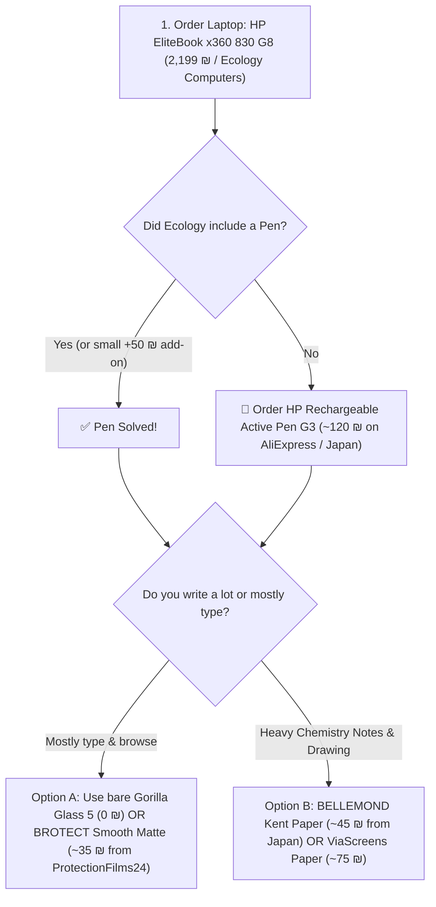

# 🖊️ HP EliteBook x360 830 G8 — Complete Pen, Screen Film & Accessories Master Guide

A comprehensive buyer's guide for styluses, paper-feel screen protectors, and accessories tailored for the **HP EliteBook x360 830 G8 (13.3" 2-in-1)**.

---

## 💻 Baseline Laptop Specifications

* **Model:** HP EliteBook x360 830 G8 (2-in-1 Convertible)
* **Store & Deal:** Ecology Computers (אקולוגיה לקהילה מוגנת) — **2,199 ₪** (with **24-Month Full Warranty**)
* **Display:** 13.3-inch 16:9 Full HD (1920x1080) IPS Corning Gorilla Glass 5 Touch
* **Digitizer Protocol:** **Wacom AES 2.0 / 1.0 (Active Electrostatic)**
* **Charging:** Dual Thunderbolt 4 / USB-C Power Delivery (65W)
* **Product Link:** [HP EliteBook x360 830 G8 on Ecology Computers](https://www.ecommunity.org.il/lti71030g8_touch)

---

## 📝 Part 1: Screen Protector & Paper-Feel Film Options

Depending on how much you type vs write with a pen, choose from one of these 4 screen styles:

```
┌────────────────────────────────────────────────────────────────────────────────────────┐
│                              CHOOSE YOUR SCREEN STYLE                                  │
├───────────────────────┬───────────────────────────────┬────────────────────────────────┤
│ Screen Style          │ Tactile Feel & Visuals        │ Best For                       │
├───────────────────────┼───────────────────────────────┼────────────────────────────────┤
│ 1. Bare Gorilla Glass │ Ultra-vibrant, glossy,        │ People who mostly type, watch  │
│    (No film at all)   │ smooth glass (Cost: 0 ₪)      │ videos, and use touch casually │
├───────────────────────┼───────────────────────────────┼────────────────────────────────┤
│ 2. Smooth Matte       │ Silky smooth on fingers,      │ 🌟 THE SWEET SPOT: Great for   │
│    Anti-Glare         │ 100% anti-glare, no smudges,  │ typing, browsing, and          │
│    (BROTECT / Elecom) │ mild pencil grip when needed  │ OCCASIONAL pen writing         │
├───────────────────────┼───────────────────────────────┼────────────────────────────────┤
│ 3. Japanese Kent Paper│ True paper tooth, 50% less nib│ 👑 BEST FOR CHEMISTRY: High    │
│    (BELLEMOND / Elecom│ wear, no rainbow grain,       │ precision drawing, reaction    │
│    Paper-Feel)        │ crisp text and formulas       │ mechanisms, and daily notes    │
├───────────────────────┼───────────────────────────────┼────────────────────────────────┤
│ 4. Custom Cutout Paper│ High tooth friction, tailored │ Digital sketching and drafting │
│    (ViaScreens Paper) │ cut around IR camera bezels   │                                │
└───────────────────────┴───────────────────────────────┴────────────────────────────────┘
```

---

### Detailed Screen Film Breakdown & Where to Buy

| # | Brand & Model | Type | Est. Price | Where & How to Buy | Shipping to Israel |
| :-: | :--- | :--- | :---: | :--- | :---: |
| **1** | **🥇 BELLEMOND Kent Paper (13.3" 16:9)** | 🇯🇵 Japanese Kent Paper *(Low nib wear, high clarity)* | **~45 – 55 ₪** *(1,800–2,200 JPY)* | • **Japan Trip:** Yodobashi / Bic Camera<br>• **Amazon Japan:** Konbini / Hotel pickup | ✈️ Bring from Japan or Amazon Global |
| **2** | **🥈 BROTECT Matte (HP 830 G8 2-Pack)** | 🇩🇪 German Smooth Matte Anti-Glare *(Silky for fingers)* | **~35 – 45 ₪** *(2-Pack)* | • **ProtectionFilms24.com** (Bedifol Germany)<br>• **eBay UK** | 📦 **Direct to Israel:** ~€3 (~12 ₪) via Deutsche Post |
| **3** | **🥈 ELECOM Paper-Feel / Smooth (13.3")** | 🇯🇵 Japanese Optical Matte Film | **~40 – 50 ₪** | • **Japan Trip:** Any 7-Eleven / Yodobashi | ✈️ Bring from Japan |
| **4** | **🥉 ViaScreens "Paper" (HP 830 G8)** | 🇬🇧 UK Laser-Cut Paper Texture | **~65 – 80 ₪** | • **viascreens.com** (via Dealtas forwarding)<br>• **eBay UK** (viascreens official store) | 📦 **Via Forwarding (Dealtas):** ~$7–$9 |
| **5** | **Supershieldz Matte (13.3" 16:9 2-Pack)**| 🇺🇸 Budget Anti-Glare Matte | **~30 – 40 ₪** | • **Amazon US**<br>• **AliExpress** | 📦 Direct to Israel (Amazon / Ali) |

---

## 🖊️ Part 2: Active Stylus Pen Options (Wacom AES 2.0)

> [!WARNING]
> **Why your existing passive Wacom pen won't work:**  
> Passive Wacom pens (Wacom EMR) require a heavy magnetic coil layer *behind* the screen (like Wacom Intuos or Samsung Galaxy Tabs). Modern thin 2-in-1 laptops use **Wacom AES (Active Electrostatic)**, which requires an **Active Pen with a battery/power source**.

---

### Recommended Compatible Active Styluses

| # | Stylus Model | Battery / Power | Features | Est. Price | Best Place to Buy |
| :-: | :--- | :--- | :--- | :---: | :--- |
| **1** | **👑 HP Rechargeable Active Pen G3**<br>*(Part # 6SG43AA / L04729-002)* | ⚡ **USB-C Fast Rechargeable**<br>*(7m charge = 1 week use)* | 🧲 **Snaps magnetically to laptop side**<br>• 4,096 pressure levels + Tilt<br>• Bluetooth top shortcut button | **~110 – 150 ₪** | • **AliExpress** (Official Surplus)<br>• **eBay / Amazon**<br>• **Store Add-on:** Ask Ecology Computers |
| **2** | **🥈 HP Active Pen G2** | 🔋 **1x AAAA Battery**<br>*(Lasts 12–18 months)* | • 4,096 pressure levels<br>• Standard pocket clip | **~75 – 95 ₪** | • **AliExpress / eBay** |
| **3** | **🥉 Lenovo Precision Pen 2 / Wacom Bamboo Ink Plus** | ⚡ **USB-C Rechargeable** | • Dual Wacom AES + MPP support<br>• 4,096 levels + Tilt | **~120 – 160 ₪** | • **KSP / Ivory** (In Israel)<br>• **Japan Trip:** Yodobashi Camera |
| **4** | **📞 Ecology Computers Store Add-On** | Official HP Active Pen | Often have original surplus pens from corporate batches | **~50 – 100 ₪** | Call Ecology Computers on WhatsApp before placing laptop order |

---

## 🗺️ Part 3: Step-by-Step Purchase & Logistics Guide

### 🗾 Route A: Buying in Japan (Via Your Brother)

Japan is the ultimate place to buy screen protectors and Wacom styluses for low prices.

#### Method 1: Amazon Japan "Convenience Store (Konbini) Pickup" (Zero Stress)
1. Go to **[Amazon.co.jp](https://www.amazon.co.jp)** (switch interface language to English).
2. Search: `BELLEMOND 13.3 inch kent paper` or `ELECOM 13.3 inch paper feel`.
3. At Checkout, choose **"Pick up at Convenience Store"** $\rightarrow$ Select a **7-Eleven, Lawson, or FamilyMart** near his hotel.
4. When delivered (takes 24 hours), Amazon sends a pickup barcode. Your brother shows the barcode to the cashier and collects the package in 10 seconds.

#### Method 2: Hotel Front Desk Delivery
* Order on Amazon Japan and enter his hotel address:  
  *`Hotel Name, Guest: [Your Brother's Full Name], Check-in Date: [DD/MM]`*  
* Japanese hotel front desks happily receive and hold Amazon parcels for arriving guests.

#### Method 3: Walk-in at Yodobashi Camera or Bic Camera
* When in **Tokyo (Akihabara / Shinjuku / Shibuya)** or **Osaka (Namba / Umeda)**:
* Walk into **Yodobashi Camera** or **Bic Camera** $\rightarrow$ go to the PC Accessories floor $\rightarrow$ look for the **13.3" 16:9 Screen Protector wall**.
* Cost: ~1,800 – 2,500 JPY (**~40 – 60 ₪**).

---

### 📦 Route B: Direct Shipping to Israel (Online Order)

If you want it delivered straight to your home in Israel:

1. **For Screen Film:** Go to **[ProtectionFilms24.com](https://www.protectionfilms24.com/c/hp-elitebook-x360-830-g8/)**:
   * Select **BROTECT Matte (2-Pack)** (~€6.99).
   * Shipping to Israel: ~€2.99 (~12 ₪) via Deutsche Post airmail.
2. **For Active Pen:** Go to **AliExpress**:
   * Search: `HP Rechargeable Active Pen G3 6SG43AA` (~120 ₪ with free Choice shipping).

---

### 📦 Route C: Package Forwarding (For ViaScreens "Paper")

If you specifically want the UK **ViaScreens Paper**:
1. Sign up for a free US/UK address at **[Dealtas (דילטס)](https://www.dealtas.com)** or **[Forward2Me](https://www.forward2me.com)**.
2. Buy on **viascreens.com** using your forwarding address.
3. Forward to Israel: Since screen protectors are flat envelopes ($< 100\text{g}$), forwarding costs **~$7 – $9 (~25 – 35 ₪)**.

---

## 🎯 The Recommended "Best Value" Action Plan



